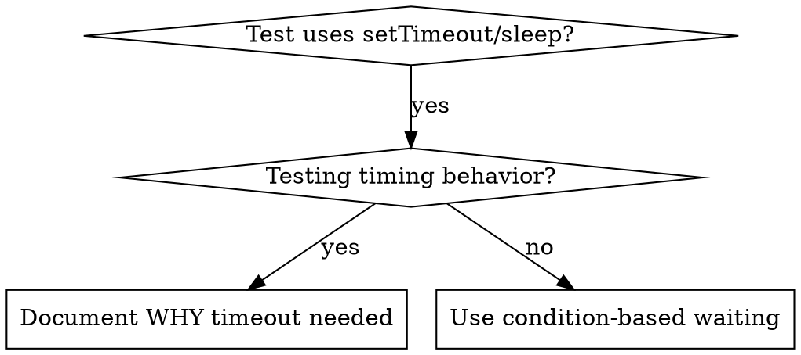

# Condition-Based Waiting

## Overview

Flaky tests often guess at timing with arbitrary delays. This creates race conditions where tests pass on fast machines but fail under load or in CI.

**Core principle:** Wait for the actual condition you care about, not a guess about how long it takes.

## When to Use



**Use when:**
- Tests have arbitrary delays (`setTimeout`, `sleep`, `time.sleep()`)
- Tests are flaky (pass sometimes, fail under load)
- Tests timeout when run in parallel
- Waiting for async operations to complete

**Don't use when:**
- Testing actual timing behavior (debounce, throttle intervals)
- Always document WHY if using arbitrary timeout

## Before You Pace a Test

A timing failure is a product bug whenever a person at ordinary speed can reach it.

- **Replay the scenario at human pace first**, on a slowed machine and on an unloaded one. If a person can land on the failing outcome, file it as a finding and keep the test honest — never pace or settle the test past it. "Load-sensitive" can mean it fails on FAST machines: an app-side "in motion" window that a fast machine finishes inside and a slow one lands outside.
- **Make the slow runner's slowness reproducible, then prove the fix at it.** For a browser: CPU throttling (Chromium's `Emulation.setCPUThrottlingRate` over CDP, behind an opt-in switch) or an N-core busy load. Calibrate the factor from the CI's own durations (a test that takes 10s here and 23s there is roughly 2x). Run each changed test several times per factor, before and after the fix, on the same build — and report the factor at which it still breaks.

## Core Pattern

```typescript
// ❌ BEFORE: Guessing at timing
await new Promise(r => setTimeout(r, 50));
const result = getResult();
expect(result).toBeDefined();

// ✅ AFTER: Waiting for condition
await waitFor(() => getResult() !== undefined);
const result = getResult();
expect(result).toBeDefined();
```

## Quick Patterns

| Scenario | Pattern |
|----------|---------|
| Wait for event | `waitFor(() => events.find(e => e.type === 'DONE'))` |
| Wait for state | `waitFor(() => machine.state === 'ready')` |
| Wait for count | `waitFor(() => items.length >= 5)` |
| Wait for file | `waitFor(() => fs.existsSync(path))` |
| Complex condition | `waitFor(() => obj.ready && obj.value > 10)` |

## Implementation

Generic polling function:
```typescript
async function waitFor<T>(
  condition: () => T | undefined | null | false,
  description: string,
  timeoutMs = 5000
): Promise<T> {
  const startTime = Date.now();

  while (true) {
    const result = condition();
    if (result) return result;

    if (Date.now() - startTime > timeoutMs) {
      throw new Error(`Timeout waiting for ${description} after ${timeoutMs}ms`);
    }

    await new Promise(r => setTimeout(r, 10)); // Poll every 10ms
  }
}
```

See `condition-based-waiting-example.ts` in this directory for complete implementation with domain-specific helpers (`waitForEvent`, `waitForEventCount`, `waitForEventMatch`) from actual debugging session.

## Common Mistakes

**❌ Polling too fast:** `setTimeout(check, 1)` - wastes CPU
**✅ Fix:** Poll every 10ms

**❌ No timeout:** Loop forever if condition never met
**✅ Fix:** Always include timeout with clear error

**❌ Stale data:** Cache state before loop
**✅ Fix:** Call getter inside loop for fresh data

**❌ Waiting on a proxy:** a condition that also changes for unrelated background work (a scroll position that moves with every background redraw) turns the wait into waiting for that work — slower than the pause it replaced
**✅ Fix:** Watch exactly the state the next action consumes (the on-screen position of the element it will click)

**❌ Reading what is not there yet:** once a pause is gone, a read of a target that has not appeared returns `undefined`/`null`/`''` — on BOTH sides of a before/after comparison alike, so the comparison passes without comparing anything
**✅ Fix:** For every read that followed the removed pause, wait for its target to exist first

## When Arbitrary Timeout IS Correct

```typescript
// Tool ticks every 100ms - need 2 ticks to verify partial output
await waitForEvent(manager, 'TOOL_STARTED'); // First: wait for condition
await new Promise(r => setTimeout(r, 200));   // Then: wait for timed behavior
// 200ms = 2 ticks at 100ms intervals - documented and justified
```

**Requirements:**
1. First wait for triggering condition
2. Based on known timing (not guessing)
3. Comment explaining WHY

## Real-World Impact

From debugging session (2025-10-03):
- Fixed 15 flaky tests across 3 files
- Pass rate: 60% → 100%
- Execution time: 40% faster
- No more race conditions
