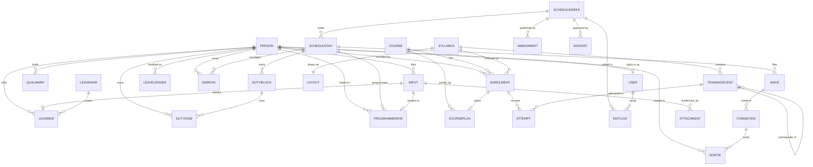

# Data model — the designed target

For the squadron's technical team, ahead of the shared-database step.
Target platform: **Dataverse**; the model below is relational and is written
so it can be built on any relational store. Date of this draft: 9 Sep 26.

> **The recommendation this document answers:** "Prior to deployment, the
> problem owner should work with relevant technical stakeholders to define the
> application's data model and database schema. This should include key
> entities such as syllabus structures, training events, students, progression
> records and scheduling data to support live data updates, multi-user access
> and long-term maintainability."

## 1. Purpose and how to read it

Two documents, two questions. `docs/data-schema.md` is the **as-is map**:
every record RAPTOR reads or writes today, taken from working code, including
its "Loose spots" and its "Suggested first cut of tables". This document is
the **to-be model**: the entities, keys and relationships the shared database
should hold, and the route from one to the other. Where they disagree, the
as-is map is the fact and this is the destination.

Four things are **already true on the branch** and are treated as done here:
the person identity is one identity (RAPTOR's `PEOPLE` id), and the Tracker
links its students to it through a bridge module plus a links record; every
Tracker mark and date write stamps who made it (`by`) and when (`at`, an ISO
instant); course, syllabus and student names may not contain a colon; and the
scheduler's shapes are declared in `src/engine/schema.ts`, proved against the
shipped seeds by a conformance test — those types are this model's contract.

Everything else is **what the database step adds**: opaque ids in place of
names and positions, ownership and timestamp columns, a version for
concurrency, one date format, an explicit `Attempt` history behind the
Tracker's mark summary, and referential integrity across the seams the app
keeps in separate stores today.

Nothing here changes what a screen does. The app's own units (a week, a chart
layout) survive as JSON columns at stage 1 and normalise later, on the
schedule in section 6.

## 2. Design rules every entity follows

| Rule | What it means in the schema |
|---|---|
| Stable opaque id | Every table has an `id` primary key: a GUID (Dataverse's own row id is acceptable). It is never a name, never a position, never a composite of either. Positional slot keys (`d:<day>.<section>.<index>`) and name keys (`course:syllabus:student`) both become derived addresses, not identity. |
| Ownership and time | `createdBy`, `createdAt`, `updatedBy`, `updatedAt` on every table. `createdBy`/`updatedBy` reference `User`; `createdAt`/`updatedAt` are UTC datetimes written by the store, not the client. |
| Version | Integer `version`, incremented on every write, used for optimistic concurrency. **The ack is not trusted**: a write is confirmed by reading the row back (or its returned ETag/version) and comparing, not by the transport's success. A mismatched version fails the write and the client re-reads. |
| One date format | ISO 8601 throughout: `yyyy-mm-dd` for a date, `yyyy-mm-ddThh:mm:ssZ` for an instant, UTC. The three conventions in the app today (`'Jul 13'` display strings, a 0–6 day index, minutes-from-midnight) stay inside the app; the storage door converts on the way in and out. Clock times inside a schedule day stay `HH:MM` strings — they are a time-of-day on a known date, not an instant. |
| Soft delete where history matters | `isDeleted` + `deletedBy`/`deletedAt` on Person, Enrolment, Attempt, Input, Amendment, Attachment, LeaveBid. Hard delete is allowed only for rows with no history value (display preferences, draft rows never published). |
| Names are attributes, ids are identity | `Person.callsign`, `Course.name`, `Syllabus.name`, `Enrolment.studentName` are ordinary columns that can be renamed or masked without touching a foreign key. The colon guard shipped on the branch stays until stage 2 has moved the Tracker off name keys; after that it is a display rule only. |
| JSON columns, deliberately | A shape the app always reads and writes as one unit may live in a single JSON column: a week snapshot, a chart layout's geometry, an aircraft's stores options, a leave period's day/band definitions. **Normalise when something outside the app must query inside the shape** — a report, a Power BI view, a per-row permission, or two people editing different rows of it at once. That last case is why `ScheduleWeek` normalises at stage 2 and `Layout` does not. |

## 3. Entity catalogue

Each entity carries the common columns from section 2 (`id`, `createdBy`,
`createdAt`, `updatedBy`, `updatedAt`, `version`, and `isDeleted` where
listed) — they are not repeated in the field tables. A field marked
**(new)** exists in neither the as-is map nor the field inventory and is
proposed here.

### Person

The one identity in the application. The scheduler roster, the Leave War's
projected roster and the Tracker's student link all point at this row; no
second identity is minted anywhere.

| Field | Type | Req | Meaning |
|---|---|---|---|
| `id` | guid | yes | opaque. Today's short lowercase handle is kept as `legacyKey` for the import only |
| `callsign` | string | yes | the display name (`cs`) |
| `seat` | choice `FCP\|RCP\|GND` | yes | front cockpit / rear cockpit / ground |
| `category` | choice `OCU,D,C,B,A,IW,IP,IR,FI` or empty | yes | the category ladder (`q`); ground crew hold empty |
| `sxo` | bool | no | SXO-qualified |
| `initials`, `flight`, `remarks` | string | no | ground-crew extras |
| `isGroundPersonnel` | bool | no | `pers` — no flying quals derive |
| `isSentinel` | bool | no | `special` — `ALL`, `ALL AVAIL`; occupies slots, is not a person |
| `archived` | bool | no | kept out of every roster |
| `isSans` | bool | no | `san` |
| `sansFlown`, `sansCarry`, `sansMissedQtrs` | int | no | `sanQ`, present only when `isSans` |
| `band` | choice `instructor\|ops` | no | Leave War `personedits.band` |
| `fromDate`, `toDate` | date | no | in-squadron window; `toDate` null = open (Leave War `from`/`to`) |
| `poArchive` | bool | no | posting-out archive flag (Leave War `postouts`) |
| `label` | string | no | Leave War `perslabels` entry for this person |
| `legacyKey` | string | no | the pre-migration `PEOPLE` id, import only |

Relationships: 1–n `QualMark`, `Enrolment`, `Input`, `LeaveBid`,
`LeaveLedger`, `LeaveOpening`; 0–1 `User`; referenced by every schedule row
that seats a body.
From today: `PEOPLE[id]` (`raptor:people/all`), plus Leave War's `Person`
projection and its two per-person records `personedits` and `postouts`.
App change: Leave War stops re-projecting a roster and laying two override
records on top — it reads these columns. `quals` is **not stored**: it stays
derived at boot by `deriveQuals`, from `QualMark` plus category.

### Qualification

The catalogue of qualification columns — the LoX column list.

| Field | Type | Req | Meaning |
|---|---|---|---|
| `key` | string | yes | `k`, the column key |
| `heading` | string | yes | `h`, the column heading |
| `lav`, `apt`, `scq`, `aar`, `fcpOnly` | bool | no | the column's behaviour flags |
| `sortIndex` | int | yes | display order |

Relationships: 1–n `QualMark`.
From today: the `qualcols` setting (`QualCol[]`); Leave War's `QualDef` is
the same list projected.
App change: the column list becomes a table rather than a settings blob, so a
mark can carry a real foreign key.

### QualMark

One granted qualification for one person — the ticks under a LoX column.

| Field | Type | Req | Meaning |
|---|---|---|---|
| `personId` | ref Person | yes | |
| `qualificationKey` | ref Qualification | yes | |
| `value` | choice `held\|instructor` | yes | `true` or `'I'` today (`daar`/`naar` may be instructor) |
| `grantedBy`, `grantedAt` | ref User / datetime | no | who ticked it (currently unrecorded) |

Relationships: n–1 `Person`, n–1 `Qualification`. Unique on
(`personId`, `qualificationKey`).
From today: the boolean fields on the PEOPLE record (`tf`, `sched`, `scDay`,
`scNight`, `daar`, `naar`, `sxo`, `san`) — granted marks, never derived ones.
App change: granted marks move off the person row into their own rows.
`deriveQuals`' ladder invariants (night signed off after day; an instructor
night mark outrunning its day one is demoted) run unchanged on the derived side.

### Course

A training course, e.g. an OCU intake.

| Field | Type | Req | Meaning |
|---|---|---|---|
| `name` | string | yes | today the free-text name, used as a storage key |
| `sortIndex` | int | yes | the `courses` array order |
| `archived` | bool | no | (new) — retires an old intake without deleting its history |

Relationships: 1–n `Enrolment`, 1–n `CoursePlan`.
From today: `students.courses[]` and the per-course key prefix in
`raptor:tracker/v3:<course>:…`.
App change: renaming a course becomes one column write instead of moving
eight storage keys.

### Syllabus

One chart — an ordered set of training events with a drawn layout.

| Field | Type | Req | Meaning |
|---|---|---|---|
| `name` | string | yes | the chart name (today the object key) |
| `sortIndex` | int | yes | `charts.order` position |
| `isBuiltIn` | bool | yes | shipped chart vs one drawn in the app |
| `aliasOfId` | ref Syllabus | no | `SYL_ALIAS` — a renamed built-in |
| `hidden` | bool | no | `SYL_HIDDEN` |
| `tombstoned` | bool | no | `SYL_TOMB` — a built-in removed by the squadron |

Relationships: 1–n `TrainingEvent`, 1–1 `Layout`, 1–n `Enrolment`.
From today: `charts.syllabi[name]`, `charts.order`, and the alias/hidden/tomb
registers.
App change: a syllabus can be referenced by id from an enrolment, so a rename
no longer has to rewrite marks and rosters.

### TrainingEvent

One event on a chart: what it is, where it sits, and what must precede it.

| Field | Type | Req | Meaning |
|---|---|---|---|
| `syllabusId` | ref Syllabus | yes | |
| `code` | string | yes | the event's code — today the event `id` within the chart |
| `type` | string | yes | event type (`type`) |
| `phase` | string | yes | chart phase (`phase`) |
| `sequence` | int | yes | `seq` — order within the phase |
| `name` | string | no | from `eventInfo[eventId].name` |
| `format` | string | no | from `eventInfo[eventId].fmt` |
| `hours` | decimal | no | from `eventInfo[eventId].hrs`, **stored as a number** |

Relationships: n–1 `Syllabus`; self-relation through `EventPrerequisite`
(`eventId`, `prerequisiteEventId`, both ref TrainingEvent, unique together) —
the `prereqs` string array today; 1–n `Attempt`.
From today: `charts.syllabi[name][i]` = `{ id, type, seq, prereqs, phase, _b }`
plus `charts.eventInfo`. `_b` is drawing state and moves to `Layout`.
App change: the event's details stop living in a second container keyed by
event id; `hrs` stops being free text.

### Enrolment

A person on a course, on a syllabus. **This replaces the Tracker's roster
string list and the links record shipped on this branch.**

| Field | Type | Req | Meaning |
|---|---|---|---|
| `courseId` | ref Course | yes | |
| `syllabusId` | ref Syllabus | yes | |
| `personId` | ref Person | yes at target | the link. Nullable during migration — an unlinked student exists today and a visitor from another unit is a real case |
| `studentName` | string | yes | the typed callsign; today the key, from here a display attribute |
| `sortIndex` | int | yes | roster order |
| `lastSyllDate`, `lastCurrDate` | date | no | `dates[student].lastSyll` / `lastCurr` |
| `downDays` | int | no | `dates[student].downDays` |
| `upchitDate` | date | no | `dates[student].upchit` |
| `lastEditedBy`, `lastEditedAt` | ref User / datetime | no | the `by`/`at` stamps already written on this branch |
| `isDeleted` | bool | yes | soft delete — removing a student must not lose their attempts |

Relationships: n–1 `Person`, `Course`, `Syllabus`; 1–n `Attempt`; 0–1
`CoursePlan`. Unique on (`courseId`, `syllabusId`, `personId`).
From today: the roster key `v3:<course>:<syl>:roster` (a string array), the
`dates` container, and `v3:links` = `{ course: { studentName: personId } }`.
App change: the links record disappears — it becomes `Enrolment.personId`.
Re-keying students by id is stage 2; until then `studentName` carries the
app's addressing.

### Attempt

**The progression record.** One try at one event by one enrolled person. This
is the history the Tracker's current `{ g, f, fd, d }` summary is derived
from — today only the summary is stored.

| Field | Type | Req | Meaning |
|---|---|---|---|
| `enrolmentId` | ref Enrolment | yes | |
| `eventId` | ref TrainingEvent | yes | |
| `attemptDate` | date | yes | today the `d` (done) or one entry of `fd` (failed) |
| `result` | choice `pass\|fail` | yes | derived from which list the date came from |
| `grade` | int | no | the grade `g` (0 = none); carried on the passing attempt |
| `isFailure` | bool | yes | the failure flag — `true` for one of the `f` failure ticks |
| `attemptNo` | int | yes | (new) 1-based order within (`enrolmentId`, `eventId`) |
| `recordedBy`, `recordedAt` | ref User / datetime | yes | the `by`/`at` stamps already written on this branch |
| `isDeleted` | bool | yes | a corrected attempt is retired, not erased |

Relationships: n–1 `Enrolment`, n–1 `TrainingEvent`.
From today: `marks[student][eventId]` = `{ g, f, fd: [iso…], d: iso }`, one
record per event holding a count and a list of dates.
App change: the one genuinely new shape. It makes "how many attempts, on what
dates, recorded by whom" answerable — what a progression report needs. See
the Open questions on whether it is required from day one.

### ProgressionSummary (a view, not a table)

The Tracker's mark record, derived. Read-only; the app writes `Attempt`.

| Column | Derivation |
|---|---|
| `enrolmentId`, `eventId` | group key |
| `grade` (`g`) | grade of the latest passing attempt, else 0 |
| `failures` (`f`) | count of attempts with `isFailure` |
| `doneDate` (`d`) | `attemptDate` of the latest passing attempt |
| `failDates` (`fd`) | ordered `attemptDate` list of the failing attempts |

From today: `marks[student][eventId]` — the app's mark record **is this
view**. Keeping the shape identical lets the Tracker's screens, undo/redo
snapshots and the export file stay as they are while the history underneath
becomes real.

### CoursePlan

Pace, lull periods and target dates for an enrolment.

| Field | Type | Req | Meaning |
|---|---|---|---|
| `courseId` | ref Course | yes | |
| `enrolmentId` | ref Enrolment | no | null = the course-wide plan (`plan`) |
| `pace` | JSON | no | the per-student `pace` record |
| `lulls` | JSON | no | the per-student `lulls` record |
| `targets` | JSON | no | target dates carried in `plan` |
| `currentSyllabusId` | ref Syllabus | no | `plan.sylName` |

Relationships: n–1 `Course`, 0–1 `Enrolment`.
From today: `students.byCourse[course].plan`, plus the per-course `pace` and
`lulls` keys.
App change: pace and lulls stop being cleared by hand when a student leaves
their last syllabus — the relationship does it.

### ScheduleWeek

One week of the flying programme. **Stage 1: a whole-record JSON snapshot.
Stage 2: the parent of the row tables below.**

| Field | Type | Req | Meaning |
|---|---|---|---|
| `weekStart` | date | yes | the Monday, ISO. Unique |
| `snapshot` | JSON | stage 1 | exactly what `histSnap()` already serialises: `DAYS`, `INPUTS`, the `SCHED` fields, muted warnings, the planning layer |
| `mutedWarnings` | string[] | no | `wo` — promoted out of the snapshot at stage 2 |
| `planningLayer` | JSON | no | `PLANPUCKS` + `DAYRMK`, keyed by ISO date; own rows at stage 2 |
| `ownedBy` | ref User | yes | (new) who created the week — needed before incoming sync (section 7) |

Relationships: 1–n `ScheduleDay` (stage 2), `Amendment`, `Signoff`.
From today: `raptor:weeks/<week-start>`, and the session-only week stash.
App change: none at stage 1 — the app already builds this exact record for
undo. At stage 2 the snapshot column empties as the rows take over.

### ScheduleRow family

The stage-2 normalisation of a week. Every row gets a **stable id** and a
`sortIndex`; the positional slot key becomes an address derived from the ids,
so inserting a row no longer renumbers the ones after it.

| Entity | Parent | Key fields |
|---|---|---|
| `ScheduleDay` | ScheduleWeek | `dayIndex` 0–6, `date`, `dayOfWeek`, `flyingTally` (`wc`), `notes` string[], `programmeNotes`, `dutyNotes`, `simNotes`, `groundNotes`, `sectionOrder` string[] (absent = canonical), `groundManualOrder` (`gman`) |
| `Wave` | ScheduleDay | `label`, `night`, `inTimes` string[], `traffic` string[], `standalone`, `kind` (`sc\|avalon\|bb`), `noConflictCheck` (`noconf`), `sortIndex` |
| `Formation` | Wave | `callsign` (`cs`), `mission` (`msn`), `shift`, `takeOff` (`to`), `land` (`ld`), `inTime` (`br`), `cancelled` (`cx`), `cancelReason` (`cxr`), `sortIndex` |
| `Sortie` (seat pair) | Formation | `frontSeatPersonId` (`p`), `rearSeatPersonId` (`w`), `area`, `remarks` (`rmks`), `stores` JSON (`opts`), `spare`, `role` (`MAIN\|SPARE`), `spareAircraft` JSON, `cancelled`, `cancelReason`, `flag`, `sortIndex` |
| `DutyBlock` | ScheduleDay | `label`, `forWave` (`sa`), `noConflictCheck`, `sortIndex` |
| `DutyRow` | DutyBlock | `role`, `personId` (`id`), `start` (`str`), `end`, `overflowPersonIds` (`more`), `cancelled`, `cancelReason`, `flag`, `sortIndex` |
| `SimRow` | ScheduleDay | `kind` (`amt\|oft`), `label`, `start`, `end`, `remarks`, `frontSeatPersonId`, `rearSeatPersonId`, `paxPersonIds` string[], `who` (free text or id), `overflowPersonIds`, `cancelled`, `cancelReason`, `flag`, `sortIndex` |
| `ProgrammeRow` | ScheduleDay | `section` (`allhands\|ground`), `item` (`prog`), `start`, `end`, `who` (id, free text, or list), `overflowPersonIds`, `cancelled`, `cancelReason`, `infoOnly` (`info`), `flag`, `sourceInputId` (ref Input — today `src`), `sortIndex` |

Relationships: as the parent column shows; every `*PersonId` is a
`Person` reference.
From today: the nested `DAYS[0..6]` structure — `waves[].formations[].aircraft[]`,
`sims.{amt,oft}[]`, `dutywaves[].rows[]`, `allhands[]`, `ground[]`.
App change: `keys.ts`' key remapping becomes an id lookup — the as-is map's
third loose spot, and stage-2 work.

### Input

One filed absence or activity — leave, medical, an appointment, duty, SANS
availability.

| Field | Type | Req | Meaning |
|---|---|---|---|
| `personId` | ref Person | yes | |
| `startDate`, `endDate` | date | yes / no | ISO. Today `date` is a `'Jul 13'` display string with a separate `yr`; both are replaced by one ISO date |
| `allDay` | bool | yes | |
| `startMinutes`, `endMinutes` | int | no | `s`/`e`, minutes from midnight; required together when not all-day; `end < start` legitimately crosses midnight |
| `half` | choice `am\|pm` | no | half-day marker |
| `typeCode` | ref InputType | yes | the catalogue code |
| `remarks` | string | yes | may be empty |
| `modifiedAt` | datetime | yes | `mod` — drives the late-input mark |
| `acceptance` | choice `ground\|unavailable\|removed` | no | `acc` = `g\|u\|r`; absent = never landed |
| `fromLeaveWar` | bool | no | `lw` — **the sync loop-breaker. It must survive the migration.** |
| `oilCredit` | JSON | no | `oil`: ISO date → `0 \| 0.5 \| 1` |
| `sansEvents` | JSON | no | `sans`: which of Fly / OFT / AMT are offered |
| `isDeleted` | bool | yes | undo can resurrect an input |

`InputType` is a reference table, not free text: `code` (PK), `group`
(`leave\|med\|upchit\|act\|duty\|sans`), `name`, and the flags `work`,
`local`, `ground`, `half`, `shiftHard`. The shipped catalogue (`LL`, `OL`,
`OIL`, `CCL`, `PL`, `FCL`, `EL`, `CL`, `HL`, `OML`, `ATT B`, `ATT C`,
`Upchit`, the eight activity codes, `OD`, `SANS Availability`) is seeded
into it and is the source of truth for what a type means.

Relationships: n–1 `Person`, n–1 `InputType`; n–n `Attachment` through
`InputAttachment` (`inputId`, `attachmentId`) — today `docId` / `docIds`;
0–1 `LeaveBid` per covered day.
From today: `INPUTS[]` (`raptor:inputs/all`), addressed by `iid`.
App change: inputs stay global rather than week-scoped, as they already are.
The display date and `yr` fold into one ISO date at the storage door.

### Amendment

One published amendment (AL) to a day.

| Field | Type | Req | Meaning |
|---|---|---|---|
| `weekId` | ref ScheduleWeek | yes | |
| `number` | int | yes | `n`, the AL number |
| `dayIndexes` | int[] | yes | `days` |
| `slotKeys` | string[] | yes | `keys` — becomes row ids at stage 2 |
| `itemCount` | int | yes | `n0`, frozen at issue |
| `structuralAdds` | string[] | no | `adds` / `structAdds` |
| `signatures` | JSON | yes | `sign` at issue — the four names per day |
| `snapshot` | JSON | no | `snap`, the day as issued |
| `issuedBy`, `issuedAt` | ref User / datetime | yes | today only the signature name is kept |
| `isDeleted` | bool | yes | published history is never hard-deleted |

Relationships: n–1 `ScheduleWeek`.
From today: `SCHED.als[n]`, which also rides inside the week snapshot.
App change: split out of the snapshot at stage 1 already (the as-is map's own
suggested first cut), so amendments can be reported on without opening a week.

### Signoff

The approval state of one day: who signed it and which version it shows.

| Field | Type | Req | Meaning |
|---|---|---|---|
| `weekId` | ref ScheduleWeek | yes | |
| `dayIndex` | int | yes | 0–6. **Approval is per day, not per week** |
| `role` | choice `cur\|sked\|plan\|appr` | yes | the four sign-off slots |
| `signedByPersonId` | ref Person | yes | the live `SCHED.sign[di].<role>` value is already a `PEOPLE` id (the sign-off picker stores ids) |
| `signedName` | string | no | the callsign frozen on an issued AL (`als[n].sign`) — a display copy, never the identity |
| `signedAt` | datetime | no | (new) |
| `approved` | bool | yes | `SCHED.dayOK[di]` |
| `shownVersion` | string | yes | `SCHED.cur[di]` — `'orig'` or an AL number |

Relationships: n–1 `ScheduleWeek`. Unique on (`weekId`, `dayIndex`, `role`).
From today: `SCHED.sign`, `SCHED.dayOK`, `SCHED.cur`, `SCHED.orig`.
App change: `orig` (the day as first published) stays a JSON column on the
day-level row; the rest becomes queryable.

### EditLog

One recorded edit. Today session-only and capped at 400 rows; in the database
it is durable and shared.

| Field | Type | Req | Meaning |
|---|---|---|---|
| `at` | datetime | yes | `t`, wall clock |
| `byUserId` | ref User | no | (new) — today only a display name is kept |
| `byName` | string | yes | `who`, from `HOOKS.whoami()` |
| `weekId` | ref ScheduleWeek | no | |
| `dayIndex` | int | no | null for a structural edit |
| `slotKey` | string | yes | empty for a structural edit |
| `rowId` | guid | no | (new) the stable row id, from stage 2 |
| `label` | string | yes | `lbl`, frozen at the time |
| `fromValue`, `toValue` | string | yes | before and after |

Relationships: n–1 `User`, n–1 `ScheduleWeek`.
From today: `ELOG.rows`.
App change: the 400-row cap becomes a retention policy the database owns (see
Open questions).

### Attachment

Metadata for one uploaded document. **The bytes are not a column** — they live
in a file store and this row references them.

| Field | Type | Req | Meaning |
|---|---|---|---|
| `id` | string | yes | `doc-` + UUID, minted globally unique (already true on this branch) |
| `fileName` | string | yes | `name` |
| `mimeType` | string | yes | `image/*` or `application/pdf` |
| `sizeBytes` | int | yes | capped at 8 MB per file |
| `storeRef` | string | yes | (new) the file store's own reference |
| `uploadedBy`, `uploadedAt` | ref User / datetime | yes | (new) |
| `isDeleted` | bool | yes | append-only in practice — undo can resurrect the input that owned it |

Relationships: n–n `Input` through `InputAttachment`.
From today: the `docBackend` map plus the per-browser IndexedDB drawer
`raptor-docs`.
App change: the drawer becomes a **shared** file store. The app keeps its
synchronous in-memory read cache; the database step owns write-behind retry,
durability confirmation, and referential integrity between row and file
(section 7).

### LeaveWar

One leave period — a "war".

| Field | Type | Req | Meaning |
|---|---|---|---|
| `name` | string | yes | |
| `startDate`, `endDate` | date | yes | |
| `stage` | choice `draft\|open\|closed\|published` | yes | |
| `bidFrom`, `bidTo` | date | no | the bidding window |
| `days` | JSON | yes | `DayInfo[]` — the calendar's own annotations |
| `bands` | JSON | yes | `EventBand[]` |

Relationships: 1–n `LeaveBid`.
From today: `raptor:leavewar/wars` — an array of `{ period, grid, states }`,
one record for every war.
App change: the grid and states come out of the war record into `LeaveBid`
rows. That single record is the largest whole-record clobber surface in the
app today (section 7).

### LeaveBid

One person, one date, in one war: what they asked for and what happened.

| Field | Type | Req | Meaning |
|---|---|---|---|
| `warId` | ref LeaveWar | yes | |
| `personId` | ref Person | yes | |
| `date` | date | yes | |
| `code` | string | yes | the cell's code — the `Grid` value |
| `portion` | choice `full\|am\|pm` | yes | parsed from the code today (`Cell.portion`) |
| `state` | choice `pending\|acknowledged\|approved\|refused` | yes | |
| `source` | choice `bid\|raptor` | yes | **the other half of the sync loop-breaker; it must survive the migration** |
| `shiftedFrom` | date | no | set only for a move made once bidding is closed |
| `note` | string | no | |
| `inputId` | ref Input | no | (new) the input this cell derives from, when it does |
| `isDeleted` | bool | yes | |

Relationships: n–1 `LeaveWar`, n–1 `Person`, 0–1 `Input`.
Unique on (`warId`, `personId`, `date`).
From today: `Grid` (`personId → date → code`) and `States`
(`personId → date → BidRecord`), both inside the war record.
App change: `sync.ts` keeps computing desired state and writing the
difference. `inputId` is a strengthening, **not** a replacement for
`source` / `Input.fromLeaveWar` — losing either marker loses the loop-breaker.

### LeaveLedger, LeaveCounter, LeaveOpening

The leave balances.

| Entity | Fields |
|---|---|
| `LeaveCounter` | `code` (PK: `annual`, `oil`, `ccl`, `fcl`, `pl`, `el`, `cl`), `label` — a reference table |
| `LeaveOpening` | `personId`, `counterCode`, `amount` — opening balances (`Openings`). Unique on the pair |
| `LeaveLedger` | `personId`, `counterCode`, `amount` (a grant or a correction), `date`, `reason`, `approvedBy`, `givenBy`, `isDeleted` — one `LedgerEntry` |

Relationships: all n–1 `Person` and n–1 `LeaveCounter`.
From today: `raptor:leavewar/openings` and `raptor:leavewar/ledger`.
App change: none to the OIL derivation — `OilLedger`, `OilCredit` and
`OilDebit` stay **derived** from these rows plus the OIL policy, and are not
stored.

### Setting

One configuration key. The whole `sqn142_*` / Leave War preferences family.

| Field | Type | Req | Meaning |
|---|---|---|---|
| `key` | string | yes | e.g. `daytpl`, `rules`, `groupcolors`. Unique |
| `scope` | choice `scheduler\|leavewar\|tracker` | yes | (new) — the three worlds share one table |
| `value` | JSON | yes | the record as the app already serialises it |

Relationships: none.
From today: the `raptor:settings/*` keys and the ~20 `raptor:leavewar/*`
preference keys.
App change: **an absent row means "on the shipped standard"** — today's `null`
convention. The default is never written, so a later change to the standard is
picked up rather than frozen. Do not seed this table.

### User

The sign-in identity. **Separate from `Person`**, linked to it.

| Field | Type | Req | Meaning |
|---|---|---|---|
| `signInName` | string | yes | the provider's principal name. Unique |
| `displayName` | string | yes | what `HOOKS.whoami()` returns and the edit log records |
| `role` | choice `admin\|main` | yes | today's two roles |
| `personId` | ref Person | no | null for an account with no roster body (a service or an admin who does not fly) |
| `enabled` | bool | yes | |
| `lastSignInAt` | datetime | no | (new) |

Relationships: 0–1 `Person`; referenced by every `createdBy`/`updatedBy`.
From today: `ACCOUNTS` — two hard-coded prototype accounts in
`src/state/auth.ts` — plus `SESSION`, `ME` and the Admin page's `USERS[]`.
App change: **no password is ever stored in this model.** The auth provider
owns credentials; this table maps a signed-in principal to a role and a roster
body. Stage 4, and a separate step from storage.

### Layout

The drawn geometry of one chart.

| Field | Type | Req | Meaning |
|---|---|---|---|
| `syllabusId` | ref Syllabus | yes | Unique — one layout per chart |
| `geometry` | JSON | yes | box positions, lines, fonts; includes each event's `_b` |

Relationships: 1–1 `Syllabus`.
From today: `charts.layouts[name]`.
App change: none. The clearest case for a JSON column — the app reads and
writes the whole layout as one unit, and nothing outside it queries inside.

## 4. Relationship diagram

Four entities are left off the diagram for readability and hang off it
simply: `QUALIFICATION` (parent of `QUALMARK`), `LEAVEOPENING` and
`LEAVECOUNTER` (beside `LEAVELEDGER`), and `SETTING` (no relationships).
`PROGRESSIONSUMMARY` is a view over `ATTEMPT` and is not a table.

## 5. Mapping — today's records to the target

One row per record in the as-is map, including each of the three storage
worlds' keys.

| Today (record / key) | Target entity | Migration note |
|---|---|---|
| `raptor:people/all` — `PEOPLE[id]` | `Person` + `QualMark` | One row per person; mint a guid and keep the old handle as `legacyKey`. Granted marks (`tf`, `sched`, `scDay`, `scNight`, `daar`, `naar`, `sxo`, `san`) become QualMark rows. `quals` is **not** migrated — it stays derived at boot |
| `raptor:inputs/all` — `INPUTS[]` | `Input` (+ `InputAttachment`) | One row per `iid`. Convert `date`/`endDate`/`yr` to ISO at the door. Preserve `lw` verbatim. `docId`/`docIds` become link rows |
| `raptor:weeks/<week-start>` — the `histSnap()` week | `ScheduleWeek` | Stage 1: one row, snapshot JSON as-is. Stage 2: expand into the ScheduleRow family and empty the column |
| `SCHED.als[n]` (inside the week) | `Amendment` | Split out at stage 1 — already the as-is map's own recommendation |
| `SCHED.sign` / `dayOK` / `cur` / `orig` | `Signoff` | One row per (week, day, role); `orig` stays a JSON column |
| `raptor:plan/all` — `PLANPUCKS`, `DAYRMK` | `ScheduleWeek.planningLayer` | JSON at stage 1 (dates already ISO); own rows at stage 2 |
| `ELOG.rows` (session-only) | `EditLog` | Nothing to migrate — the log starts empty and becomes durable. Decide retention first |
| `raptor:settings/*` — `daytpl`, `wavetpl`, `wavehide`, `wavedefault`, `dutytpl`, `cxreasons`, `lookahead`, `secdefault`, `stores`, `rules` | `Setting` | One row per key, value verbatim. **Do not write a row for a key that is on the shipped standard** — absent still means default |
| `raptor:settings/qualcols` | `Qualification` + `Setting` | The column list becomes rows so `QualMark` can key off it; display flags travel with each column |
| IndexedDB `raptor-docs` + `docBackend` map | `Attachment` + shared file store | Bytes to the file store, metadata to the row. Ids are already globally unique (`doc-`+UUID). A pre-drawer browser holds `docId`s with no bytes — import them as "no document on file", never fabricate |
| `ACCOUNTS`, `SESSION`, `ME`, `USERS[]` (code) | `User` | Not migrated — replaced by the auth provider at stage 4. Map each new principal to a `Person` on first sign-in |
| `raptor:leavewar/wars` (+ legacy `grid`, `states`, `stage`) | `LeaveWar` + `LeaveBid` | One `LeaveWar` per war; explode grid + states into one `LeaveBid` per (person, date). Preserve `source` verbatim |
| `raptor:leavewar/openings` | `LeaveOpening` | One row per (person, counter) |
| `raptor:leavewar/ledger` | `LeaveLedger` | One row per `LedgerEntry`. The OIL ledger stays derived |
| `raptor:leavewar/oilpolicy`, `eventdefs`, `manningdefs`, `groupdefs`, `grouppriority`, `grouppriocustom`, `groupcolors`, `figorder`, `rosterorder`, `manningorder`, `manninghidden`, `fighidden`, `perslabels`, `eventrows`, `showsans`, `current` | `Setting` (scope `leavewar`) | Preferences and definitions, value verbatim, absent = default |
| `raptor:leavewar/personedits` | `Person.band` / `seat` / `sxo` | Fold the overrides onto the person row; the override record disappears |
| `raptor:leavewar/postouts` | `Person.fromDate` / `toDate` / `poArchive` | Same — an entry exists today only while `to` is set |
| `raptor:tracker/v3:master:syls` | `Syllabus` + `TrainingEvent` (+ `EventPrerequisite`) | Chart per row, event per row; `prereqs` strings resolve to event ids within the same syllabus |
| `raptor:tracker/v3:eventinfo` | `TrainingEvent.name` / `format` / `hours` | Merge into the event row; parse `hrs` to a number, refuse and report anything that will not parse |
| `raptor:tracker/v3:lay` | `Layout` | One row per chart, geometry JSON verbatim (including each event's `_b`) |
| `raptor:tracker/v3:courses` | `Course` | One row per name, `sortIndex` from the array order |
| `raptor:tracker/v3:<course>:<syl>:roster` | `Enrolment` | One row per student name on that roster, `sortIndex` from the array order |
| `raptor:tracker/v3:links` (this branch) | `Enrolment.personId` | The links record **disappears** into the column. A student with no link imports with a null `personId` |
| `…:marks` — `{ g, f, fd[], d }` | `Attempt` (+ the `ProgressionSummary` view) | Expand: the `d` date becomes one passing attempt carrying `g`; each `fd` entry becomes a failing attempt. A missing date on a counted failure imports as an attempt with a null date and is reported |
| `…:dates` — `lastSyll`, `lastCurr`, `downDays`, `upchit` | `Enrolment` | Straight column copy; the `by`/`at` stamps become `lastEditedBy`/`lastEditedAt` |
| `…:plan`, `…:pace`, `…:lulls` | `CoursePlan` | Course-wide plan as the row with a null `enrolmentId`; per-student pace and lulls on the enrolment's row |
| `raptor:tracker/v3:seedstamp` | — | Dropped. It marks a demo seed, which never reaches the shared store |
| `ocuLocal:*` (last course, last crew member) | — | **Stays per browser.** A view preference, deliberately outside the shared prefix; it must not be migrated |

## 6. Migration recipe

The stages match the storage-seam design, so each one is a backend change
behind the existing door rather than a rewrite above it.

| Stage | What lands | What it lets the squadron do |
|---|---|---|
| **1 — whole-record JSON tables** | The tables of section 5 in their simplest form: `Person`, `Input`, `ScheduleWeek` (snapshot column), `Amendment`, `EditLog`, `Setting`, `Attachment` metadata, `LeaveWar`, `Enrolment`, `Syllabus`, `TrainingEvent`, `Layout`. One record in, one row out. The app's doors do not change | One shared copy of the squadron's data instead of one per browser. Everyone sees the same roster, the same weeks, the same charts, from any machine. A real backup |
| **2 — stable row ids** | The ScheduleRow family; Tracker students re-keyed by `Enrolment.id` rather than by typed name; `Attempt` rows behind the mark summary; slot keys become derived addresses; `EditLog.rowId` starts being written | Two people can edit different rows of the same day without overwriting each other. A renamed course or student stops moving storage keys. Progression history becomes real data, not a count |
| **3 — live-ish sync** | The backend contract gains `since(version)`; the postman gains an incoming side (poll with backoff, one catch-up on return); records reach the whiteboard as per-change deltas; row ownership decides what may be reconciled away | The programme updates on screen while someone else edits it. Presence rides the same poll. This is the stage the "live data updates" half of the recommendation refers to |
| **4 — Dataverse adapter and sign-in** | One new backend passing the existing `contractTests`, plus Microsoft sign-in feeding `HOOKS.whoami()` and the `User` table | Squadron accounts, real names on every edit and sign-off, and the platform's own audit, backup and reporting |

The Tracker's own move is already rehearsed: **Export with both boxes ticked
→ wipe → Import, answer yes.** The export file is a format, not a store, and
it now carries the `links` block alongside charts and students, so the person
links survive the round trip.

## 7. Multi-user rules the database must own

From the 9 Sep 26 stress test in the storage-seam design, which drove the real
seam against a faked network database. Each is a database-stage requirement,
not a bug in what ships today.

| Rule | Requirement |
|---|---|
| Write-verify | A network store can ack a write that never durably landed, or lose the ack; a later retry of a lost-ack write can resurrect a stale value over a newer one. Confirm every write by version/ETag or read-back. Never report "saved" on the transport's success alone |
| Per-row writes for the big blobs | `inputs/all`, `people/all` and `leavewar/wars` are one record each today; two people editing unrelated rows clobber each other whole-record. `LeaveWar` is the largest surface. Per-row writes (or a field-level merge) are mandatory before two people share the store |
| Ownership before incoming sync | Today's reconcile deletes every `weeks/*` record nothing local backs — correct for one browser, destructive against a shared store. Whole-collection ownership assumptions must be replaced by `ownedBy` / row-level rules before stage 3 |
| Boot timeout and all-or-nothing hydrate | The boot gate awaits one load with no timeout: a hung network load blanks the app, and a partial load half-hydrates — the hydrated flag latches on one record and can re-seed the demo world over real data. Needs a timeout, a loading state, and a hydrate that is all or nothing |
| Never seed demo data into the shared store | An empty store on first boot must stay empty. The demo roster, days and inputs are test fixtures, not a seed for the squadron's database |
| Referential integrity across the seams | Two of them: the text records reference attachment ids held in a **separate file store**, and cross-key operations (a rename does delete-old + put-new) have no transaction today. The database layer owns both — a foreign key to `Attachment`, and a real transaction around multi-row operations |
| A wedged record must not poison the rest | A never-settling write times out and retries rather than blocking later edits to that record; save status is per record, so one stuck row does not report the whole app as unsaved |
| One-time legacy import | The legacy-key import (`sqn142_*`, `leavewar:*`, `ocu:*`) runs **once for the shared store**, not once per browser. Guard it with a stored migration stamp on the server side |

## 8. Open questions for the technical team

1. **Dataverse table naming and publisher prefix** — the schema names above
   are logical. What prefix, and do we use Dataverse's own `createdby` /
   `modifiedby` / `versionnumber` columns rather than declaring our own?
2. **File store** — SharePoint document library, Dataverse file column, or
   Azure Blob? It decides what `Attachment.storeRef` holds and who enforces
   the 8 MB cap.
3. **Auth provider** — Entra ID is assumed. How is a signed-in principal
   matched to a `Person` on first sign-in: by callsign, by an admin mapping
   step, or automatically by email?
4. **EditLog retention** — the app caps it at 400 rows in memory. Shared and
   durable, how long is it kept, who may read it, and is it a compliance
   record or an operational convenience?
5. **Is `Attempt` history required from day one?** Two routes: build the
   table at stage 1 and back-fill it from the existing `{ g, f, fd, d }`
   summary (one pass, dates present for most rows), or keep the summary
   shape at stage 1 and introduce `Attempt` at stage 2. The second is
   cheaper; the first means no marks are recorded without provenance.
6. **Does the ScheduleWeek normalisation wait for a reporting need?** The
   as-is map's own advice is to normalise only when something outside the app
   must query inside a week. Multi-user editing is now that need — but the
   team should confirm the trade against the schedule.
7. **Unlinked students** — is a `Person` required for every enrolment, or is
   a visitor from another unit a permanent case that keeps `personId`
   nullable?

## 9. Security and classification

The model carries **no classified data**. It holds names, seat and category,
absence types, a flying programme and training progress. There is no
operational tasking, no target data, no capability data.

Names are **attributes, not identity**: every relationship is by opaque id, so
a callsign can be masked, pseudonymised or restricted per role without
breaking a foreign key or losing history. `Person`, `Enrolment` and `EditLog`
are the only tables carrying a person's name at all.

The repository is public and stays that way: the roster, weeks, inputs and
Tracker fixtures committed to it are **invented demo data** and placeholder
names. No real name, date or mark is ever committed, and the shared database
is never seeded from the demo world (section 7).
