# Data model — the designed target

For the squadron's technical team, ahead of the shared-database step.
Target platform: **Dataverse**; the model below is relational and is written
so it can be built on any relational store. Date of this draft: 9 Sep 26.

> **The recommendation this document answers:** "Prior to deployment, the
> problem owner should work with relevant technical stakeholders to define the
> application's data model and database schema. This should include key
> entities such as syllabus structures, training events, students, progression
> records and scheduling data to support live data updates, multi-user access
> and long-term maintainability."

## 1. Purpose and how to read it

Two documents, two questions. `docs/data-schema.md` is the **as-is map**:
every record RAPTOR reads or writes today, taken from working code, including
its "Loose spots" and its "Suggested first cut of tables". This document is
the **to-be model**: the entities, keys and relationships the shared database
should hold, and the route from one to the other. Where they disagree, the
as-is map is the fact and this is the destination.

Four things are **already true on the branch** and are treated as done here:
the person identity is one identity (RAPTOR's `PEOPLE` id), and the Tracker
links its students to it through a bridge module plus a links record; every
Tracker mark and date write stamps who made it (`by`) and when (`at`, an ISO
instant); course, syllabus and student names may not contain a colon; and the
scheduler's shapes are declared in `src/engine/schema.ts`, proved for the
shipped seeds and the boot snapshot by a conformance test — those types are
this model's contract. Fields the app writes only after boot (a typed SC
in-time, a landed ground row's `src`, a puck row's `ids`) are declared from
their writers and are checked by that test's "after edits" block, which
exercises the writers rather than the seeds; the as-is map lists each with
its writer.

Everything else is **what the database step adds**: opaque ids in place of
names and positions, ownership and timestamp columns, a version for
concurrency, one date format, an explicit `Attempt` history behind the
Tracker's mark summary, and referential integrity across the seams the app
keeps in separate stores today.

Nothing here changes what a screen does. The app's own units (a week, a chart
layout) survive as JSON columns at stage 1 and normalise later, on the
schedule in section 6.

## 2. Design rules every entity follows

| Rule | What it means in the schema |
|---|---|
| Dataverse vocabulary | The model is written in the platform's own terms so a Dataverse builder can create it directly: an entity below is a **table**, a field a **column**, an enumerated value a **choice column**, a `ref X` a **lookup** to table X, and a link between two tables a **many-to-many relationship** — or, where the position in the list matters, a **junction table** listed under its own name. The logical names are the ones this document already uses; the publisher prefix is Open question 1. |
| Stable opaque id | Every table has an `id` primary key: a GUID (Dataverse's own row id). It is never a name, never a position, never a composite of either. Positional slot keys (`d:<day>.<section>.<index>`) and name keys (`course:syllabus:student`) both become derived addresses, not identity. |
| Ownership and time | `createdBy`, `createdAt`, `updatedBy`, `updatedAt` on every table. **On Dataverse these are the platform's own `createdby`, `createdon`, `modifiedby`, `modifiedon`**, written by the platform, never by the client; they reference the platform user, which `User` (section 3) maps to a `Person`. Said once here, not repeated per table. |
| Version | Integer `version` — **Dataverse's own `versionnumber`** — incremented by the store on every write and used for optimistic concurrency: the client sends the version it read as `If-Match` on every update, a mismatch is rejected, and the client re-reads (section 9). **The ack is not trusted**: a write is confirmed by reading the row back (or its returned version) and comparing, not by the transport's success. |
| Change feed columns | `changeSeq` (whole number, monotonic across every table, set by the store on each write) on every table, and `isDeleted` on every table as a **tombstone**: a delete is a write that sets it, so the change feed (section 9) carries removals as ordinary rows. A tombstone is purged only after the retention window (section 11). |
| One date format | ISO 8601 throughout: `yyyy-mm-dd` for a date, `yyyy-mm-ddThh:mm:ssZ` for an instant, UTC. The three conventions in the app today (`'Jul 13'` display strings, a 0–6 day index, minutes-from-midnight) stay inside the app; the storage door converts on the way in and out. Clock times inside a schedule day stay `HH:MM` strings — they are a time-of-day on a known date, not an instant. |
| Soft delete where history matters | `deletedBy`/`deletedAt` beside the tombstone on Person, Enrolment, Attempt, Input, Amendment, Attachment, LeaveBid — the tables the app can un-delete (undo) or must keep for history. `Person` is **never hard-deleted**, even after the retention window. Hard delete after the window is allowed only for rows with no history value (display preferences, draft rows never published). |
| Names are attributes, ids are identity | `Person.callsign`, `Course.name`, `Syllabus.name`, `Enrolment.studentName` are ordinary columns that can be renamed or masked without touching a foreign key. The colon guard shipped on the branch stays until stage 2 has moved the Tracker off name keys; after that it is a display rule only. |
| JSON columns, deliberately | A shape the app always reads and writes as one unit may live in a single JSON column: a week snapshot, a chart layout's geometry, an aircraft's stores options, a leave period's day/band definitions. **Normalise when something outside the app must query inside the shape** — a report, a Power BI view, a per-row permission, or two people editing different rows of it at once. That last case is why `ScheduleWeek` normalises at stage 2 and `Layout` does not. |

## 3. Entity catalogue

Each entity carries the common columns from section 2 (`id`, `createdBy`,
`createdAt`, `updatedBy`, `updatedAt`, `version`, `changeSeq`, `isDeleted`;
`deletedBy`/`deletedAt` where listed) — they are not repeated in the field
tables. A field marked **(new)** exists in neither the as-is map nor the
field inventory and is proposed here. Each entity names its **owning
module** (section 8): only that module writes it.

### Person

Owner: **Shell**. The one identity in the application. The scheduler
roster, the Leave War's projected roster and the Tracker's student link all
point at this row; no second identity is minted anywhere. **Never
hard-deleted** — `archived` and the tombstone are the only ways out.

| Field | Type | Req | Meaning |
|---|---|---|---|
| `id` | guid | yes | opaque. Today's short lowercase handle is kept as `legacyKey` for the import only |
| `callsign` | string | yes | the display name (`cs`) |
| `seat` | choice `FCP\|RCP\|GND` | yes | front cockpit / rear cockpit / ground. The one seat; the Leave War's `personedits.seat` override is dropped |
| `category` | choice `OCU,D,C,B,A,IW,IP,IR,FI` or empty | yes | the category ladder (`q`); ground crew hold empty |
| `sxo` | bool | no | SXO-qualified (the Leave War's `personedits.sxo` override folds into it) |
| `initials`, `flight`, `remarks` | string | no | ground-crew extras; `initials`/`flight` are written for aircrew too |
| `isGroundPersonnel` | bool | no | `pers` — no flying quals derive |
| `isSentinel` | bool | no | `special` — `ALL`, `ALL AVAIL`; occupies slots, is not a person |
| `archived` | bool | no | kept out of every roster |
| `isExternal` | bool | no | (new) a visitor from another unit: enrolled on a course, never on the roster, the schedule or a leave war. Open question 7 of the first draft, decided |
| `isSans` | bool | no | `san` |
| `sansFlown`, `sansCarry`, `sansMissedQtrs` | int | no | `sanQ`, present only when `isSans` |
| `legacyKey` | string | no | the pre-migration `PEOPLE` id, import only |

Relationships: 1–n `QualMark`, `Enrolment`, `Input`, `LeaveBid`,
`LeaveLedger`, `LeaveOpening`; 0–1 `User`; 0–1 `LeavePersonProfile`;
referenced by every schedule row that seats a body.
From today: `PEOPLE[id]` (`raptor:people/all`), plus Leave War's `Person`
projection. Its two per-person override records, `personedits` and
`postouts`, and the `perslabels` entry go to `LeavePersonProfile` (below),
except `seat` and `sxo`, which fold into this row.
App change: Leave War stops re-projecting a roster and laying two override
records on top — it reads identity from this row and its own extras from
its own table. `quals` is **not stored**: it stays derived at boot by
`deriveQuals`, from `QualMark` plus category.

### Qualification

Owner: **Shell**. The catalogue of qualification columns — the LoX column
list. Identity is the GUID `id`; `key` is an attribute, so a column can be
re-keyed without touching a mark.

| Field | Type | Req | Meaning |
|---|---|---|---|
| `key` | string | yes | `k`, the column key. Unique, but not the identity |
| `heading` | string | yes | `h`, the column heading |
| `lav`, `apt`, `scq`, `aar`, `fcpOnly` | bool | no | the column's behaviour flags |
| `sortIndex` | int | yes | display order |

Relationships: 1–n `QualMark`.
From today: the `qualcols` setting (`QualCol[]`); Leave War's `QualDef` is
the same list projected.
App change: the column list becomes a table rather than a settings blob, so a
mark can carry a real foreign key.

### QualMark

Owner: **Shell**. One granted qualification for one person — the ticks
under a LoX column.

| Field | Type | Req | Meaning |
|---|---|---|---|
| `personId` | ref Person | yes | |
| `qualificationId` | ref Qualification | yes | a lookup to the row, not to its `key` |
| `value` | choice `held\|instructor` | yes | `true` or `'I'` today (`daar`/`naar` may be instructor) |
| `grantedBy`, `grantedAt` | ref User / datetime | no | who ticked it (currently unrecorded) |

Relationships: n–1 `Person`, n–1 `Qualification`. Unique on
(`personId`, `qualificationId`).
From today: the boolean fields on the PEOPLE record (`tf`, `sched`, `scDay`,
`scNight`, `daar`, `naar`, `sxo`, `san`) — granted marks, never derived ones.
App change: granted marks move off the person row into their own rows.
`deriveQuals`' ladder invariants (night signed off after day; an instructor
night mark outrunning its day one is demoted) run unchanged on the derived side.

### Course

Owner: **Tracker**. A training course, e.g. an OCU intake.

| Field | Type | Req | Meaning |
|---|---|---|---|
| `name` | string | yes | today the free-text name, used as a storage key |
| `sortIndex` | int | yes | the `courses` array order |
| `archived` | bool | no | (new) — retires an old intake without deleting its history |

Relationships: 1–n `Enrolment`, 1–n `CoursePlan`.
From today: `students.courses[]` and the per-course key prefix in
`raptor:tracker/v3:<course>:…`.
App change: renaming a course becomes one column write instead of moving
eight storage keys.

### Syllabus

Owner: **Tracker**. One chart — an ordered set of training events with a
drawn layout.

| Field | Type | Req | Meaning |
|---|---|---|---|
| `name` | string | yes | the chart name (today the object key) |
| `sortIndex` | int | yes | `charts.order` position |
| `isBuiltIn` | bool | yes | shipped chart vs one drawn in the app |
| `aliasOfId` | ref Syllabus | no | `SYL_ALIAS` — a renamed built-in |
| `hidden` | bool | no | `SYL_HIDDEN` |
| `tombstoned` | bool | no | `SYL_TOMB` — a built-in removed by the squadron |

Relationships: 1–n `TrainingEvent`, 1–1 `Layout`, 1–n `Enrolment`.
From today: `charts.syllabi[name]`, `charts.order`, and the alias/hidden/tomb
registers.
App change: a syllabus can be referenced by id from an enrolment, so a rename
no longer has to rewrite marks and rosters.

### TrainingEvent

Owner: **Tracker**. One event on a chart: what it is, where it sits, and
what must precede it.

| Field | Type | Req | Meaning |
|---|---|---|---|
| `syllabusId` | ref Syllabus | yes | |
| `code` | string | yes | the event's code — today the event `id` within the chart |
| `type` | string | yes | event type (`type`) |
| `phase` | string | yes | chart phase (`phase`) |
| `sequence` | int | yes | `seq` — order within the phase |
| `name` | string | no | from `eventInfo[eventId].name` |
| `format` | string | no | from `eventInfo[eventId].fmt` |
| `hours` | decimal | no | from `eventInfo[eventId].hrs`, **stored as a number** |

Relationships: n–1 `Syllabus`; self-relation through `EventPrerequisite`
(`eventId`, `prerequisiteEventId`, both ref TrainingEvent, unique together) —
the `prereqs` string array today; 1–n `Attempt`.
From today: `charts.syllabi[name][i]` = `{ id, type, seq, prereqs, phase, _b }`
plus `charts.eventInfo`. `_b` is drawing state and moves to `Layout`.
App change: the event's details stop living in a second container keyed by
event id; `hrs` stops being free text.

### Enrolment

Owner: **Tracker**. A person on a course, on a syllabus. **This replaces
the Tracker's roster string list and the links record shipped on this
branch.**

| Field | Type | Req | Meaning |
|---|---|---|---|
| `courseId` | ref Course | yes | |
| `syllabusId` | ref Syllabus | yes | |
| `personId` | ref Person | yes at target | the link. Nullable during migration only — an unlinked student exists today and imports with null. A visitor from another unit is a `Person` with `isExternal`, not a null link (decided; see Person) |
| `studentName` | string | yes | the typed callsign; today the key, from here a display attribute |
| `sortIndex` | int | yes | roster order |
| `lastSyllDate`, `lastCurrDate` | date | no | `dates[student].lastSyll` / `lastCurr` |
| `downDays` | int | no | `dates[student].downDays` |
| `upchitDate` | date | no | `dates[student].upchit` |
| `lastEditedBy`, `lastEditedAt` | ref User / datetime | no | the `by`/`at` stamps already written on this branch |
| `isDeleted` | bool | yes | soft delete — removing a student must not lose their attempts |

Relationships: n–1 `Person`, `Course`, `Syllabus`; 1–n `Attempt`; 0–1
`CoursePlan`. Unique on (`courseId`, `syllabusId`, `personId`).
From today: the roster key `v3:<course>:<syl>:roster` (a string array), the
`dates` container, and `v3:links` = `{ course: { studentName: personId } }`.
App change: the links record disappears — it becomes `Enrolment.personId`.
Re-keying students by id is stage 2; until then `studentName` carries the
app's addressing.

### Attempt

Owner: **Tracker**. **The progression record.** One try at one event by one
enrolled person. This is the history the Tracker's current `{ g, f, fd, d }`
summary is derived from — today only the summary is stored.

| Field | Type | Req | Meaning |
|---|---|---|---|
| `enrolmentId` | ref Enrolment | yes | |
| `eventId` | ref TrainingEvent | yes | |
| `attemptDate` | date | no | today the `d` (done) or one entry of `fd` (failed). **Nullable**: a counted failure with no date (`fd` holds `null`) imports as an attempt with no date |
| `dateUnknown` | bool | yes | `true` when `attemptDate` is null because the date was never recorded — distinguishes "unknown" from "not yet filled in" |
| `outcome` | choice `pass\|fail\|marginal\|na\|incomplete` | yes | the one outcome column. Today's data yields only `pass` (the `d` date) and `fail` (an `fd` entry); the other three are held for grading the Tracker does not do yet |
| `grade` | int | no | the grade `g` (0 = none); carried on the passing attempt |
| `attemptNo` | int | yes | (new) 1-based order within (`enrolmentId`, `eventId`) |
| `recordedBy`, `recordedAt` | ref User / datetime | yes | the `by`/`at` stamps already written on this branch |
| `isDeleted` | bool | yes | a corrected attempt is retired, not erased |

Relationships: n–1 `Enrolment`, n–1 `TrainingEvent`.
From today: `marks[student][eventId]` = `{ g, f, fd: [iso…], d: iso }`, one
record per event holding a count and a list of dates.
App change: the one genuinely new shape. It makes "how many attempts, on what
dates, recorded by whom" answerable — what a progression report needs. See
the Open questions on whether it is required from day one.

**One write path.** The Tracker keeps writing the summary it knows; the
store owns the translation. `applySummary(enrolmentId, eventId, summary)` —
`summary` being today's `{ g, f, fd, d }` — is the **only** way `Attempt`
rows are created, retired or restored, and undo/redo goes through it too (an
undo re-applies the earlier summary; it never edits an `Attempt` row by
hand). The function diffs the summary against the live rows: a new `d`
becomes a `pass` attempt carrying `g`; a new `fd` entry a `fail` attempt
(null date + `dateUnknown` when the entry is `null`); a removed entry
retires its row with `isDeleted`; a re-added one restores it. Two callers
writing attempts two ways is exactly the drift seam the robustness doctrine
forbids.

### ProgressionSummary (a view, not a table)

The Tracker's mark record, derived. Read-only; the app writes `Attempt`
through `applySummary`.

| Column | Derivation |
|---|---|
| `enrolmentId`, `eventId` | group key |
| `grade` (`g`) | `grade` of the latest live attempt with `outcome = pass`, else 0 |
| `failures` (`f`) | count of live attempts with `outcome = fail` |
| `doneDate` (`d`) | `attemptDate` of the latest live `pass` attempt |
| `failDates` (`fd`) | `attemptDate` of the live `fail` attempts in `attemptNo` order, `null` where `dateUnknown` |
| `by`, `at` | `recordedBy`/`recordedAt` of the latest live attempt |

"Live" = not `isDeleted`. `marginal`, `na` and `incomplete` do not reach the
summary — the Tracker has no cell for them yet — so an `applySummary`
round trip leaves them untouched.
From today: `marks[student][eventId]` — the app's mark record **is this
view**. Keeping the shape identical lets the Tracker's screens, undo/redo
snapshots and the export file stay as they are while the history underneath
becomes real.

### CoursePlan

Owner: **Tracker**. Pace, lull periods and target dates for an enrolment.

| Field | Type | Req | Meaning |
|---|---|---|---|
| `courseId` | ref Course | yes | |
| `enrolmentId` | ref Enrolment | no | null = the course-wide plan (`plan`) |
| `pace` | JSON | no | the per-student `pace` record |
| `lulls` | JSON | no | the per-student `lulls` record |
| `targets` | JSON | no | target dates carried in `plan` |
| `currentSyllabusId` | ref Syllabus | no | `plan.sylName` |

Relationships: n–1 `Course`, 0–1 `Enrolment`.
From today: `students.byCourse[course].plan`, plus the per-course `pace` and
`lulls` keys.
App change: pace and lulls stop being cleared by hand when a student leaves
their last syllabus — the relationship does it.

### ScheduleWeek

Owner: **Scheduler**. One week of the flying programme. **Stage 1: a
whole-record JSON snapshot. Stage 2: the parent of the row tables below.**

| Field | Type | Req | Meaning |
|---|---|---|---|
| `weekStart` | date | yes | the Monday, ISO. Unique |
| `snapshot` | JSON | stage 1 | exactly what `weekStashSnap()` serialises today — the persisted week record (`state/store.ts`, filed by `state/persist.ts`): `d` (the seven days), the `SCHED` fields under their short names, `wo` (muted warnings) and `un` (content keys of inputs a scheduler removed on this week). **Not** the inputs or the planning layer: those are their own records today (`inputs/all`, `plan/all`) and their own tables here. Undo's `histSnap()` is the wider record that also carries them; it is never stored |
| `mutedWarnings` | string[] | no | `wo` — promoted out of the snapshot at stage 2 |
| `removedInputKeys` | string[] | no | `un` — promoted out of the snapshot at stage 2, as `Input` lookups |
| `originals` | JSON | stage 1 | `SCHED.orig` — each day as first published, keyed by day index. Moves to `ScheduleDay.original` at stage 2 |
| `dayState` | JSON | stage 1 | per day index: `approved` (`dayOK`), `shownAmendmentId` (`cur` — null for `orig`), and the four sign-off slots. Moves to `ScheduleDay` + `Signoff` rows at stage 2 |
| `planningLayer` | JSON | no | `PLANPUCKS` + `DAYRMK` for this week's dates, keyed by ISO date; own rows at stage 2. Today one global record (`plan/all`) — the migration splits it by week |
| `ownedBy` | ref User | yes | (new) who created the week — needed before incoming sync (section 7) |
| `editingBy`, `leaseUntil` | ref User / datetime | no | (new, stage 1) the whole-record edit lease: who holds the week open and until when (section 9) |

Relationships: 1–n `ScheduleDay` (stage 2), `Amendment`, `Signoff`.
From today: `raptor:weeks/<dd-mm-yyyy>` — **already persisted**: the
per-week stash is hydrated from and written to the whiteboard on every
history step (`state/persist.ts`), so a week survives a reload today. The
loaded week is filed only once it has changed since load (a pristine seed
week is never written).
App change: none at stage 1 — the app already builds this exact record. At
stage 2 the snapshot column empties as the rows take over.

### ScheduleRow family

Owner: **Scheduler**. The stage-2 normalisation of a week. Every row gets a
**stable id** and a `sortIndex`; the positional slot key becomes an address
derived from the ids, so inserting a row no longer renumbers the ones after
it. Every row also carries `pendingSince` (datetime, set by an edit, cleared
at issue — today `SCHED.pending[key]`) and `changedFrom` (ref Amendment,
nullable — the AL this row was last issued under, today `SCHED.changes[key]
= n`, cleared when the row is edited again), so "what is pending" and "what
did AL 3 change" are queries, not a book beside the week.

| Entity | Parent | Key fields |
|---|---|---|
| `ScheduleDay` | ScheduleWeek | `dayIndex` 0–6, `date`, `dayOfWeek`, `flyingTally` (`wc`), `notes` string[], `programmeNotes`, `dutyNotes`, `simNotes`, `groundNotes`, `sectionOrder` string[] (absent = canonical), `groundManualOrder` (`gman`), `approved` (`dayOK`), `shownAmendmentId` (ref Amendment, null = the original — `cur`), `original` JSON (`orig`, the day as first published) |
| `DayDraft` | ScheduleDay | `blob` JSON (one alternate draft of the day — `SCHED.drafts[di][i]`), `isLive` (`curDraft`), `sortIndex` |
| `Wave` | ScheduleDay | `label`, `night`, `inTimes` string[], `traffic` string[], `standalone`, `kind` (`sc\|avalon\|bb`), `noConflictCheck` (`noconf`), `sortIndex` |
| `Formation` | Wave | `callsign` (`cs`), `mission` (`msn`), `shift`, `takeOff` (`to`), `land` (`ld`), `inTime` (`br`), `area`, `areaTime` (`atime`), `cancelled` (`cx`), `cancelReason` (`cxr`), `sortIndex` |
| `Sortie` (seat pair) | Formation | `frontSeatPersonId` (`p`), `rearSeatPersonId` (`w`), `area`, `remarks` (`rmks`), `stores` JSON (`opts`), `spare`, `role` (`MAIN\|SPARE`), `cancelled`, `cancelReason`, `flag`, `sortIndex`. No spare-aircraft column: the engine's `spareAcs` is rebuilt from `spare` rows on every validate, never stored |
| `DutyBlock` | ScheduleDay | `label`, `forWave` (`sa`), `noConflictCheck`, `sortIndex` |
| `DutyRow` | DutyBlock | `role`, `personId` (`id`), `start` (`str`), `end`, `cancelled`, `cancelReason`, `flag`, `sortIndex`; overflow crew (`more`) in `RowPerson` |
| `SimRow` | ScheduleDay | `kind` (`amt\|oft`), `label`, `start`, `end`, `remarks`, `frontSeatPersonId`, `rearSeatPersonId`, `whoText` (free text such as `EXT SQN`), `cancelled`, `cancelReason`, `flag`, `sortIndex`; the `pax` list, a `who` that is an id, and overflow crew in `RowPerson` |
| `ProgrammeRow` | ScheduleDay | `section` (`allhands\|ground`), `item` (`prog`), `start`, `end`, `whoText` (free text), `cancelled`, `cancelReason`, `infoOnly` (`info`), `flag`, `sourceInputId` (ref Input), `sortIndex`; a `who` that is an id or a list, and overflow crew in `RowPerson` |
| `RowPerson` | DutyRow / SimRow / ProgrammeRow | the junction table for every list of people a row carries: `rowId` (a lookup to exactly one of the three row tables), `personId` (ref Person), `slot` choice `who\|pax\|more` (which list: the named crew, a sim's pax box, or the overflow `more[]`), `position` int (order within the list). Unique on (`rowId`, `slot`, `position`) |

Relationships: as the parent column shows; every `*PersonId` is a
`Person` lookup. No row stores an array of person ids — a list is
`RowPerson` rows, and free text that is not a person is `whoText`.
`sourceInputId` is a real lookup: today's `src` is not an input id but the
input's content key (`inpKey`: `person|date|type|start|yr`, `engine/slots.ts`),
which the migration resolves to the one `Input` row it names — an
ambiguous key (two inputs with identical content) is reported, not guessed.
From today: the nested `DAYS[0..6]` structure — `waves[].formations[].aircraft[]`,
`sims.{amt,oft}[]`, `dutywaves[].rows[]`, `allhands[]`, `ground[]`, plus the
publish book's per-key maps.
App change: `keys.ts`' key remapping becomes an id lookup — the as-is map's
third loose spot, and stage-2 work.

### Input

Owner: **Scheduler**. One filed absence or activity — leave, medical, an
appointment, duty, SANS availability.

| Field | Type | Req | Meaning |
|---|---|---|---|
| `personId` | ref Person | yes | |
| `startDate`, `endDate` | date | yes / no | ISO. Today `date` is a `'Jul 13'` display string with a separate `yr`; both are replaced by one ISO date |
| `allDay` | bool | yes | |
| `startMinutes`, `endMinutes` | int | no | `s`/`e`, minutes from midnight; required together when not all-day; `end < start` legitimately crosses midnight |
| `half` | choice `am\|pm` | no | half-day marker |
| `typeCode` | ref InputType | yes | the catalogue code |
| `remarks` | string | no | may be empty; absent on the seed SANS rows today |
| `modifiedAt` | datetime | yes | `mod` — drives the late-input mark. Today the Inputs page and the Leave War sync write the literal `'now'`, which the reader resolves to today's date; **the storage door resolves it to a real instant on the way in** — a stored `'now'` would read as "modified today" for ever |
| `acceptance` | choice `ground\|unavailable\|removed` | no | `acc` = `g\|u\|r`; absent = never landed |
| `leaveWarId` | ref LeaveWar | no | `lw` — today the id of the war the row was derived from. Null = filed by hand. **The sync loop-breaker: it must survive the migration** |
| `oilCredit` | JSON | no | `oil`: ISO date → `0 \| 0.5 \| 1` |
| `sansEvents` | JSON | no | `sans`: which of Fly / OFT / AMT are offered |
| `isDeleted` | bool | yes | undo can resurrect an input |

`InputType` is a reference table, not free text: `code` (PK), `group`
(`leave\|med\|upchit\|act\|duty\|sans`), `name`, and the flags `work`,
`local`, `ground`, `half`, `shiftHard`. The shipped catalogue (`LL`, `OL`,
`OIL`, `CCL`, `PL`, `FCL`, `EL`, `CL`, `HL`, `OML`, `ATT B`, `ATT C`,
`Upchit`, the eight activity codes, `OD`, `SANS Availability`) is seeded
into it and is the source of truth for what a type means.

Relationships: n–1 `Person`, n–1 `InputType`; n–n `Attachment` through
`InputAttachment` (`inputId`, `attachmentId`) — today `docId` / `docIds`;
0–1 `LeaveBid` per covered day.
From today: `INPUTS[]` (`raptor:inputs/all`), addressed by `iid`.
App change: inputs stay global rather than week-scoped, as they already are.
The display date and `yr` fold into one ISO date at the storage door.

### Amendment

Owner: **Scheduler**. One published amendment (AL) to a day. **Append-only
once `issuedAt` is set**: no column of an issued amendment is ever updated,
and it is never hard-deleted — a correction is the next AL.

| Field | Type | Req | Meaning |
|---|---|---|---|
| `weekId` | ref ScheduleWeek | yes | |
| `number` | int | yes | `n`, the AL number |
| `dayIndexes` | int[] | yes | `days` |
| `slotKeys` | string[] | yes | `keys` — becomes row ids at stage 2 |
| `itemCount` | int | yes | `n0`, frozen at issue |
| `structuralAdds` | string[] | no | `adds` / `structAdds` |
| `signatures` | JSON | yes | `sign` at issue — the four callsigns per day, a display copy frozen at issue |
| `snapshot` | JSON | yes | `snap`, the covered days as issued. **Required** — it is the document the squadron signed |
| `issuedBy`, `issuedAt` | ref User / datetime | yes | today only the signature name is kept |
| `isDeleted` | bool | yes | published history is never hard-deleted |

Relationships: n–1 `ScheduleWeek`.
From today: `SCHED.als[n]`, which also rides inside the week snapshot.
App change: split out of the snapshot at stage 1 already (the as-is map's own
suggested first cut), so amendments can be reported on without opening a week.

### Signoff

Owner: **Scheduler**. One signature on one day: who signed which slot, and
when. **A row is who/when only** — a day's approval and the version it
shows are day-level facts and live on the day (`ScheduleWeek.dayState` at
stage 1, `ScheduleDay.approved` / `shownAmendmentId` at stage 2), not on
four sign-off rows that would have to agree.

| Field | Type | Req | Meaning |
|---|---|---|---|
| `weekId` | ref ScheduleWeek | yes | |
| `dayIndex` | int | yes | 0–6. **Approval is per day, not per week** |
| `role` | choice `cur\|sked\|plan\|appr` | yes | the four sign-off slots |
| `signedByPersonId` | ref Person | no | the live `SCHED.sign[di].<role>` value is a `PEOPLE` id when signed — the sign-off picker's options are ids (`ui/html.ts`, written through `ui/Shell.tsx`) — and `''` when unsigned. **Nullable**: null is the unsigned slot |
| `signedName` | string | no | the callsign frozen on an issued AL (`als[n].sign`) — a display copy, never the identity |
| `signedAt` | datetime | no | (new) |

Relationships: n–1 `ScheduleWeek`, n–1 `Person`. Unique on (`weekId`,
`dayIndex`, `role`). Append-only once the day it signs has been issued in
an `Amendment` (`issuedAt` set): a later re-sign is a new row for the next
AL, never an update of the frozen one.
From today: `SCHED.sign` (the rows), `SCHED.dayOK` and `SCHED.cur` (the
day-level `approved` and `shownAmendmentId`), `SCHED.orig` (the day-level
`original`).
App change: `orig` (the day as first published) stays a JSON column on the
day-level row; the rest becomes queryable.

### EditLog

Owner: **Scheduler**. One recorded edit. Today session-only and capped at
400 rows; in the database it is durable and shared.

| Field | Type | Req | Meaning |
|---|---|---|---|
| `at` | datetime | yes | `t`, wall clock |
| `byUserId` | ref User | no | (new) — today only a display name is kept |
| `byName` | string | yes | `who`, from `HOOKS.whoami()` |
| `weekId` | ref ScheduleWeek | no | |
| `dayIndex` | int | no | null for a structural edit |
| `slotKey` | string | yes | empty for a structural edit |
| `rowId` | guid | no | (new) the stable row id, from stage 2 |
| `label` | string | yes | `lbl`, frozen at the time |
| `fromValue`, `toValue` | string | yes | before and after |

Relationships: n–1 `User`, n–1 `ScheduleWeek`.
From today: `ELOG.rows`.
App change: the 400-row cap becomes a retention policy the database owns (see
Open questions).

### Attachment

Owner: **Scheduler**. Metadata for one uploaded document. **The bytes are not a column** — they live
in a file store and this row references them.

| Field | Type | Req | Meaning |
|---|---|---|---|
| `id` | string | yes | `doc-` + UUID, minted globally unique (already true on this branch) |
| `fileName` | string | yes | `name` |
| `mimeType` | string | yes | `image/*` or `application/pdf` |
| `sizeBytes` | int | yes | capped at 8 MB per file |
| `storeRef` | string | yes | (new) the file store's own reference |
| `uploadedBy`, `uploadedAt` | ref User / datetime | yes | (new) |
| `isDeleted` | bool | yes | append-only in practice — undo can resurrect the input that owned it |

Relationships: n–n `Input` through `InputAttachment`.
From today: the `docBackend` map plus the per-browser IndexedDB drawer
`raptor-docs`.
App change: the drawer becomes a **shared** file store. The app keeps its
synchronous in-memory read cache; the database step owns write-behind retry,
durability confirmation, and referential integrity between row and file
(section 7).

### LeaveWar

Owner: **Leave War**. One leave period — a "war".

| Field | Type | Req | Meaning |
|---|---|---|---|
| `name` | string | yes | |
| `startDate`, `endDate` | date | yes | |
| `stage` | choice `draft\|open\|closed\|published` | yes | |
| `bidFrom`, `bidTo` | date | no | the bidding window |
| `days` | JSON | yes | `DayInfo[]` — the calendar's own annotations |
| `bands` | JSON | yes | `EventBand[]` |

Relationships: 1–n `LeaveBid`.
From today: `raptor:leavewar/wars` — an array of `{ period, grid, states }`,
one record for every war.
App change: the grid and states come out of the war record into `LeaveBid`
rows. That single record is the largest whole-record clobber surface in the
app today (section 7).

### LeaveBid

Owner: **Leave War**. One person, one date, in one war: what they asked for
and what happened.

| Field | Type | Req | Meaning |
|---|---|---|---|
| `warId` | ref LeaveWar | yes | |
| `personId` | ref Person | yes | |
| `date` | date | yes | |
| `code` | string | yes | the cell's code — the `Grid` value |
| `portion` | choice `full\|am\|pm` | yes | parsed from the code today (`Cell.portion`) |
| `state` | choice `pending\|acknowledged\|approved\|refused` | yes | |
| `source` | choice `bid\|raptor` | yes | **the other half of the sync loop-breaker; it must survive the migration** |
| `shiftedFrom` | date | no | set only for a move made once bidding is closed |
| `note` | string | no | |
| `inputId` | ref Input | no | (new) the input this cell derives from, when it does |
| `isDeleted` | bool | yes | |

Relationships: n–1 `LeaveWar`, n–1 `Person`, 0–1 `Input`.
Unique on (`warId`, `personId`, `date`).
From today: `Grid` (`personId → date → code`) and `States`
(`personId → date → BidRecord`), both inside the war record.
App change: `sync.ts` keeps computing desired state and writing the
difference. `inputId` is a strengthening, **not** a replacement for
`source` / `Input.fromLeaveWar` — losing either marker loses the loop-breaker.

### LeaveLedger, LeaveCounter, LeaveOpening

Owner: **Leave War**. The leave balances.

| Entity | Fields |
|---|---|
| `LeaveCounter` | `code` (PK: `annual`, `oil`, `ccl`, `fcl`, `pl`, `el`, `cl`), `label` — a reference table |
| `LeaveOpening` | `personId`, `counterCode`, `amount` — opening balances (`Openings`). Unique on the pair |
| `LeaveLedger` | `personId`, `counterCode`, `amount` (a grant or a correction), `date`, `reason`, `approvedBy`, `givenBy`, `isDeleted` — one `LedgerEntry` |

Relationships: all n–1 `Person` and n–1 `LeaveCounter`.
From today: `raptor:leavewar/openings` and `raptor:leavewar/ledger`.
App change: none to the OIL derivation — `OilLedger`, `OilCredit` and
`OilDebit` stay **derived** from these rows plus the OIL policy, and are not
stored.

### LeavePersonProfile

Owner: **Leave War**. What the Leave War knows about a person beyond their
identity — the columns the first draft of this document put on `Person`,
moved here so the Leave War writes its own table and never the shell's.

| Field | Type | Req | Meaning |
|---|---|---|---|
| `personId` | ref Person | yes | Unique — at most one profile per person |
| `band` | choice `instructor\|ops` | no | `personedits.band` |
| `fromDate`, `toDate` | date | no | in-squadron window; `toDate` null = open (`Person.from`/`to`) |
| `poArchive` | bool | no | posting-out archive flag (`postouts`) |
| `label` | string | no | the `perslabels` entry for this person |

Relationships: 1–1 `Person` (optional on the Person side).
From today: `raptor:leavewar/personedits` (its `band` only — the `seat` and
`sxo` overrides fold into `Person` and are dropped as overrides),
`raptor:leavewar/postouts`, and the `perslabels` preference.
App change: `setPeople` lays this row on the projection instead of two
override records and a label map; a posting-out date is a column, not an
entry that exists only while `to` is set.

### Setting

Owner: **Shell** (the row's `scope` says which module reads it). One
configuration key. The whole `sqn142_*` / Leave War preferences family.

| Field | Type | Req | Meaning |
|---|---|---|---|
| `key` | string | yes | e.g. `daytpl`, `rules`, `groupcolors`. Unique |
| `scope` | choice `scheduler\|leavewar\|tracker` | yes | (new) — the three worlds share one table |
| `value` | JSON | yes | the record as the app already serialises it |

Relationships: none.
From today: the `raptor:settings/*` keys and the ~20 `raptor:leavewar/*`
preference keys.
App change: **an absent row means "on the shipped standard"** — today's `null`
convention. The default is never written, so a later change to the standard is
picked up rather than frozen. Do not seed this table.

### SchemaVersion

Owner: **Shell**. One row. The front end reads it at boot and refuses to run
against a store it does not understand (section 6).

| Field | Type | Req | Meaning |
|---|---|---|---|
| `stage` | int | yes | the migration stage the store is at (1–4) |
| `appliedAt` | datetime | yes | when that stage's migration completed |
| `minClient` | string | yes | the oldest front-end build allowed to write |

### User

Owner: **Shell**. The sign-in identity. **Separate from `Person`**, linked
to it.

| Field | Type | Req | Meaning |
|---|---|---|---|
| `signInName` | string | yes | the provider's principal name. Unique |
| `displayName` | string | yes | what `HOOKS.whoami()` returns and the edit log records |
| `role` | choice `admin\|main` | yes | today's two roles |
| `personId` | ref Person | no | null for an account with no roster body (a service or an admin who does not fly) |
| `enabled` | bool | yes | |
| `lastSignInAt` | datetime | no | (new) |

Relationships: 0–1 `Person`; referenced by every `createdBy`/`updatedBy`.
From today: `ACCOUNTS` — two hard-coded prototype accounts in
`src/state/auth.ts` — plus `SESSION`, `ME` and the Admin page's `USERS[]`.
App change: **no password is ever stored in this model.** The auth provider
owns credentials; this table maps a signed-in principal to a role and a roster
body. Stage 4, and a separate step from storage.

### Layout

Owner: **Tracker**. The drawn geometry of one chart.

| Field | Type | Req | Meaning |
|---|---|---|---|
| `syllabusId` | ref Syllabus | yes | Unique — one layout per chart |
| `geometry` | JSON | yes | box positions, lines, fonts; includes each event's `_b` |

Relationships: 1–1 `Syllabus`.
From today: `charts.layouts[name]`.
App change: none. The clearest case for a JSON column — the app reads and
writes the whole layout as one unit, and nothing outside it queries inside.

## 4. Relationship diagram

```mermaid
erDiagram
    PERSON ||--o| USER : "signs in as"
    PERSON ||--o{ QUALMARK : holds
    PERSON ||--o{ ENROLMENT : "enrolled by"
    PERSON ||--o{ INPUT : files
    PERSON ||--o{ LEAVEBID : bids
    PERSON ||--o{ LEAVELEDGER : "credited on"
    PERSON ||--o{ SORTIE : "seated in"
    PERSON ||--o{ DUTYROW : mans
    PERSON ||--o{ SIMROW : crews
    PERSON ||--o{ ROWPERSON : "listed as"
    PERSON ||--o{ SIGNOFF : signs
    PERSON ||--o| LEAVEPERSONPROFILE : "known to Leave War as"

    COURSE ||--o{ ENROLMENT : has
    COURSE ||--o{ COURSEPLAN : paced_by
    SYLLABUS ||--o{ TRAININGEVENT : contains
    SYLLABUS ||--|| LAYOUT : "drawn as"
    SYLLABUS ||--o{ ENROLMENT : "followed by"
    TRAININGEVENT ||--o{ TRAININGEVENT : "prerequisite of"
    ENROLMENT ||--o{ ATTEMPT : records
    ENROLMENT ||--o| COURSEPLAN : plans
    TRAININGEVENT ||--o{ ATTEMPT : "attempted in"

    SCHEDULEWEEK ||--o{ SCHEDULEDAY : holds
    SCHEDULEWEEK ||--o{ AMENDMENT : "published as"
    SCHEDULEWEEK ||--o{ SIGNOFF : "signed on"
    SCHEDULEWEEK |o--o{ EDITLOG : "edited in"
    SCHEDULEDAY ||--o{ DAYDRAFT : "drafted as"
    SCHEDULEDAY |o--o{ AMENDMENT : shows
    SCHEDULEDAY ||--o{ WAVE : flies
    SCHEDULEDAY ||--o{ DUTYBLOCK : mans
    SCHEDULEDAY ||--o{ SIMROW : simulates
    SCHEDULEDAY ||--o{ PROGRAMMEROW : programmes
    WAVE ||--o{ FORMATION : "made of"
    FORMATION ||--o{ SORTIE : seats
    DUTYBLOCK ||--o{ DUTYROW : rows
    DUTYROW ||--o{ ROWPERSON : overflow
    SIMROW ||--o{ ROWPERSON : "pax / who / overflow"
    PROGRAMMEROW ||--o{ ROWPERSON : "who / overflow"
    AMENDMENT |o--o{ SORTIE : "last issued"

    INPUTTYPE ||--o{ INPUT : "typed as"
    INPUT ||--o{ INPUTATTACHMENT : has
    ATTACHMENT ||--o{ INPUTATTACHMENT : "attached by"
    INPUT ||--o| PROGRAMMEROW : "landed as"
    INPUT |o--o{ LEAVEBID : "mirrored on each day as"
    LEAVEWAR |o--o{ INPUT : "derived into"
    LEAVEWAR ||--o{ LEAVEBID : covers
    USER |o--o{ EDITLOG : wrote
```

Read the arrows with the entity tables, not the other way round. Five were
corrected in the review pass: `Input`–`Attachment` is many-to-many through
`InputAttachment`, not one-to-many; `EditLog.weekId` and `EditLog.byUserId`
are nullable, so those parents are optional; one `Input` spans several days
and so mirrors onto **several** `LeaveBid` rows, not one; `InputType` and
`Person`–`Signoff` (`signedByPersonId`) were missing. `AMENDMENT` "last
issued" stands for every row table's `changedFrom`; `SORTIE` is drawn as the
example.

Four entities are left off the diagram for readability and hang off it
simply: `QUALIFICATION` (parent of `QUALMARK`), `LEAVEOPENING` and
`LEAVECOUNTER` (beside `LEAVELEDGER`), and `SETTING` and `SCHEMAVERSION` (no
relationships). `PROGRESSIONSUMMARY` is a view over `ATTEMPT` and is not a
table.

## 5. Mapping — today's records to the target

One row per record in the as-is map, including each of the three storage
worlds' keys.

| Today (record / key) | Target entity | Migration note |
|---|---|---|
| `raptor:people/all` — `PEOPLE[id]` | `Person` + `QualMark` | One row per person; mint a guid and keep the old handle as `legacyKey`. Granted marks (`tf`, `sched`, `scDay`, `scNight`, `daar`, `naar`, `sxo`, `san`) become QualMark rows. `quals` is **not** migrated — it stays derived at boot |
| `raptor:inputs/all` — `INPUTS[]` | `Input` (+ `InputAttachment`) | One row per `iid`. Convert `date`/`endDate`/`yr` to ISO at the door; resolve a literal `mod: 'now'` to the import instant. `lw` (a war id) becomes the `leaveWarId` lookup, preserved verbatim. `docId`/`docIds` become link rows |
| `raptor:weeks/<dd-mm-yyyy>` — the `weekStashSnap()` week (`d`, the `SCHED` short fields, `wo`, `un`) | `ScheduleWeek` | Stage 1: one row, snapshot JSON as-is; `orig` copied out to `originals`, `dayOK`/`cur`/`sign` to `dayState`. Stage 2: expand into the ScheduleRow family and empty the column |
| `SCHED.als[n]` (inside the week) | `Amendment` | Split out at stage 1 — already the as-is map's own recommendation |
| `SCHED.sign` | `Signoff` | One row per (week, day, role) with a non-empty id; `''` = no row |
| `SCHED.dayOK` / `cur` / `orig` | `ScheduleWeek.dayState` + `originals` (stage 1) → `ScheduleDay.approved` / `shownAmendmentId` / `original` (stage 2) | Day-level state, never on a sign-off row |
| `SCHED.pending` / `changes` / `added` / `drafts` / `curDraft` | inside the snapshot (stage 1) → row `pendingSince` / `changedFrom`, `DayDraft` (stage 2) | `changes[key] = n` is the AL that issued the key; it resolves to a `changedFrom` lookup |
| `raptor:plan/all` — `PLANPUCKS`, `DAYRMK` | `ScheduleWeek.planningLayer` | One global record today; split by the ISO `date` of each puck / remark into its week's row. JSON at stage 1; own rows at stage 2 |
| `ELOG.rows` (session-only) | `EditLog` | Nothing to migrate — the log starts empty and becomes durable. Decide retention first |
| `raptor:settings/*` — `daytpl`, `wavetpl`, `wavehide`, `wavedefault`, `dutytpl`, `cxreasons`, `lookahead`, `secdefault`, `stores`, `rules` | `Setting` | One row per key, value verbatim. **Do not write a row for a key that is on the shipped standard** — absent still means default |
| `raptor:settings/qualcols` | `Qualification` + `Setting` | The column list becomes rows — a GUID each, `k` kept as `key` — so `QualMark` can key off the id; display flags travel with each column |
| IndexedDB `raptor-docs` + `docBackend` map | `Attachment` + shared file store | Bytes to the file store, metadata to the row. Ids are already globally unique (`doc-`+UUID). A pre-drawer browser holds `docId`s with no bytes — import them as "no document on file", never fabricate |
| `ACCOUNTS`, `SESSION`, `ME`, `USERS[]` (code) | `User` | Not migrated — replaced by the auth provider at stage 4. Map each new principal to a `Person` on first sign-in |
| `raptor:leavewar/wars` (+ legacy `grid`, `states`, `stage`) | `LeaveWar` + `LeaveBid` | One `LeaveWar` per war; explode grid + states into one `LeaveBid` per (person, date). Preserve `source` verbatim |
| `raptor:leavewar/openings` | `LeaveOpening` | One row per (person, counter) |
| `raptor:leavewar/ledger` | `LeaveLedger` | One row per `LedgerEntry`. The OIL ledger stays derived |
| `raptor:leavewar/oilpolicy`, `eventdefs`, `manningdefs`, `groupdefs`, `grouppriority`, `grouppriocustom`, `groupcolors`, `figorder`, `rosterorder`, `manningorder`, `manninghidden`, `fighidden`, `eventrows`, `showsans`, `current` | `Setting` (scope `leavewar`) | Preferences and definitions, value verbatim, absent = default |
| `raptor:leavewar/perslabels` | `LeavePersonProfile.label` | One profile row per labelled person |
| `raptor:leavewar/personedits` | `LeavePersonProfile.band`; `Person.sxo` | `band` to the profile; `sxo` folds onto the person row; the `seat` override is **dropped** (the person's seat is the seat). The override record disappears |
| `raptor:leavewar/postouts` | `LeavePersonProfile.fromDate` / `toDate` / `poArchive` | An entry exists today only while `to` is set; a profile row is created for each |
| `raptor:tracker/v3:master:syls` | `Syllabus` + `TrainingEvent` (+ `EventPrerequisite`) | Chart per row, event per row; `prereqs` strings resolve to event ids within the same syllabus |
| `raptor:tracker/v3:eventinfo` | `TrainingEvent.name` / `format` / `hours` | Merge into the event row; parse `hrs` to a number, refuse and report anything that will not parse |
| `raptor:tracker/v3:lay` | `Layout` | One row per chart, geometry JSON verbatim (including each event's `_b`) |
| `raptor:tracker/v3:courses` | `Course` | One row per name, `sortIndex` from the array order |
| `raptor:tracker/v3:<course>:<syl>:roster` | `Enrolment` | One row per student name on that roster, `sortIndex` from the array order |
| `raptor:tracker/v3:links` (this branch) | `Enrolment.personId` | The links record **disappears** into the column. A student with no link imports with a null `personId` |
| `…:marks` — `{ g, f, fd[], d, by?, at? }` | `Attempt` (+ the `ProgressionSummary` view) | One `applySummary` call per mark: the `d` date becomes one `pass` attempt carrying `g`; each `fd` entry a `fail` attempt; a `null` `fd` entry an attempt with no date and `dateUnknown`, reported. `by`/`at` stamp every row the mark yields |
| `…:dates` — `lastSyll`, `lastCurr`, `downDays`, `upchit` | `Enrolment` | Straight column copy; the `by`/`at` stamps become `lastEditedBy`/`lastEditedAt` |
| `…:plan`, `…:pace`, `…:lulls` | `CoursePlan` | Course-wide plan as the row with a null `enrolmentId`; per-student pace and lulls on the enrolment's row |
| `raptor:tracker/v3:seedstamp` | — | Dropped. It marks a demo seed, which never reaches the shared store |
| `ocuLocal:*` (last course, last crew member) | — | **Stays per browser.** A view preference, deliberately outside the shared prefix; it must not be migrated |

## 6. Migration recipe

The stages match the storage-seam design, so each one is a backend change
behind the existing door rather than a rewrite above it.

| Stage | What lands | What it lets the squadron do | Rollback |
|---|---|---|---|
| **1 — whole-record JSON tables** | The tables of section 5 in their simplest form: `Person`, `Input`, `ScheduleWeek` (snapshot column), `Amendment`, `EditLog`, `Setting`, `Attachment` metadata, `LeaveWar`, `Enrolment`, `Syllabus`, `TrainingEvent`, `Layout`, `SchemaVersion`. One record in, one row out. The app's doors do not change: the **row fan-out backend** (`FanOutBackend`, a `Backend` behind the same postman) splits the three whole-collection records — `people/all`, `inputs/all`, `plan/all` — into one row per person / input / week on `put` and re-joins them on `loadAll`, so the whiteboard above it never learns the difference | One shared copy of the squadron's data instead of one per browser. Everyone sees the same roster, the same weeks, the same charts, from any machine. A real backup | Point the front end back at the browser backend; export the rows to the whole-record shapes with the same fan-out run in reverse. No data shape has changed, so nothing is lost |
| **2 — stable row ids** | The ScheduleRow family; Tracker students re-keyed by `Enrolment.id` rather than by typed name; `Attempt` rows behind the mark summary; slot keys become derived addresses; `EditLog.rowId` starts being written. **`ScheduleWeek.snapshot` stays as a read-only shadow for one release**: the rows are the record, the column is rewritten from them on every write and compared at boot, and it is emptied only in the release after | Two people can edit different rows of the same day without overwriting each other. A renamed course or student stops moving storage keys. Progression history becomes real data, not a count | The shadow column IS the rollback: set `SchemaVersion.stage` back to 1 and the stage-1 build reads the snapshot it always did. `Attempt` rows fold back to a summary through the `ProgressionSummary` view |
| **3 — live-ish sync** | The backend contract gains `since(changeSeq)`; the postman gains an incoming side (poll with backoff, one catch-up on return); records reach the whiteboard as per-change deltas; row ownership decides what may be reconciled away. **Dual-write for the whole stage**: every write goes to the rows *and* to the change feed's table, and a nightly job proves the feed replays to the rows | The programme updates on screen while someone else edits it. Presence rides the same poll. This is the stage the "live data updates" half of the recommendation refers to | Switch the incoming side off (a flag); the rows are complete without the feed because of the dual-write, and the stage-2 build reads them unchanged |
| **4 — Dataverse adapter and sign-in** | One new backend passing the existing `contractTests`, plus Microsoft sign-in feeding `HOOKS.whoami()` and the `User` table | Squadron accounts, real names on every edit and sign-off, and the platform's own audit, backup and reporting | Sign-in and storage are separate flags: either can go back to the previous provider alone. `User` rows are recreated on first sign-in, so dropping them loses nothing |

**The boot check.** Every build carries the stage it was written for. At
boot the front end reads the one `SchemaVersion` row and compares: a store
ahead of the build refuses to load (the "could not load" screen, with the
reason), a store behind it runs the pending migration only when the signed-in
role is admin and the build says so, and a missing row is an empty store at
stage 1. This is what makes each rollback above a change of flag rather than
a restore from backup.

The Tracker's own move is already rehearsed: **Export with both boxes ticked
→ wipe → Import, answer yes.** The export file is a format, not a store, and
it now carries the `links` block alongside charts and students, so the person
links survive the round trip.

## 7. Multi-user rules the database must own

From the 9 Sep 26 stress test in the storage-seam design, which drove the real
seam against a faked network database. Each is a database-stage requirement,
not a bug in what ships today.

| Rule | Requirement |
|---|---|
| Write-verify | A network store can ack a write that never durably landed, or lose the ack; a later retry of a lost-ack write can resurrect a stale value over a newer one. Confirm every write by version/ETag or read-back. Never report "saved" on the transport's success alone |
| Per-row writes for the big blobs | `inputs/all`, `people/all` and `leavewar/wars` are one record each today; two people editing unrelated rows clobber each other whole-record. `LeaveWar` is the largest surface. Per-row writes (or a field-level merge) are mandatory before two people share the store |
| Ownership before incoming sync | Today's reconcile deletes every `weeks/*` record nothing local backs — correct for one browser, destructive against a shared store. Whole-collection ownership assumptions must be replaced by `ownedBy` / row-level rules before stage 3 |
| Boot timeout and all-or-nothing hydrate | The boot gate awaits one load with no timeout: a hung network load blanks the app, and a partial load half-hydrates — the hydrated flag latches on one record and can re-seed the demo world over real data. Needs a timeout, a loading state, and a hydrate that is all or nothing |
| Never seed demo data into the shared store | An empty store on first boot must stay empty. The demo roster, days and inputs are test fixtures, not a seed for the squadron's database |
| Referential integrity across the seams | Two of them: the text records reference attachment ids held in a **separate file store**, and cross-key operations (a rename does delete-old + put-new) have no transaction today. The database layer owns both — a foreign key to `Attachment`, and a real transaction around multi-row operations |
| A wedged record must not poison the rest | A never-settling write times out and retries rather than blocking later edits to that record; save status is per record, so one stuck row does not report the whole app as unsaved |
| One-time legacy import | The legacy-key import (`sqn142_*`, `leavewar:*`, `ocu:*`) runs **once for the shared store**, not once per browser. Guard it with a stored migration stamp on the server side |

## 8. Ownership and the API boundary

The rule from `docs/architecture-direction.md` §3, applied table by table.
**A table is owned by exactly one module, which is the only writer.** Shared
tables are owned by the shell. Another module reads them through the API,
never joins to them in its own queries. A cross-module derivation is
*derived* by the owning module from the change feed (section 9), never
written into another module's table — the same rule the Leave War sync
already follows in the browser (compute the desired state, write only your
own side of the difference).

| Owner (the only writer) | Tables | Read by | Written through |
|---|---|---|---|
| **Shell** | `Person`, `User`, `Qualification`, `QualMark`, `Setting`, `SchemaVersion` | every module | one shell function per table — `Person` through the people writer the Quals page already uses (`persistPeople` today); a module that needs a person changed calls it, never the table |
| **Scheduler** | `ScheduleWeek`, `ScheduleDay`, `DayDraft`, `Wave`, `Formation`, `Sortie`, `DutyBlock`, `DutyRow`, `SimRow`, `ProgrammeRow`, `RowPerson`, `Input`, `InputType`, `InputAttachment`, `Attachment`, `Amendment`, `Signoff`, `EditLog` | Leave War (the published schedule and the leave / medical inputs, as API views); Tracker (nothing today) | the mutation funnel → the storage seam |
| **Leave War** | `LeaveWar`, `LeaveBid`, `LeaveLedger`, `LeaveCounter`, `LeaveOpening`, `LeavePersonProfile` | Scheduler (approved leave and the four medical markers, as an API view) | its own store → its own doorway |
| **Tracker** | `Course`, `Syllabus`, `TrainingEvent`, `EventPrerequisite`, `Enrolment`, `Attempt`, `Layout`, `CoursePlan` | Shell (a qualification picture from marks, later) | `core.js` → `storage.js`, `Attempt` only through `applySummary` |

`Course` is the Tracker's here, not the shell's as the direction document's
sketch lists it: only the Tracker writes a course today, and nothing else
reads one. It moves to the shell the day a second module needs it — a shell
change with its own review, as the contract rule says.

The rules that follow from the table:

- **Write your own tables only.** A module's OpenAPI file lists no write
  endpoint on another module's table, and the server's role check
  (section 11) refuses one that is tried.
- **`Person` changes go through one shell function.** The Leave War's
  posting-out pass, which today sets `archived` on the person, becomes a
  call to that function, not a write to the row.
- **Cross-module reads are API views**, read-only and versioned: the
  scheduler exposes `schedule/published` (issued days) and `inputs/leave`
  (leave and medical inputs); the Leave War exposes `leave/approved`
  (approved cells and the medical markers); the shell exposes `people`. A
  module never queries another's table by name.
- **The two sync wires become two derivations from the feed.** Today the
  Leave War writes an `lw`-tagged `Input` and the scheduler's edit writes a
  `source: 'raptor'` cell. Under the rule each owner derives its own side:
  the scheduler mints and retracts `Input` rows from `leave/approved`
  (`leaveWarId` set), the Leave War mints and retracts `LeaveBid` rows from
  `inputs/leave` (`source: 'raptor'`). The markers stay exactly what they
  are — the loop-breaker — and each module still writes only its own table.
- **OIL is derived from the change feed.** The Leave War credits OIL from
  `schedule/published` and the acknowledged duty inputs, replaying the feed
  from the last `changeSeq` it saw; it stores nothing on the schedule.
- **Per-collection lazy load.** Today `loadAll()` fetches all seven
  collections at boot. Against the shared store a module loads its own
  collections when first shown (the Tracker already mounts lazily); the
  shell loads `people` and `settings` at boot and nothing else.
- **One OpenAPI file per module**, beside its code
  (`docs/api/shell.yaml`, `scheduler.yaml`, `leavewar.yaml`, `tracker.yaml`),
  written from the storage-seam calls the module already makes. A change to
  a shell table is a shell change with its own review.

## 9. Concurrency and conflicts

What the storage seam does today, from the code, and what the shared store
changes.

**Today.** `src/storage/backend.ts` is `put(collection, id, json)` with no
version, `loadAll()` returns `Record<Collection, Record<string, string>>`
with no version, and `src/storage/postman.ts` retries a failed send with
backoff for ever, keeping "a newer value, if any" — **the last writer
wins**, and nothing can tell a lost race from a saved edit. Correct for one
browser; a clobber against a shared store.

**Contract change.** `put(collection, id, json, version)` — the `version`
the client last read — returns the version the store assigned; `Snapshot`
carries `{ json, version }` per record; `remove` takes a version too. A
mismatched version is **rejected**, not queued: the postman treats it as a
conflict rather than a failure — no backoff, no retry — and the seam
**re-reads the record, replaces it on the whiteboard, tells the app, and
clears that record's undo stack** (an undo that re-applied the stale row
would be the clobber by another route). The app re-renders from the reloaded
row and the user redoes the edit against it. A transport failure keeps
today's backoff; only a version mismatch takes the reject-and-reload path.
On Dataverse the version is `versionnumber`, sent as `If-Match`; the reject
is the platform's 412.

**Conflict policy, per table.** Reject-and-reload is the floor; some tables
can do better.

| Table | Unit of write | Policy | Stage |
|---|---|---|---|
| `ScheduleWeek` (snapshot) | the whole week | **reject and reload**, plus the edit lease below so two schedulers rarely collide at all | 1 |
| ScheduleRow family | one row | **row merge**: two people editing different rows of one day both land; the same row is reject-and-reload | 2 |
| `LeaveBid` | one cell (person × date) | **per-cell last writer wins** — a cell is one person's bid and one admin's decision; the row version still guards the same cell edited twice | 1 |
| `Attempt`, `Enrolment` | one row | reject and reload — a mark is a fact about one attempt; `applySummary` re-reads and re-applies | 2 |
| `Setting` | one key | reject and reload — an admin edit over an admin edit is a conversation, not a merge | 1 |
| `Input`, `Person`, `LeavePersonProfile`, `QualMark` | one row | reject and reload | 1 |
| `Amendment`, `Signoff` (issued) | append-only | no conflict possible: an insert with a duplicate `(weekId, number)` or `(weekId, dayIndex, role)` under the same AL is rejected outright | 1 |

**The stage-1 edit lease.** While a week is one record, two schedulers with
it open would reject each other on every keystroke. `ScheduleWeek.editingBy`
+ `leaseUntil`: opening a week for edit takes the lease (five minutes,
renewed on activity, released on leave); a second editor sees who holds it
and gets the week read-only until it expires; an expired lease is free to
take. The version check stays underneath — the lease reduces conflicts, it
does not replace the guard. The lease goes away at stage 2 with the row
merge.

**The change feed.** Every table carries `changeSeq` and a tombstone
(section 2). `since(changeSeq)` returns every row of every collection the
caller may read with a `changeSeq` above the one given, tombstones
included, in `changeSeq` order — so a client that was away catches up in
one call, and a deleted row reaches it as a row, not as an absence. The
postman's incoming side (stage 3) polls it; the Leave War's OIL pass and
the two sync derivations replay it. On Dataverse this is change tracking
on each table, and a tombstone is the platform's deleted-row token.

## 10. Foreign-key policy

What happens to the children when a parent row goes. Dataverse's
relationship behaviours are the terms.

| Parent → child | On delete | Why |
|---|---|---|
| `Person` → everything | **Restrict** — `Person` is never hard-deleted; `archived` + the tombstone are the only exits | Every seat, mark, bid and input points at a person; history must keep pointing |
| `Course` → `Enrolment`, `CoursePlan` | **Restrict** (soft delete: `archived`) | An old intake is retired, never removed; its attempts stay reportable |
| `Syllabus` → `TrainingEvent`, `Layout`, `Enrolment` | **Restrict** (soft delete: `tombstoned` / `hidden`) | A chart with marks against it cannot go; hide it |
| `TrainingEvent` → `Attempt`, `EventPrerequisite` | **Restrict** (soft delete) | A mark records an attempt at *that* event |
| `ScheduleWeek` → `ScheduleDay`, `Amendment`, `Signoff`, `EditLog` (week-scoped) | **Cascade** | A week is one unit; its days, drafts and rows have no meaning without it. Amendments cascade because a week is deleted only when it was never issued (an issued week is never deleted) |
| `ScheduleDay` → `DayDraft`, `Wave`, `DutyBlock`, `SimRow`, `ProgrammeRow`; `Wave` → `Formation` → `Sortie`; `DutyBlock` → `DutyRow`; any row → `RowPerson` | **Cascade** | The same unit, one level down |
| `Input` → `InputAttachment` | **Cascade** the link row; **restrict** the `Attachment` | The link goes with the input (soft-deleted, so undo restores it); the file row stays |
| `Attachment` → the file store | **Restrict** + **orphan sweep** | The row and the bytes live in two stores with no shared transaction (section 7): the row is written first and the bytes confirmed against it; a nightly sweep lists bytes with no live row and rows with no bytes, and reports both — it deletes bytes only when the row has been tombstoned past the retention window |
| `Enrolment` → `Attempt`, `CoursePlan` | **Restrict** (soft delete: `isDeleted`) | Removing a student must not lose their attempts — the roster case today |
| `LeaveWar` → `LeaveBid` | **Restrict** (a war is closed, never deleted) | The bids are the record of the war |
| `InputType`, `LeaveCounter`, `Qualification` → their rows | **Restrict** | Reference tables; a code with rows against it cannot be removed |
| `User` → `EditLog`, `createdBy`/`updatedBy` everywhere | **Restrict** (`enabled = false` is the exit) | An audit row must keep its author |

## 11. Security roles

Two roles today (`admin`, `main` — a squadron member); the matrix is written
for those two and gains a column when the directory brings more. In
Dataverse terms: two **security roles**, one **business unit** (single
tenant — one squadron, one environment, no cross-squadron rows), **row
ownership** by the person's `User` where the own-row rule applies. C R U D
= create, read, update, delete (delete is the soft delete throughout).

| Table | Admin | Member | Own-row rule (member) |
|---|---|---|---|
| `Person`, `Qualification` | C R U D | R | — |
| `QualMark` | C R U D | R, C U D **own** | `personId` = my person — a member ticks their own quals |
| `Setting`, `SchemaVersion`, `User` | C R U D | R (`Setting` only) | — |
| ScheduleWeek family, `DayDraft`, `RowPerson` | C R U D | R | — (a member reads the programme; only a scheduler writes it) |
| `Amendment`, `Signoff` | C R | R | — (append-only for everyone) |
| `EditLog` | R | — | — (written by the store, not a role; retention is Open question 4) |
| `Input` | C R U D | C R U D **own**; R others' non-medical | `personId` = my person, or filed for me by a scheduler. A **medical** input (`InputType.group = med`) is readable by its person and admins only: its `remarks` sit behind Dataverse column-level security (a field security profile: admin + the row's owner), and the row itself is owned by the person so a member's user-level read reaches only their own |
| `Attachment`, `InputAttachment` | R (D by sweep only) | C R **own** | owned by the person who uploaded it; readable by that person and admins only — every attachment today is medical evidence |
| `LeaveWar` | C R U D | R | — |
| `LeaveBid` | C R U D (decide, move) | R, C U **own** while `stage = open` | `personId` = my person — the `canEditRow` rule the store already enforces |
| `LeaveOpening`, `LeaveLedger`, `LeaveCounter` | C R U D | R **own** | `personId` = my person |
| `LeavePersonProfile` | C R U D | R | — |
| `Course`, `Syllabus`, `TrainingEvent`, `EventPrerequisite`, `Layout`, `CoursePlan`, `Enrolment`, `Attempt` | C R U D | C R U D | — (**everyone edits** the Tracker — owner, 7 Sep 26; only Import / Export, which are not table operations, are the admin's) |

**The server enforces, the browser mirrors.** Every rule above is a
privilege on the store (a Dataverse security role) and a check at the API's
write path; the browser keeps its `canEditSched` / `canEditRow` / role
checks for feedback only, and a screen that lets a member try something the
role refuses is a bug in the mirror, not a hole. **Retention** (placeholder
until the team answers Open question 4): tombstoned rows and the `EditLog`
are kept for a period the squadron sets, then purged by a scheduled job;
`Person`, `Amendment` and `Signoff` are never purged.

## 12. Open questions for the technical team

1. **Dataverse table naming and publisher prefix** — the schema names above
   are logical. What prefix? (The platform's own `createdby` / `modifiedby`
   / `versionnumber` columns are used as-is — section 2.)
2. **File store** — SharePoint document library, Dataverse file column, or
   Azure Blob? It decides what `Attachment.storeRef` holds and who enforces
   the 8 MB cap.
3. **Auth provider** — Entra ID is assumed. How is a signed-in principal
   matched to a `Person` on first sign-in: by callsign, by an admin mapping
   step, or automatically by email?
4. **EditLog retention** — the app caps it at 400 rows in memory. Shared and
   durable, how long is it kept, who may read it, and is it a compliance
   record or an operational convenience?
5. **Is `Attempt` history required from day one?** Two routes: build the
   table at stage 1 and back-fill it from the existing `{ g, f, fd, d }`
   summary (one pass, dates present for most rows), or keep the summary
   shape at stage 1 and introduce `Attempt` at stage 2. The second is
   cheaper; the first means no marks are recorded without provenance.
6. **Does the ScheduleWeek normalisation wait for a reporting need?** The
   as-is map's own advice is to normalise only when something outside the app
   must query inside a week. Multi-user editing is now that need — but the
   team should confirm the trade against the schedule.
7. **Dataverse or a custom API in front of it** — does the front end call
   the Dataverse Web API directly from the Code App (platform roles
   enforce), or a thin API that owns the version check and the change feed?
   Our recommendation: **direct Web API for stage 4**, if platform row
   ownership plus `If-Match` on `versionnumber` cover the conflict policy in
   section 9 — they do for every reject-and-reload table, and change
   tracking gives `since(changeSeq)`. A thin API only if the change feed
   needs it: the cross-module derivations (section 8) and the row merge at
   stage 2 are the two places a server-side step might be simpler than a
   client replaying the feed.

## 13. Security and classification

The model carries **no classified data**. It holds names, seat and category,
absence types, a flying programme and training progress. There is no
operational tasking, no target data, no capability data.

Names are **attributes, not identity**: every relationship is by opaque id, so
a callsign can be masked, pseudonymised or restricted per role without
breaking a foreign key or losing history. `Person`, `Enrolment` and `EditLog`
are the only tables carrying a person's name at all.

The repository is public and stays that way: the roster, weeks, inputs and
Tracker fixtures committed to it are **invented demo data** and placeholder
names. No real name, date or mark is ever committed, and the shared database
is never seeded from the demo world (section 7).
