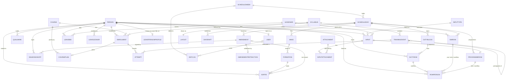

# Data model — the designed target

For the squadron's technical team, ahead of the shared-database step.
Target platform: **Dataverse**; the model below is relational and is written
so it can be built on any relational store. Date of this draft: 9 Sep 26.

> **The recommendation this document answers:** "Prior to deployment, the
> problem owner should work with relevant technical stakeholders to define the
> application's data model and database schema. This should include key
> entities such as syllabus structures, training events, students, progression
> records and scheduling data to support live data updates, multi-user access
> and long-term maintainability."

## 1. Purpose and how to read it

Two documents, two questions. `docs/data-schema.md` is the **as-is map**:
every record RAPTOR reads or writes today, taken from working code, including
its "Loose spots" and its "Suggested first cut of tables". This document is
the **to-be model**: the entities, keys and relationships the shared database
should hold, and the route from one to the other. Where they disagree, the
as-is map is the fact and this is the destination.

Four things are **already true on the branch** and are treated as done here:
the person identity is one identity (RAPTOR's `PEOPLE` id), and the Tracker
links its students to it through a bridge module plus a links record; every
Tracker mark and date write stamps who made it (`by`) and when (`at`, an ISO
instant); course, syllabus and student names may not contain a colon; and the
scheduler's shapes are declared in `src/engine/schema.ts`, proved for the
shipped seeds and the boot snapshot by a conformance test — those types are
this model's contract. Fields the app writes only after boot (a typed SC
in-time, a landed ground row's `src`, a puck row's `ids`) are declared from
their writers and are checked by that test's "after edits" block, which
exercises the writers rather than the seeds; the as-is map lists each with
its writer.

Everything else is **what the database step adds**: opaque ids in place of
names and positions, ownership and timestamp columns, a version for
concurrency, one date format, an explicit `Attempt` history behind the
Tracker's mark summary, and referential integrity across the seams the app
keeps in separate stores today.

Nothing here changes what a screen does. The app's own units (a week, a chart
layout) survive as JSON columns at stage 1 and normalise later, on the
schedule in section 6.

**When, and who writes the tables (owner, D473, 1 Oct 26):** the app goes into the database at the END, once its features
are built. This document is the table list: it is kept up to date in the same change as any feature that adds or alters
something the app saves, and at the end it is turned into the format the IT side asks for, for them to enter into Dataverse
(they no longer design the tables). The platform as they described it on 1 Oct 26 — no plug-ins or Custom APIs, Dataverse
functions and Power Automate flows, a reading limit of 2,000 rows PER REQUEST, WITH PAGING (their written reply the same day;
every large read is filtered on the server and asked for page by page) — is in `OUTSTANDING.md` `[IT-QUESTIONS]`; the
table list may be in any format a person can read, names anything that says what the table is for, the prefix theirs to
pick when the tables are made; §9's day lock (rule 8, §12 question 8) was designed with one plug-in and is redesigned for that platform
when the lock is built.

## 2. Design rules every entity follows

| Rule | What it means in the schema |
|---|---|
| Dataverse vocabulary | The model is written in the platform's own terms so a Dataverse builder can create it directly: an entity below is a **table**, a field a **column**, an enumerated value a **choice column**, a `ref X` a **lookup** to table X, and a link between two tables a **many-to-many relationship** — or, where the position in the list matters, a **junction table** listed under its own name. The logical names are the ones this document already uses; the publisher prefix is Open question 1. |
| Stable opaque id | Every table has an `id` primary key: a GUID (Dataverse's own row id). It is never a name, never a position, never a composite of either. Positional slot keys (`d:<day>.<section>.<index>`) and name keys (`course:syllabus:student`) both become derived addresses, not identity. |
| Ownership and time | `createdBy`, `createdAt`, `updatedBy`, `updatedAt` on every table. **On Dataverse these are the platform's own `createdby`, `createdon`, `modifiedby`, `modifiedon`**, written by the platform, never by the client; they reference the platform user, which `User` (section 3) maps to a `Person`. Said once here, not repeated per table. |
| Version | Integer `version` — **Dataverse's own `versionnumber`** — incremented by the store on every write and used for optimistic concurrency: the client sends the version it read as `If-Match` on every update, a mismatch is rejected, and the client re-reads (section 9). **The ack is not trusted**: a write is confirmed by reading the row back (or its returned version) and comparing, not by the transport's success. |
| Change feed columns | `changeSeq` (whole number, monotonic across every table, set by the store on each write) on every table, and `isDeleted` on every table as a **tombstone**: a delete is a write that sets it, so the change feed (section 9) carries removals as ordinary rows. A tombstone is purged only after the retention window (section 11). |
| One date format | ISO 8601 throughout: `yyyy-mm-dd` for a date, `yyyy-mm-ddThh:mm:ssZ` for an instant, UTC. The three conventions in the app today (`'Jul 13'` display strings, a 0–6 day index, minutes-from-midnight) stay inside the app; the storage door converts on the way in and out. Clock times inside a schedule day stay `HH:MM` strings — they are a time-of-day on a known date, not an instant. |
| Soft delete where history matters | `deletedBy`/`deletedAt` beside the tombstone on Person, Enrolment, Attempt, Input, Amendment, Attachment, LeaveBid — the tables the app can un-delete (undo) or must keep for history. `Person` is **never hard-deleted**, even after the retention window. Hard delete after the window is allowed only for rows with no history value (display preferences, draft rows never published). |
| Names are attributes, ids are identity | `Person.callsign`, `Course.name`, `Syllabus.name`, `Enrolment.studentName` are ordinary columns that can be renamed or masked without touching a foreign key. The colon guard shipped on the branch stays until stage 2 has moved the Tracker off name keys; after that it is a display rule only. |
| JSON columns, deliberately | A shape the app always reads and writes as one unit may live in a single JSON column: a day's snapshot (a week's, before the day lock — D355), a chart layout's geometry, an aircraft's stores options, a leave period's day/band definitions. **Normalise when something outside the app must query inside the shape** — a report, a Power BI view, a per-row permission, or two people editing different rows of it at once. That last case is why the schedule is stored a row per day from stage 1 (D355, the day lock) and normalises into rows at stage 2, and `Layout` does not. |

## 3. Entity catalogue

Each entity carries the common columns from section 2 (`id`, `createdBy`,
`createdAt`, `updatedBy`, `updatedAt`, `version`, `changeSeq`, `isDeleted`;
`deletedBy`/`deletedAt` where listed) — they are not repeated in the field
tables. A field marked **(new)** exists in neither the as-is map nor the
field inventory and is proposed here. Each entity names its **owning
module** (section 8): only that module writes it.

### Person

Owner: **Shell**. The one identity in the application. The scheduler
roster, the Leave War's projected roster and the Tracker's student link all
point at this row; no second identity is minted anywhere. **Never
hard-deleted** — `archived` and the tombstone are the only ways out. **— NARROWED 26 Sep 26 BY D287 (owner: "truly
delete him"): a man who leaves flying for good is DELETED — gone from every list; D297 (27 Sep 26): every day he
already flew keeps his puck, days still to come lose him. HOW the database does it — **answered 27 Sep 26, D290 ("hidden mark"): the tombstone below** — the row kept, marked
deleted, invisible everywhere; never erased. **BUILT 27 Sep 26 (`[POST-OUT-OUTCOMES]`): the mark is `deleted` + `deletedFrom`
below; the app's delete is `state/person-delete.ts`, reached from Admin → Users' "Delete account" and a posting out's
"Delete" on its date.**

| Field | Type | Req | Meaning |
|---|---|---|---|
| `id` | guid | yes | opaque. Today's short lowercase handle is kept as `legacyKey` for the import only |
| `callsign` | string | yes | the display name (`cs`) |
| `seat` | choice `FCP\|RCP\|GND` | yes | front cockpit / rear cockpit / ground. The one seat; the Leave War's `personedits.seat` override is dropped — and since D461 (30 Sep 26) the war has no Edit person at all: seat, band and SXO change only on Quals |
| `category` | choice `OCU,D,C,B,A,IW,IP,IR,FI` or empty | yes | the category ladder (`q`); ground crew hold empty |
| `sxo` | bool | no | SXO-qualified — changed only on Quals (D460, D461, 30 Sep 26: the Leave War's `personedits.sxo` copy goes, not folded in) |
| `initials`, `flight`, `remarks` | string | no | ground-crew extras; `initials`/`flight` are written for aircrew too |
| `isGroundPersonnel` | bool | no | `pers` — no flying quals derive |
| `isSentinel` | bool | no | `special` — `ALL`, `ALL AVAIL`; occupies slots, is not a person |
| `archived` | bool | no | kept out of every roster |
| `archivedOn` / `archivedWho` | date / → Person | no | how and when he came to be archived (D329): the date, and the admin who did it (none for a posting's archive); cleared on Restore |
| `archivedBy` | choice (`po`, `del`, `admin`) | no | who archived him: `po` the Post out's own archive, which the posting takes back; `del` a delete's (below); `admin` Archive on Admin → Users (`[ONE-DOOR]`, D310, D323 — only Restore there takes it back); empty = by hand before `[ONE-DOOR]` (26 Sep 26) |
| `back` | yes/no | no | his own "Welcome back — check your quals and CAT" is waiting (`[ONE-DOOR]`, D305): set by every Restore, cleared by him (`person.backSeen` — his own row) or by an Archive |
| `isDeleted` + `deletedFrom` | bool + date | no | **the delete's hidden mark** (D287, D290 — 27 Sep 26): `isDeleted` is the table's tombstone; `deletedFrom` is the first day he is gone — every day from it has lost him, every day before it keeps his puck (D297). Gone from every list and picker, the Archived one included; his callsign free; never restored (a delete is final) |
| `sansBy` | choice (`po`) | no | the SANS tick a posting out put on (D283), which the posting takes back; empty = ticked by hand (27 Sep 26) |
| `isExternal` | bool | no | (new) a visitor from another unit: enrolled on a course, never on the roster, the schedule or a leave war. Open question 7 of the first draft, decided |
| `isSans` | bool | no | `san` |
| `sansFlown`, `sansCarry`, `sansMissedQtrs` | int | no | `sanQ`, present only when `isSans` |
| `legacyKey` | string | no | the pre-migration `PEOPLE` id, import only |

Relationships: 1–n `QualMark`, `Enrolment`, `Input`, `LeaveBid`,
`LeaveLedger`, `LeaveOpening`; 0–1 `User`; 0–1 `LeavePersonProfile`;
referenced by every schedule row that seats a body.
From today: `PEOPLE[id]` — one stored row each since 30 Sep 26 (`raptor:people/<pid>`, with `ord` — the `sortIndex`; `[DB-READINESS]` group A, phase 2; `people/all` until then), plus Leave War's `Person`
projection. Its two per-person override records, `personedits` and
`postouts`, and the `perslabels` entry go to `LeavePersonProfile` (below),
except `seat` and `sxo`, which fold into this row.
App change: Leave War stops re-projecting a roster and laying two override
records on top — it reads identity from this row and its own extras from
its own table. `quals` is **not stored**: it stays derived at boot by
`deriveQuals`, from `QualMark` plus category.

### Qualification

Owner: **Shell**. The catalogue of qualification columns — the LoX column
list. Identity is the GUID `id`; `key` is an attribute, so a column can be
re-keyed without touching a mark.

| Field | Type | Req | Meaning |
|---|---|---|---|
| `key` | string | yes | `k`, the column key. Unique, but not the identity |
| `heading` | string | yes | `h`, the column heading |
| `lav`, `apt`, `scq`, `aar`, `fcpOnly` | bool | no | the column's behaviour flags |
| `sortIndex` | int | yes | display order |

Relationships: 1–n `QualMark`.
From today: the `qualcols` setting (`QualCol[]`); Leave War's `QualDef` is
the same list projected.
App change: the column list becomes a table rather than a settings blob, so a
mark can carry a real foreign key.

### QualMark

Owner: **Shell**. One granted qualification for one person — the ticks
under a LoX column.

| Field | Type | Req | Meaning |
|---|---|---|---|
| `personId` | ref Person | yes | |
| `qualificationId` | ref Qualification | yes | a lookup to the row, not to its `key` |
| `value` | choice `held\|instructor` | yes | `true` or `'I'` today (`daar`/`naar` may be instructor) |
| `grantedBy`, `grantedAt` | ref User / datetime | no | who ticked it (currently unrecorded) |

Relationships: n–1 `Person`, n–1 `Qualification`. Unique on
(`personId`, `qualificationId`).
From today: the boolean fields on the PEOPLE record (`tf`, `sched`, `scDay`,
`scNight`, `daar`, `naar`, `sxo`, `san`) — granted marks, never derived ones.
App change: granted marks move off the person row into their own rows.
`deriveQuals`' ladder invariants (night signed off after day; an instructor
night mark outrunning its day one is demoted) run unchanged on the derived side.

### Course

Owner: **Tracker**. A training course, e.g. an OCU intake.

| Field | Type | Req | Meaning |
|---|---|---|---|
| `name` | string | yes | today the free-text name, used as a storage key |
| `sortIndex` | int | yes | the `courses` array order |
| `archived` | bool | no | (new) — retires an old intake without deleting its history |

Relationships: 1–n `Enrolment`, 1–n `CoursePlan`.
From today: `students.courses[]` and the per-course key prefix in
`raptor:tracker/v3:<course>:…`. **Stored one row per course since 30 Sep 26** (`[DB-READINESS]` group A phase 5b —
D462): `raptor:tracker/v3:master:course:<id>` = `{ id, name, ord, deleted? }` — `ord` is `sortIndex` (decimal; the
order is `(sortIndex, id)`), and a course deleted in the app (D128 — its records kept, ↺ Restore brings it back) is the
same row with `deleted: true` (the `archived` column).
App change: renaming a course becomes one column write instead of moving
eight storage keys. (Done: a rename writes that one row.)

### Syllabus

Owner: **Tracker**. One chart — an ordered set of training events with a
drawn layout.

| Field | Type | Req | Meaning |
|---|---|---|---|
| `name` | string | yes | the chart name (today the object key) |
| `sortIndex` | int | yes | `charts.order` position |
| `isBuiltIn` | bool | yes | shipped chart vs one drawn in the app |
| `aliasOfId` | ref Syllabus | no | `SYL_ALIAS` — a renamed built-in |
| `hidden` | bool | no | `SYL_HIDDEN` |
| `tombstoned` | bool | no | `SYL_TOMB` — a built-in removed by the squadron |

Relationships: 1–n `TrainingEvent`, 1–1 `Layout`, 1–n `Enrolment`.
From today: `charts.syllabi[name]`, `charts.order`, and the alias/hidden/tomb
registers. **Stored one row per chart since 30 Sep 26** (`[DB-READINESS]` group A phase 5b — D462):
`raptor:tracker/v3:master:chart:<id>` = `{ id, name?, base?, userNamed?, ord?, hidden?, tomb?, def? }` — the chart's
catalogue entry (`name`; `base` = the shipped chart a built-in draws from, so `isBuiltIn`; `userNamed` = renamed by the
squadron), its place (`ord` = `sortIndex`), `hidden`, `tomb` (`tombstoned` — a built-in deleted by the squadron, which
has no name then), and **its events as JSON at stage 1** (`def` — only for a chart drawn or edited in the app; an
untouched built-in reads its shipped events). `aliasOfId` is retired (a rename keeps the id).
App change: a syllabus can be referenced by id from an enrolment, so a rename
no longer has to rewrite marks and rosters.

**One chart, shared — and marks belong to the student (owner, D474, 1 Oct 26):** a syllabus is ONE row every course on it
reads; an edit to it reaches every course and every student on it, and is a change to rows (this one, its `Layout`, a
ball's typed details) — never a new table and never a copy per course. Marks hang on the `Enrolment` and the event's fixed
code, so moving, redrawing or re-wording a ball leaves them where they are; a new ball shows ungraded for everyone on the
chart; deleting a ball removes its marks for everyone on it (D124). A variant for one course is a Duplicate.

### TrainingEvent

Owner: **Tracker**. One event on a chart: what it is, where it sits, and
what must precede it.

| Field | Type | Req | Meaning |
|---|---|---|---|
| `syllabusId` | ref Syllabus | yes | |
| `code` | string | yes | the event's code — today the event `id` within the chart |
| `type` | string | yes | event type (`type`) |
| `phase` | string | yes | chart phase (`phase`) |
| `sequence` | int | yes | `seq` — order within the phase |
| `name` | string | no | from `eventInfo[syllabusId][eventId].name` over the chart's shipped wording |
| `format` | string | no | from `eventInfo[syllabusId][eventId].fmt` over the shipped wording |
| `hours` | decimal | no | from `eventInfo[syllabusId][eventId].hrs` over the shipped wording, **stored as a number** |

Relationships: n–1 `Syllabus`; self-relation through `EventPrerequisite`
(`eventId`, `prerequisiteEventId`, both ref TrainingEvent, unique together) —
the `prereqs` string array today; 1–n `Attempt`.
From today: `charts.syllabi[name][i]` = `{ id, type, seq, prereqs, phase, _b }`
plus `charts.eventInfoBySyl`. `_b` is drawing state and moves to `Layout`.
**Details are per chart since 23 Sep 26 (D126)** — a detail typed on one chart
never shows on another chart with the same code, which is exactly the row this
table already is (one TrainingEvent per syllabus + code).
App change: the event's details stop living in a second container keyed by
chart and event id; `hrs` stops being free text. **At stage 1 (30 Sep 26, `[DB-READINESS]` group A phase 5b — D462,
D464):** a chart's events ride its `Syllabus` row as JSON; what the squadron TYPED on a ball is its own row,
`raptor:tracker/v3:master:info:<sylId>:<ball code, URI-encoded>` = the typed fields `{ name?, fmt?, hrs?, crew?, pre? }`
over the chart's shipped wording — one row per chart and ball, so two people typing on two balls of one chart both
keep their work.

### Enrolment

Owner: **Tracker**. A person on a course, on a syllabus. **This replaces
the Tracker's roster string list and the links record shipped on this
branch.**

| Field | Type | Req | Meaning |
|---|---|---|---|
| `courseId` | ref Course | yes | |
| `syllabusId` | ref Syllabus | yes | |
| `personId` | ref Person | yes at target | the link. Nullable during migration only — an unlinked student exists today and imports with null. A visitor from another unit is a `Person` with `isExternal`, not a null link (decided; see Person) |
| `studentName` | string | yes | the typed callsign; today the key, from here a display attribute |
| `sortIndex` | int | yes | roster order |
| `lastSyllDate`, `lastCurrDate` | date | no | `dates[student].lastSyll` / `lastCurr` |
| `downDays` | int | no | `dates[student].downDays` |
| `upchitDate` | date | no | `dates[student].upchit` |
| `lastEditedBy`, `lastEditedAt` | ref User / datetime | no | the `by`/`at` stamps already written on this branch |
| `isDeleted` | bool | yes | soft delete — removing a student must not lose their attempts |

Relationships: n–1 `Person`, `Course`, `Syllabus`; 1–n `Attempt`; 0–1
`CoursePlan`. Unique on (`courseId`, `syllabusId`, `personId`).
From today: the roster key `v3:<course>:<syl>:roster` — an array of
`{ id, name, pid? }` since 10 Sep 26 — the `dates` container keyed by that
id, and `pid` (the person). The row's id IS the entry's `id` (the
migration key); `studentName` is `name`; `personId` is `pid` (null where
the student was typed). The 9 Sep 26 `v3:links` record is already folded
into `pid` by the app's own migration and is gone from every converted
browser. App change: none — the re-key is done. **Stored one row per enrolment since 30 Sep 26** (`[DB-READINESS]`
group A phase 5b — D462): `raptor:tracker/v3:<course>:<syl>:enr:<id>` = `{ id, name, pid?, ord }` (`ord` =
`sortIndex`) — two people adding students to one course and chart at once both keep theirs.

### Attempt

Owner: **Tracker**. **The progression record.** One try at one event by one
enrolled person. This is the history the Tracker's current `{ g, f, fd, d }`
summary is derived from — today only the summary is stored.

| Field | Type | Req | Meaning |
|---|---|---|---|
| `enrolmentId` | ref Enrolment | yes | |
| `eventId` | ref TrainingEvent | yes | |
| `attemptDate` | date | no | today the `d` (done) or one entry of `fd` (failed). **Nullable**: a counted failure with no date (`fd` holds `null`) imports as an attempt with no date |
| `dateUnknown` | bool | yes | `true` when `attemptDate` is null because the date was never recorded — distinguishes "unknown" from "not yet filled in" |
| `outcome` | choice `pass\|fail\|marginal\|na\|incomplete` | yes | the one outcome column. Today's data yields only `pass` (the `d` date) and `fail` (an `fd` entry); the other three are held for grading the Tracker does not do yet |
| `grade` | int | no | the grade `g` (0 = none); carried on the passing attempt |
| `attemptNo` | int | yes | (new) 1-based order within (`enrolmentId`, `eventId`) |
| `recordedBy`, `recordedAt` | ref User / datetime | yes | the `by`/`at` stamps already written on this branch |
| `isDeleted` | bool | yes | a corrected attempt is retired, not erased |

Relationships: n–1 `Enrolment`, n–1 `TrainingEvent`.
From today: `marks[student][eventId]` = `{ g, f, fd: [iso…], d: iso }`, one
record per event holding a count and a list of dates.
App change: the one genuinely new shape. It makes "how many attempts, on what
dates, recorded by whom" answerable — what a progression report needs. See
the Open questions on whether it is required from day one.

**One write path.** The Tracker keeps writing the summary it knows; the
store owns the translation. `applySummary(enrolmentId, eventId, summary)` —
`summary` being today's `{ g, f, fd, d }` — is the **only** way `Attempt`
rows are created, retired or restored, and undo/redo goes through it too (an
undo re-applies the earlier summary; it never edits an `Attempt` row by
hand). The function diffs the summary against the live rows: a new `d`
becomes a `pass` attempt carrying `g`; a new `fd` entry a `fail` attempt
(null date + `dateUnknown` when the entry is `null`); a removed entry
retires its row with `isDeleted`; a re-added one restores it. Two callers
writing attempts two ways is exactly the drift seam the robustness doctrine
forbids.

### ProgressionSummary (a view, not a table)

The Tracker's mark record, derived. Read-only; the app writes `Attempt`
through `applySummary`.

| Column | Derivation |
|---|---|
| `enrolmentId`, `eventId` | group key |
| `grade` (`g`) | `grade` of the latest live attempt with `outcome = pass`, else 0 |
| `failures` (`f`) | count of live attempts with `outcome = fail` |
| `doneDate` (`d`) | `attemptDate` of the latest live `pass` attempt |
| `failDates` (`fd`) | `attemptDate` of the live `fail` attempts in `attemptNo` order, `null` where `dateUnknown` |
| `by`, `at` | `recordedBy`/`recordedAt` of the latest live attempt |

"Live" = not `isDeleted`. `marginal`, `na` and `incomplete` do not reach the
summary — the Tracker has no cell for them yet — so an `applySummary`
round trip leaves them untouched.
From today: `marks[student][eventId]` — the app's mark record **is this
view**. Keeping the shape identical lets the Tracker's screens, undo/redo
snapshots and the export file stay as they are while the history underneath
becomes real.

### CoursePlan

Owner: **Tracker**. Pace, lull periods and target dates for an enrolment.

| Field | Type | Req | Meaning |
|---|---|---|---|
| `courseId` | ref Course | yes | |
| `enrolmentId` | ref Enrolment | no | null = the course-wide plan (`plan`) |
| `pace` | JSON | no | the per-student `pace` record |
| `lulls` | JSON | no | the per-student `lulls` record |
| `targets` | JSON | no | target dates carried in `plan` |
| `currentSyllabusId` | ref Syllabus | no | `plan.sylName` |

Relationships: n–1 `Course`, 0–1 `Enrolment`.
From today: `students.byCourse[course].plan`, plus the per-course `pace` and
`lulls` keys.
App change: pace and lulls stop being cleared by hand when a student leaves
their last syllabus — the relationship does it.

### ScheduleWeek

Owner: **Scheduler**. One week of the flying programme. **Stage 1 (29 Sep 26, for the day lock — D355, section 9): a
small week row, plus one `ScheduleDay` row per day holding that day as a JSON snapshot. Stage 2: the parent of the row
tables below.** A day, not the week, is what a scheduler takes and what the store saves, so two schedulers on two days
of one week never write the same row.

| Field | Type | Req | Meaning |
|---|---|---|---|
| `weekStart` | date | yes | the Monday, ISO. Unique |
| `formatStamps` | JSON | yes | the week-wide format versions the persisted record carries today (`v` — `SCHED.ridV`, `am` — `SCHED.amV`): written when the week is created and by a format upgrade, **never by an edit to a day** |
| `ownedBy` | ref User | yes | (new) who created the week — needed before incoming sync (section 7) |

**The rule that makes the split work (revised 29 Sep 26 after the red team — Astra 3, 4; Fable 1–3, 5, 7, 12):**
nothing a scheduler does while holding a day writes the week row, and **nothing but the day's holder ever writes the
day's row**. Every field of today's persisted week record (`weekStashSnap()`, `state/store.ts`) is placed as follows:

- **Into that day's row:** the day itself (`d[di]`); every `SCHED` map keyed by day index (`ok`, `sg`, `sb`, `cv`,
  `dr`, `cd`, `cr`); every map keyed by slot key, split by the day the key names (`c`, `p`, `ad` — `keyDay()`);
  the muted warnings (`wo` — `warnMuteKey` leads with the day) — **confirmed by D469 (owner, 1 Oct 26): a hidden warning is
  kept with its day, for everyone, until someone unhides it** (so `wo` is part of the day's row, and a hide is the day
  holder's write like any other). *Built 1 Oct 26 (`[WARN-HIDE-KEPT]`): a column of text keys on the day row, each
  `<day index>|<rule>|<person ids>|<words with callsigns folded to ids>`; and each issued version (the `Amendment` row's
  stored warnings, `w`) keeps the keys it went out with (`w.wo`) and its marks as shown (`w.shown`) — D471: a hide on a
  published day waits for the next amendment.* The working sign-offs travel here (Sign-offs, above).
  *(Corrected 30 Sep 26, `[DB-READINESS]` group A phase 1 — plan §2.5, §4: `o` and `rt` are NOT in the day row. The
  Original is issuance 0 of its version and each amendment its own issuance — one `Amendment` row each; a withdrawn
  one keeps its row and gains an `AmendmentRetraction` row beside it. `rt` is keyed by version (`<verId>~<n>`), not by
  day.)*
- **Not stored at all — worked out on read:** the removed-input list (`un` — a cache of `Input.acc` and not-landed,
  Fable 7), the input landings' pending marks (`inp:` — nothing writes one since 30 Sep 26, `[DB-READINESS]` group A phase 6 (b):
  the filing axis counts a filing), and every other effect of a record the holder does not own
  (the day lock, rule 9).
- **Into its own tables, outside any day:** the planning calendar (`PLANPUCKS`, `DAYRMK` — Fable 1): planning pucks and
  day remarks go on ANY date from the Inputs month view, weeks ahead, with no day held — `PlanningPuck` and `DayRemark`
  below. The issued versions and their signatures: `Amendment`, `IssuedSignoff` (above) — the Original (`o`) and every
  amendment (`a`), each one issuance row written once; every Unpublish (`rt`) one `AmendmentRetraction` row.
- **Kept on the week row:** the two format stamps (`v`, `am`). **Dropped:** `SCHED.al` (no reader).

**Built 30 Sep 26 (`[DB-READINESS]` group A, phase 1 — `state/weekrows.ts`).** The stored ids hang off the week's id
(`dd-mm-yyyy`): `weeks/<wk>` the week row, `weeks/<wk>#<di>` a day row, `weeks/<wk>:is:<verId>~<n>` an issuance (n = how
many times that version had been withdrawn before it went out — today's `SCHED.retired` keys less one; `reissue` in
`Amendment`), `weeks/<wk>:rx:<verId>~<n>` its retraction. A version id carries a `#`, so an id is read issuance-first.

**At the build, a test proves the split:** a week record split into its rows and joined back is byte-identical; a key
or field that names no single day fails it; a change on one day produces exactly one day write. *(Built 30 Sep 26:
`state/weekrows.test.ts` — split then join gives the week back, join then split the same bytes;
`state/weekrows-store.test.ts` — one edit writes one day row, a move two.)*

**The same grain above the store (Fable 3).** The command layer's records (`state/sched-commit.ts` `decompose`) split
the same way: `sched.book/<wk>` becomes one book record per day (`sched.book/<wk>#<di>`, the day's slice of `c`, `p`,
`ad`, `ok`, `sg`, `sb`, `cv`, `dr`, `cd`, `cr`) and `sched.mutes/<wk>` one per day; `v` and `am` alone stay week-wide.
So an Undo step names days, and another person's change on another day never blocks it (D148; section 9, rule 11).
*(Built 30 Sep 26, `[DB-READINESS]` group A phase 1: also `sched.week/<wk>` (the stamps) and, replacing `sched.orig`,
`sched.als` and `sched.retired`, `sched.issuance/<wk>:<verId>~<n>` — every issued version, written once — and
`sched.retraction/<wk>:<verId>~<n>` — every Unpublish beside it. Proven red first: another person's Tuesday change had
blocked his Undo of Monday through the one week-wide book record; `state/sched-dayrecords.test.ts`.)*

**What the adapter writes (Astra 3, Fable 2).** The adapter does not infer intent from whole records: it takes the
command layer's write set — which day records a command changed — and sends **one all-or-nothing changeset per
command**, holding every changed day row with the version read, **and never a day the session does not hold** (a local
difference on an unheld day is a bug, logged, not sent). The week row goes only when its stamps changed, so a publish
never sends it (Fable 12); a format upgrade that rewrites every day runs only as an admin holding all seven days, or as
a server job.

Relationships: 1–n `ScheduleDay`.
From today: **stored as these rows since 30 Sep 26** (`[DB-READINESS]` group A, phase 1): each command's changes to a
week are written as exactly the rows they touched, inside its one saved group (`state/persist.ts`, through the stream
consumer `state/rowmap.ts`); a week's first save writes its week row and ONLY the days it changed — a day no one has
saved has no row and reads as the week untouched (a blank day on a shared store; the group-wide walk's finding H3, 30 Sep 26: a first save of all
seven days from the saver's copy wiped another person's day of the same new week, and would save days the saver does not
hold, D450) — and a week load's landing is saved only onto days already saved; a pristine seed week is never written; a row is removed only by an explicit delete (an Undo of a publish or of an Unpublish). **The
reconcile that deleted every stored week the browser did not hold is GONE** (it was correct for one browser and
destructive once shared). A week switch writes nothing of the week left, and NOTHING of the week arriving: its landing
pass (worked out by the load itself since 1 Oct 26 — no command at all, phase 6 (c); one `sched.load` command before) is worked out again at every load, and so is the boot's (the group-A final read, Fable F2 and F1, 30 Sep 26: saving it wrote this browser's copy of rows another person may have changed, and made a member's browser the writer of days a member may not write — the plan's phase 6(c) direction, a landing worked out on read); a day the landing
touched is saved, landing and all, with the first command that changes it. A week that will not read, or was published
by an older build, loads read-only and its rows are never rewritten.

*The stage-1 whole-week snapshot this entry described before 29 Sep 26 is in `docs/archive/data-model-2026-09-29.md` (replaced for the day lock, D355).*

### ScheduleDay at stage 1 — the day, and its lock

**Revised 29 Sep 26 (D450 — the lock is firm; round 1 Fable 16, Astra 2; round 2 Fable 1, Astra 1):** the lock is
columns of the day row, made firm by two layers together:

1. **Row ownership.** `ScheduleDay` is a user/team-owned table. The holder OWNS the row; a free day is owned by the
   **free team**, of which every scheduler is a member. Schedulers have Read at Organization depth and **Write and
   Assign at User depth only**, so nobody can save a day he does not own, and a free day is taken by an ordinary update
   of its owner sent with the version read. **The free team is an OWNER team** (not an access team), given a security
   role with Read on `ScheduleDay` at Organization depth and nothing else — the platform refuses to give a row to an
   owner who cannot read it (round 3, Fable 1).
2. **One small server-side check** — the only custom code the lock needs, in two parts (round 3, Astra 1): a
   **synchronous plug-in registered on every `ScheduleDay` update and change of owner** (and, at stage 2, on every create,
   update and delete of a child row), which no app role may bypass, so even a direct write from the holder's own stale
   tab meets it; and **Custom APIs running as SYSTEM** for the actions a caller cannot do himself — a take-over, the
   take of an idle day, answering or forcing a take-over request. Every change of holder goes through it — a take-over, the take of a day idle 30 minutes, a
   take-over request that ran out (section 9, rule 7) — because Dataverse gives no way to hand a row from one person to
   another without a permission that would also let him save it. And on **every** save to a day it checks the caller's
   `leaseId` and `sessionId` still match (ownership alone cannot tell two tabs of one person apart, nor notice that 30
   minutes have passed) and stamps `touchedAt` with the server's clock. Its rules, in one place, are section 9's. At stage 2 it guards every child row's write by
   its parent day the same way. **It runs as the SYSTEM account** (the plug-in step's user context set to SYSTEM, or the
   Custom API acting as it), so it can change an owner the caller cannot, and reads the caller from its execution
   context for its own rules — admin, lease, session (round 3, Fable 2).

**Platform settings the technical team fixes at build (they cannot be changed afterwards without rework):**
`ShareToPreviousOwnerOnAssign` = false (else a take-over leaves the old holder able to write); every relationship from
`ScheduleDay` — to `Amendment` and on to `IssuedSignoff` — is **Referential, Assign = Cascade None** (else every take
would hand the day's issued versions to the new holder too). A new admin made on Admin → Users joins the free team — the
technical team says how (Open question 8).

| Field | Type | Req | Meaning |
|---|---|---|---|
| `weekId` | ref ScheduleWeek | yes | |
| `dayIndex` | int | yes | 0–6. Unique on (`weekId`, `dayIndex`) |
| `date` | date | yes | ISO |
| `snapshot` | JSON | no | the day and every field of the week record that belongs to it (above), with the scheduler's decisions on the inputs that land on it (section 9, rule 9 — at stage 2 those decisions move to `ScheduleInputPlacement`, below, never lost with the snapshot). **No row = the day untouched** — a day no one has saved is not stored; it reads as the week before any save (a blank day on a shared store — the group-wide walk's finding H3, 30 Sep 26) |
| `ownerid` | ref User / team | yes | the platform's owner: the holder, or the "free" team |
| `leaseId` | guid | no | a new id at every take, so a stale session of the same person is refused (Astra 2) |
| `sessionId` | string | no | the browser tab that took it (a random id kept per tab), so only that tab's closing releases it (Fable 9) |
| `takenAt` | datetime | no | when the holder took it — the take-over dialog says it |
| `takenOverFrom` | ref User | no | set by a take-over, cleared at the next take — drives the old holder's message |
| `touchedAt` | datetime | no | the holder's last change, stamped with the SERVER's clock by the server check on every save and on Keep editing — what "idle 30 minutes" is measured from |

**Idle is measured from `touchedAt`**, stamped by the server check — never from `modifiedon`, which a take, a
take-over or (at stage 2) a child row's write would not move truly (round 2: Astra, over Fable 14's first decline).

**Created together (Fable 5):** a week's `ScheduleWeek` row and its seven `ScheduleDay` rows (snapshot null, owned by
the free team) are created in one batch by the first take or the first save of that week; `weekStart` and (`weekId`,
`dayIndex`) are unique, so a second creator's batch fails and it re-reads and takes as normal. Admin → Data's clear of a
week tombstones the week and its days together, as an admin holding all seven.

**Size:** a Dataverse multi-line text column holds about a million characters; a day of the demo week is far below it —
to be measured on the squadron's busiest real day before the tables settle. At stage 2 the same row gains the columns
of the ScheduleRow family below and its snapshot empties.

**`ScheduleInputPlacement` (stage 2 — round 2, Astra 3):** one row per (`scheduleDayId`, `inputId`), unique — `state`
(`landed` | `takenOff`), `rowId` (the row it landed as), `sortIndex`, `overrides` JSON (the scheduler's times, remarks),
`sourceInputVersion`. The scheduler's, lock-protected like the day. Without it an input a scheduler took off would land
again once the stage-1 snapshot empties.

### PlanningPuck, DayRemark — the planning calendar (new 29 Sep 26, Fable 1)

Owner: **Scheduler**. The Inputs page's planning layer — `PLANPUCKS`, `DAYRMK`: one stored row per note or pucks row (`plan/pp:<id>`, with `ord`) and per day title (`plan/dm:<iso>`) since 30 Sep 26 (`[DB-READINESS]` group A, phase 2; one global record `plan/all` until then).
**No lock** (section 9, rule 10): one record each, reject-and-reload.

- **`PlanningPuck`:** `date` (ISO), `personIds` — the list as the app keeps it, **gaps kept** (a deleted man leaves a
  gap, never a splice — `state/person-delete.ts`), `sortIndex`.
- **`DayRemark`:** `date` (unique), `text`.

### ScheduleRow family

Owner: **Scheduler**. The stage-2 normalisation of a week. Every row gets a
**stable id** and a `sortIndex`; the positional slot key becomes an address
derived from the ids, so inserting a row no longer renumbers the ones after
it. **The id half is done (10 Sep 26):** every row already carries `rid`
(`engine/rowids.ts`), minted before the first baseline, kept by moves, undo
and restores, re-minted on a copy — that is the migration key for every row
table below. Still to do: the address derived from the ids (`keys.ts`, the
amendment book, the edit log) and the `Attempt` history. Every row also carries `pendingSince` (datetime, set by an edit, cleared
at issue — today `SCHED.pending[key]`) and `changedFrom` (ref Amendment,
nullable — the AL this row was last issued under, today `SCHED.changes[key]
= n`, cleared when the row is edited again), so "what is pending" and "what
did AL 3 change" are queries, not a book beside the week.

| Entity | Parent | Key fields |
|---|---|---|
| `ScheduleDay` | ScheduleWeek | `dayIndex` 0–6, `date`, `dayOfWeek`, `flyingTally` (`wc`), `notes` string[], `programmeNotes`, `dutyNotes`, `simNotes`, `groundNotes`, `sectionOrder` string[] (absent = canonical), `groundManualOrder` (`gman`), `approved` (`dayOK`), `shownAmendmentId` (ref Amendment, null = the original — `cur`), `original` JSON (`orig`, the day as first published) |
| `DayDraft` | ScheduleDay | `blob` JSON (one alternate draft of the day — `SCHED.drafts[di][i]`), `isLive` (`curDraft`), `sortIndex` |
| `Wave` | ScheduleDay | `label`, `night`, `inTimes` string[], `traffic` string[], `standalone`, `kind` (`sc\|avalon\|bb`), `noConflictCheck` (`noconf`), `sortIndex` |
| `Formation` | Wave | `callsign` (`cs`), `mission` (`msn`), `shift`, `takeOff` (`to`), `land` (`ld`), `inTime` (`br`), `area`, `areaTime` (`atime`), `cancelled` (`cx`), `cancelReason` (`cxr`), `sortIndex` |
| `Sortie` (seat pair) | Formation | `frontSeatPersonId` (`p`), `rearSeatPersonId` (`w`), `area`, `remarks` (`rmks`), `stores` JSON (`opts`), `spare`, `role` (`MAIN\|SPARE`), `cancelled`, `cancelReason`, `flag`, `sortIndex`. No spare-aircraft column: the engine's `spareAcs` is rebuilt from `spare` rows on every validate, never stored |
| `DutyBlock` | ScheduleDay | `label`, `forWave` (`sa`), `noConflictCheck`, `sortIndex` |
| `DutyRow` | DutyBlock | `role`, `personId` (`id`), `start` (`str`), `end`, `cancelled`, `cancelReason`, `flag`, `sortIndex`; overflow crew (`more`) in `RowPerson` |
| `SimRow` | ScheduleDay | `kind` (`amt\|oft`), `label`, `start`, `end`, `remarks`, `frontSeatPersonId`, `rearSeatPersonId`, `whoText` (free text such as `EXT SQN`), `cancelled`, `cancelReason`, `flag`, `sortIndex`; the `pax` list, a `who` that is an id, and overflow crew in `RowPerson` |
| `ProgrammeRow` | ScheduleDay | `section` (`allhands\|ground`), `item` (`prog`), `start`, `end`, `whoText` (free text), `cancelled`, `cancelReason`, `infoOnly` (`info`), `flag`, `sourceInputId` (ref Input), `sortIndex`; a `who` that is an id or a list, and overflow crew in `RowPerson` |
| `RowPerson` | DutyRow / SimRow / ProgrammeRow | the junction table for every list of people a row carries: `rowId` (a lookup to exactly one of the three row tables), `personId` (ref Person), `slot` choice `who\|pax\|more` (which list: the named crew, a sim's pax box, or the overflow `more[]`), `position` int (order within the list). Unique on (`rowId`, `slot`, `position`) |

Relationships: as the parent column shows; every `*PersonId` is a
`Person` lookup. No row stores an array of person ids — a list is
`RowPerson` rows, and free text that is not a person is `whoText`.
`sourceInputId` is a real lookup: today's `src` is not an input id but the
input's content key (`inpKey`: `person|date|type|start|yr`, `engine/slots.ts`),
which the migration resolves to the one `Input` row it names — an
ambiguous key (two inputs with identical content) is reported, not guessed.
From today: the nested `DAYS[0..6]` structure — `waves[].formations[].aircraft[]`,
`sims.{amt,oft}[]`, `dutywaves[].rows[]`, `allhands[]`, `ground[]`, plus the
publish book's per-key maps.
App change: `keys.ts`' key remapping becomes an id lookup — the as-is map's
third loose spot, and stage-2 work.

### Input

Owner: **Scheduler**. One filed absence or activity — leave, medical, an
appointment, duty, SANS availability.

| Field | Type | Req | Meaning |
|---|---|---|---|
| `personId` | ref Person | yes | |
| `startDate`, `endDate` | date | yes / no | ISO. Today `date` is a `'Jul 13'` display string with a separate `yr`; both are replaced by one ISO date |
| `allDay` | bool | yes | |
| `startMinutes`, `endMinutes` | int | no | `s`/`e`, minutes from midnight; required together when not all-day; `end < start` legitimately crosses midnight |
| `half` | choice `am\|pm` | no | half-day marker |
| `typeCode` | ref InputType | yes | the catalogue code |
| `remarks` | string | no | may be empty; absent on the seed SANS rows today |
| `modifiedAt` | datetime | yes | `mod` — drives the late-input mark. Today the Inputs page and the Leave War sync write the literal `'now'`, which the reader resolves to today's date; **the storage door resolves it to a real instant on the way in** — a stored `'now'` would read as "modified today" for ever |
| `acceptance` | choice `ground\|unavailable\|removed` | no | `acc` = `g\|u\|r`; absent = never landed |
| `leaveWarId` | ref LeaveWar | no | `lw` — PROVENANCE since [ARCH-STACK] step 4 (20 Sep 26): "approved in war W". Null = filed on the Inputs page. A member's own date/type/person edit clears it (owner, 19 Sep 26). No longer a sync loop-breaker — there is no copy to break a loop in |
| `movedFrom` | JSON | no | `lwMoved`: per covered ISO date, the date it was moved from by a closed-bidding move on the war — keeps the dotted "moved" mark through edits and undo |
| `oilCredit` | JSON | no | `oil`: ISO date → `0 \| 0.5 \| 1` |
| `sansEvents` | JSON | no | `sans`: which of Fly / OFT / AMT are offered |
| `handCount` | int | no | `hand` — how many times the request has changed hands (+1 at every change of person; absent = 0). An OIL decision about it records the holding it was made under (the day's `oild.pa`) — `[DB-READINESS]` group A phase 6 (a), 30 Sep 26 (section 9 rule 9) |
| `leftAt` | JSON | no | person id → the holding at which the request LEFT him — written by the hand-over; an OIL decision about him made under an earlier holding reads as nothing, so a hand-over writes no day (phase 6 (a)) |
| `filedBy` / `filedAt` | FK → Person / datetime | no | `by` / `at`: who PLACED it and when (owner D629, 7 Oct 26) — the signed-in person who filed it, who can differ from `personId` (an admin filing for a member; the approver of a leave on the Leave War). Set once at creation; a piece the app cuts from a record carries that record's. Null on a record filed before the fields existed. NOT the platform's own created-by column: Undo and Redo re-make a record and must give these back as they were |
| `changedBy` / `changedAt` | FK → Person / datetime | no | `modBy` / `modAt`: who last changed it and when; equal to `filedBy` / `filedAt` on a record nobody has changed; `changedBy` null when the last change was the app's own act (a posting that ran on its date). Beside `modified` (the DATE the late rule reads), never instead of it. NOT the platform's modified-by column, for the same reason |
| `groupId` / `groupFiledBy` | text / FK → Person | no | `grp` / `grpBy`: an input filed for SEVERAL people (owner D654, D655, 7 Oct 26) is one row per man — the shape of this table does not change, and there is no group table. `groupId` is a plain text id, the same on every row of one group filing; `groupFiledBy` is the entry's filer, the same on every row of the group, set once. Both null on an ordinary input, never one without the other. What the app shows as "one shared input" is the rows sharing a `groupId` AND the same type, dates, times and remarks. The server holds two rules at the write: no two live rows of one `groupId` for the same person with the same type, dates, times and remarks; every row of a `groupId` carries the one `groupFiledBy`. A member's right over a row he filed for another man reads `filedBy` or `groupFiledBy` (§11) |
| `isDeleted` | bool | yes | undo can resurrect an input |

`InputType` is a reference table, not free text: `code` (PK), `group`
(`leave\|med\|upchit\|act\|duty\|sans`), `name`, and the flags `work`,
`local`, `ground`, `half`, `shiftHard`. The shipped catalogue (`LL`, `OL`,
`OIL`, `CCL`, `PL`, `FCL`, `EL`, `CL`, `HL`, `OML`, `ATT B`, `ATT C`,
`Upchit`, the eight activity codes, `OD`, `SANS Availability`) is seeded
into it and is the source of truth for what a type means.

Relationships: n–1 `Person`, n–1 `InputType`; n–n `Attachment` through
`InputAttachment` (`inputId`, `attachmentId`) — today `docId` / `docIds`;
0–1 `LeaveBid` per covered day.
From today: `INPUTS[]` — one stored row per request since 30 Sep 26 (`raptor:inputs/<iid>`, with `ord` — the `sortIndex`; `[DB-READINESS]` group A, phase 2; `inputs/all` until then), addressed by `iid`.
App change: inputs stay global rather than week-scoped, as they already are.
The display date and `yr` fold into one ISO date at the storage door.

### Amendment (one issued version of one day)

Owner: **Scheduler**. **Rewritten 29 Sep 26 from the day-lock red team (Astra 1, Fable 19) to the record the app has
issued since the amendment core's Phase 2 (`engine/publish.ts`, the head of `SCHED`):** every issuance is ONE day's —
the Original or an amendment (ALn) — numbered on that day's own track (Monday AL1 and Tuesday AL1 are both legal).
**Append-only**: no column of an issued row is ever updated, and none is ever deleted; a correction is the next AL, and
an Unpublish writes an `AmendmentRetraction` row beside it (below) — the issued row itself is never touched.

| Field | Type | Req | Meaning |
|---|---|---|---|
| `scheduleDayId` | ref ScheduleDay | yes | the day it issues |
| `sequence` | int | yes | `seq` — 0 is the Original, 1 is AL1 … (the day's own track) |
| `versionId` | string | yes | `id` = `verId(iso, seq)` — the immutable name the app keys everything on |
| `reissue` | int | yes | 0 for the first issuance under this `versionId`; 1, 2 … for a same-label reissue after an Unpublish (today's `SCHED.retired` keys `<verId>~<n>`), so a reissue never overwrites the one before |
| `snapshot` | JSON | yes | `snap` — the day as issued (`d`, its book slice `c`, the filing `fil`). **Required** — it is the document the squadron signed |
| `diff` | JSON | yes | the canonical change against the version before, frozen at issue (replaces the old `keys` list) |
| `issuedBy`, `issuedAt` | ref User / datetime | yes | who pressed Publish, and when |

Unique on (`versionId`, `reissue`). Relationships: n–1 `ScheduleDay`, 1–4 `IssuedSignoff`, 0–1 `AmendmentRetraction`.

**`AmendmentRetraction`** (append-only): `amendmentId` (unique), `retractedBy`, `retractedAt` — written by an Unpublish,
in the same changeset as its day. An organisation-owned table like `Amendment`, so any admin may write it (create only).
From today: `SCHED.als[]` (the live issuances) and `SCHED.retired` (the retracted ones), both inside the persisted week.
**Written only in the same all-or-nothing write as its day** (section 9, the day lock, rule 2): a publish is one
changeset — the day row (with the holder's version, so only the holder's current session can do it), the `Amendment`
row and its four `IssuedSignoff` rows — or nothing.

### Sign-offs — working and issued

**Rewritten 29 Sep 26 (Astra 1).** Two kinds, because they behave differently:

- **Working sign-offs** — the four names on a day not yet (re)issued, and what each one signed. Today `SCHED.sign[di]`
  and `SCHED.signBind[di]` (the binding: the content digest, the date, the issued base and the plan revision each
  signature promised; a signature is valid only while all four still match — D103; since 6 Oct 26 the binding also
  keeps `orv`, the three Logic values the day's OIL was worked out from at signing — `[OIL-WORK-START]`). **At stage 1 they ride inside the
  day's snapshot**, so the day lock protects them like any other change to the day; at stage 2, a `WorkingSignoff`
  row per (day, role): `personId`, `signedAt`, `binding` JSON. Their validity is always recomputed, never stored.
- **`IssuedSignoff`** — append-only, written with its `Amendment`: `amendmentId`, `role` (`cur|sked|plan|appr`),
  `personId`, `signedName` (the callsign as it stood — a display copy, never the identity), `signedAt`. Unique on
  (`amendmentId`, `role`).
### EditLog

*Built with the one changes window (`[DRAFT-PENDING]`, 28 Sep 26): it carries every change to an absence (D263 — edited,
cut, moved, deleted, and the Leave War's decisions), Quals changes, a publish or a withdrawal, a sign-off, an Undo / Redo,
with who (the person's id) and when; durable in the browser, kept across sign-outs (D336 (b)), 2,000 lines. Each person's
"seen" is `EditLogSeen` below.*

Owner: **Scheduler**. One recorded change. Per browser today, 2,000 lines — **one stored row per line since 30 Sep 26**
(`settings/elog:<lineId>`, `[DB-READINESS]` group A phase 4.3), written inside the command that made the line, in its
changeset and its `ChangeBatch`; in the database it is durable and shared.
**Its order (Fable F2-02):** `(at, lineId)` — `at` the wall clock, `lineId` the app's own id, rising within a page life —
the same on every client. `seq` below is **yours**: the store's own rising number (its `changeSeq`), store-assigned; the
app keeps no number of its own (its in-memory place in the loaded list is never stored).

**`EditLogSeen`** (new, `[DRAFT-PENDING]`): one row per person — `personId`, `upTo` (every line at or before this
POSITION in the log's order — `(at, lineId)` in the stand-in, the store's `seq` once assigned — is seen), `extra` (lines
after it marked seen one by one, by `lineId`). Written only by that person ("Mark all as seen", own row — §11).
Today the rows `settings/seen:<pid>` (they were one shared record, `changeseen`, until 30 Sep 26).

| Field | Type | Req | Meaning |
|---|---|---|---|
| `seq` | bigint | yes | the store's own number for the line — only rises, **store-assigned** (`changeSeq`); what `EditLogSeen.upTo` points at once the database assigns it |
| `lineId` | string | yes | the app's own id for the line (`<page>.<n>`) — unique; the stored row's key; with `at`, the log's order until `seq` exists (30 Sep 26) |
| `at` | datetime | yes | `t`, wall clock |
| `byUserId` | ref User | no | `pid` — the person behind it (kept since `[ACCOUNTS]`) |
| `date`, `endDate` | date | no | the calendar day(s) it is on — the span after for an absence |
| `wasDate`, `wasEndDate` | date | no | an absence's span before, when it moved |
| `inputId` | ref Input | no | the input a line is about |
| `subjectPersonId`, `subjectField` | ref Person, string | no | a Quals line's person and which of his details (`sub`, `fld` — kept by id, so a rename or a reused callsign never mixes two men); an absence line's person (`sub`) |
| `inputIds` | ref Input, many | no | every input a war decision is about (`iids` — a move re-files the moved day as a new record) |
| `days`, `wasDays` | date, many | no | the exact days after / before when they are not one run (`days`, `wdays` — a gap day is not touched) |
| `byName` | string | yes | `who`, from `HOOKS.whoami()` |
| `weekId` | ref ScheduleWeek | no | |
| `dayIndex` | int | no | null for a structural edit |
| `slotKey` | string | yes | empty for a structural edit |
| `rowId` | guid | no | (new) the stable row id, from stage 2 |
| `label` | string | yes | `lbl`, frozen at the time |
| `fromValue`, `toValue` | string | yes | before and after |

Relationships: n–1 `User`, n–1 `ScheduleWeek`.
From today: `ELOG.rows`.
App change: the 400-row cap becomes a retention policy the database owns (see
Open questions).

### MissionRoleAnswer — separate Insights annotation (D518, D525, D529–D531)

Owner: **Insights**. One formation-wide Blue/Red answer for an exact supported context, outside signed programme
content. Identity: `(scheduleWeek, dayISO, formationRid, contextVersion=1, context)`; the versioned context contains
normalized mission plus sorted unique cue-bearing Remarks clauses, including cancelled aircraft wording. Exact
DS/RED/RED AIR remains automatic Red and cannot be overridden by an annotation. Noncue formations remain Blue.
Supported conditional contexts with no valid matching answer remain unresolved, never guessed.

Stage 1 uses `settings/missionrole:<URI-encoded JSON tuple>` and `{ format:1, contextVersion:1, weekKey, dayISO,
formationRid, context, side }`. Only the guarded typed Insights command writes; the global timeline/history and
change-log batch carry actor/revisions/audit, rather than mutating the formation or issued snapshot. Same identity
and context share corrections across alternate plans; differing contexts coexist. Fresh template rows receive
validated seeds as independent annotations in the whole-day transaction; same-ID/context restoration never
replays an old answer. Existing schedule-data wipe clears this overlay too. Permission row: §11 below.

### Attachment

Owner: **Scheduler**. Metadata for one uploaded document. **The bytes are not a column** — they live
in a file store and this row references them.

| Field | Type | Req | Meaning |
|---|---|---|---|
| `id` | string | yes | `doc-` + UUID, minted globally unique (already true on this branch) |
| `fileName` | string | yes | `name` |
| `mimeType` | string | yes | `image/*` or `application/pdf` |
| `sizeBytes` | int | yes | capped at 8 MB per file |
| `storeRef` | string | yes | (new) the file store's own reference |
| `uploadedBy`, `uploadedAt` | ref User / datetime | yes | (new) |
| `isDeleted` | bool | yes | append-only in practice — undo can resurrect the input that owned it |

Relationships: n–n `Input` through `InputAttachment`.
From today: the `docBackend` map plus the per-browser IndexedDB drawer
`raptor-docs`.
App change: the drawer becomes a **shared** file store. The app keeps its
synchronous in-memory read cache; the database step owns write-behind retry,
durability confirmation, and referential integrity between row and file
(section 7).

### LeaveWar

Owner: **Leave War**. One leave period — a "war".

| Field | Type | Req | Meaning |
|---|---|---|---|
| `name` | string | yes | |
| `startDate`, `endDate` | date | yes | |
| `stage` | choice `draft\|open\|closed\|published` | yes | |
| `bidFrom`, `bidTo` | date | no | the bidding window |
| `days` | JSON | yes | `DayInfo[]` — the calendar's own annotations |
| `bands` | JSON | yes | `EventBand[]` |
| `sortIndex` | decimal | yes | its place among the wars — the order they were created, which the period picker lists them by (`ord`, `[DB-READINESS]` group A, phase 3; added 30 Sep 26) |

Relationships: 1–n `LeaveBid`.
From today: one stored row per war since 30 Sep 26 (`raptor:leavewar/war:<warId>` — its period, with `ord`; `[DB-READINESS]` group A, phase 3).
Until then `raptor:leavewar/wars` — an array of `{ period, recs }`, one record for every war (`recs` = the war's own
record lists, [ARCH-STACK] step 4), the largest whole-record clobber surface in the app (section 7).
App change: *(built 30 Sep 26)* the record lists came out of the war record into `LeaveBid` rows.

### LeaveBid

Owner: **Leave War**. One of the war's OWN records on one person/date — since
[ARCH-STACK] step 4 (20 Sep 26) several may share a date (a morning bid and an
afternoon bid, a worked morning beside an afternoon bid, a refused bid kept as
history, a replaced-bid notice). It holds **requests** (`pending` /
`acknowledged` / `refused`), **OIL credits** (`FO`/`HO`, `auto` from the
published schedule; an OIL AWARD is a `LeaveLedger` row since [OIL-AWARD-IS-A-GRANT], 29 Sep 26) and **notices** — never approved leave, which
is the `Input` alone (with `leaveWarId`). What a day SHOWS is derived from these
plus the Inputs on read.

| Field | Type | Req | Meaning |
|---|---|---|---|
| `warId` | ref LeaveWar | yes | |
| `personId` | ref Person | yes | |
| `date` | date | yes | |
| `kind` | choice `request\|credit\|notice` | yes | which record this is |
| `code` | string | yes | the stored notation (`LL`, `*LL` morning, `LL*` afternoon); a notice holds the REPLACED bid's code |
| `portion` | choice `full\|am\|pm` | yes | parsed from the code today (`Cell.portion`) |
| `state` | choice `pending\|acknowledged\|refused` | request only | nothing approved is stored here |
| `oil` | choice `auto` | credit only | generated by the OIL pass (removable by it) — the only credit the war stores; every hand-given OIL award is ONE `LeaveLedger` row (D400, D402) |
| `spans` | JSON | no | a credit's work times (minutes of the day); none = the whole day |
| `shiftedFrom` | date | no | set only for a move made once bidding is closed |
| `carried` | JSON | no | what an un-approval carried back from the Input (remark, moved marks) for the next approval |
| `note` | string | no | a credit's reason |
| `replacedBy` / `replacedWho` / `groupSeq` / `at` | string / string / int / datetime | notice only | what replaced the bid, who (frozen label), the command that did it ("OK, seen" clears the group) |
| `sortIndex` | decimal | yes | its place among the records at its (`warId`, `personId`, `date`); they read back by (`sortIndex`, key) (`ord`, `[DB-READINESS]` group A, phase 3) |
| `isDeleted` | bool | yes | |

Relationships: n–1 `LeaveWar`, n–1 `Person`.
Unique on the record id; per (`warId`, `personId`, `date`) at most one
undecided request per half, one refused per half, one credit.
From today: one stored row per record since 30 Sep 26 (`raptor:leavewar/rec:<warId>:<recId>` — the record with its
`pid`, `date` and `ord`; `[DB-READINESS]` group A, phase 3), written from the command that changed it: a MOVE rewrites the one row, and a row
is removed only for a record that command removed — a stale client never writes back a record another deleted. Two
records at one address that would break the rules above (two people each bidding the same half at once) are both
kept in storage; the second in (`sortIndex`, key) order is not read. Until then `recs` (`personId → date → WarRec[]`)
inside the war record.
App change: none beyond the move to rows — the Leave War reads the Inputs and
writes only these records; there is no sync difference to compute and no
loop-breaker to keep ([ARCH-STACK] step 4).

### LeaveLedger, LeaveCounter, LeaveOpening

Owner: **Leave War**. The leave balances.

| Entity | Fields |
|---|---|
| `LeaveCounter` | `code` (PK: `annual`, `oil`, `ccl`, `fcl`, `pl`, `el`, `cl`), `label` — a reference table |
| `LeaveOpening` | `personId`, `counterCode`, `amount` — opening balances (`Openings`). Unique on the pair |
| `LeaveLedger` | `personId`, `counterCode`, `amount` (a grant or a correction), `date`, `reason`, `approvedBy`, `givenBy`, `enteredBy` (ref Person — who entered it, D200 (2)), `enteredAt` (datetime), `isDeleted` — one `LedgerEntry`. **A row with `counterCode = oil` and `amount > 0` is an OIL AWARD** — the ONE kind of hand-given OIL, whether given on the war grid or from the OIL tracker ([OIL-AWARD-IS-A-GRANT], D400, D402, 29 Sep 26); the grid draws it on its date; its date never changes (D260); a negative OIL row is a correction |

Relationships: all n–1 `Person` and n–1 `LeaveCounter`.
From today: one stored row each since 30 Sep 26 — `raptor:leavewar/opening:<pid>:<counter>` and
`raptor:leavewar/ledger:<id>` (`[DB-READINESS]` group A, phase 3; `openings` and `ledger`, one record each for everyone, until then).
App change: none to the OIL derivation — `OilLedger`, `OilCredit` and
`OilDebit` stay **derived** from these rows plus the OIL policy, and are not
stored.

### LeavePersonProfile

Owner: **Leave War**. What the Leave War knows about a person beyond their
identity — the columns the first draft of this document put on `Person`,
moved here so the Leave War writes its own table and never the shell's.

| Field | Type | Req | Meaning |
|---|---|---|---|
| `personId` | ref Person | yes | Unique — at most one profile per person |
| `fromDate`, `toDate` | date | no | in-squadron window; `toDate` null = open (`Person.from`/`to`) |
| `poOutcome` | choice `overseas\|delete\|sans\|none` | no | **which posting out it is** (D229, D294 — built 27 Sep 26): `overseas` — archived on Quals and his account suspended on the date (D280); `delete` — his person and account deleted on the date (D287); `sans` — SANS on the date (D283); `none` — off the manpower, nothing else. (`transfer`, D281, comes with the multi-squadron database.) Replaces the old `poArchive` (true = `overseas`), which the app still keeps in step for older readers |
| `poDone` | date | no | the posting date its outcome has RUN for — so it runs once and never undoes a later hand change (an account enabled by hand, a SANS tick taken off); cleared when the date or the outcome changes |
| `label` | string | no | the `perslabels` entry for this person |

Relationships: 1–1 `Person` (optional on the Person side).
From today: *(D461, 30 Sep 26: `raptor:leavewar/personedits` goes whole — the war's Edit person is removed; seat and SXO
are the person's, band is worked out from his CAT, so the profile has no `band`)*
`raptor:leavewar/postouts`, and the `perslabels` preference — since 30 Sep 26 one stored row per man
(`raptor:leavewar/profile:<pid>` = `{ post?, label? }` — his window, as the app's frozen copy of him with it on, and his
label; `[DB-READINESS]` group A, phase 3).
App change: `setPeople` lays this row on the projection instead of two
override records and a label map; a posting-out date is a column, not an
entry that exists only while `to` is set.

### Setting

Owner: **Shell** (the row's `scope` says which module reads it). One
configuration key. The whole `sqn142_*` / Leave War preferences family.

| Field | Type | Req | Meaning |
|---|---|---|---|
| `key` | string | yes | e.g. `daytpl`, `rules`, `groupcolors`. Unique |
| `scope` | choice `scheduler\|leavewar\|tracker` | yes | (new) — the three worlds share one table |
| `value` | JSON | yes | the record as the app already serialises it |

D511 (3 Oct26): the existing rules row's `value.v` also carries optional
`reportText: string`, beside numeric reportLead. Default IN TIME + WX/NOTAMS,
single line/max60/trimmed, blank falls back. All other v keys remain numbers;
no new Setting key or table. Existing reset, serializable settings snapshot,
export and Undo carry the same typed value and restore missing text to default.

Relationships: none.
From today: the `raptor:settings/*` keys and the ~20 `raptor:leavewar/*`
preference keys.
**The flying plan (7 Oct 26, D617–D642 — `docs/data-schema.md` has the stored shapes).** Kept today as rows of this
Setting table (`flyday:<ISO>`, `flyrule:<id>`, `flyrun:<ISO>`, and the keys `flynames`, `sanscalendar`), all written by
admin commands under this table's permissions (§11: `Setting` — Admin C R U D, Member R). **For the IT side: the three
row kinds are per-date records and want tables of their own, not Setting rows** — `FlyingDay` (`date` PK, `flyingClass`,
`requiredPilots`, `requiredWsos`), `FlyingRule` (`id`, `weekday`, `flyingClass`, `fromDate`, `untilDate`), `RequiredRun`
(`fromDate` PK, `pilots`, `wsos` — each nullable, null meaning the run ends there) — organisation-owned, admin-written,
read by every member.

SANS calendar D580 uses this existing Setting table: one global `sanscalendar`
row and one `sansday:<ISO>` row per authored date. Validated shapes/defaults
live in `data-schema.md` §SANS calendar planning settings. Typed admin writes
`settings.sanscalendar` / `sans.day.set` retain this row's permissions and Undo;
members read these rows. They do not amend a schedule or imply shared storage.
App change: **an absent row means "on the shipped standard"** — today's `null`
convention. The default is never written, so a later change to the standard is
picked up rather than frozen. Do not seed this table.

### SchemaVersion

Owner: **Shell**. One row. The front end reads it at boot and refuses to run
against a store it does not understand (section 6). **One object, built 30 Sep 26** (`[DB-READINESS]` group A
phase 0, Astra R3-03 — `src/storage/schema.ts`): it replaced both the bare format number the browser stored and a
separate "already started" record, and it is how the app knows a store has STARTED — never by whether one
particular record happens to exist.

| Field | Type | Req | Meaning |
|---|---|---|---|
| `stage` | int | yes | the migration stage the store is at (1–4) |
| `dataFormatVersion` | int | yes | the shape the records are in — 6 since 30 Sep 26, every record one row per thing (the fold, `src/storage/fold.ts`, converts a format-5 browser once at boot — the manifest complete with the Tracker's converter, group A phase 5b); 5 before. Reset and fold decisions compare THIS, never `stage` |
| `initialized` | bool | yes | the store has started — seeded (the demo), folded, or bootstrapped (an empty shared store's first admin, group A phase 5). An initialized store is never seeded; a wipe clears it |
| `appliedAt` | datetime | yes | when that format was applied |
| `minClient` | int | yes | the oldest front-end data format allowed to write (a build below it refuses to load) |

### User

Owner: **Shell**. The sign-in identity. **Separate from `Person`**, linked
to it — every account IS one callsign (owner, D166, 25 Sep 26).

| Field | Type | Req | Meaning |
|---|---|---|---|
| `signInName` | string | yes | the provider's principal name — the person's defence mail address (D165). Unique |
| `role` | choice `admin\|main` | yes | today's two roles |
| `personId` | ref Person | **yes** | the callsign the account belongs to (D166); one account per person (unique) |
| `enabled` | bool | yes | false = **suspended** (D280, D285 — the button "Suspend" / "Enable"; a man away). The account itself can be DELETED ("Delete account", D285) — always with his person (D287, built 27 Sep 26) |
| `suspendedBy` | choice (`po`) | no | the suspension a posting out made (overseas, D280), which "he's back" (Restore) enables — never one an admin made by hand; any hand Suspend / Enable clears it (27 Sep 26) |
| `seenFrom` | position | no | where the change history stood when the account was made — `(at, lineId)` in the stand-in, the `EditLog.seq` once assigned: every line after it is news to him, none before (`[DRAFT-PENDING]`, Fable F6; a position since 30 Sep 26, F2-02) |
| `createdAt` | datetime | no | when it was made (the platform's `createdon`) — at stage 1, two accounts stored for one person (two admins at once): the older is kept, the other dropped with a logged line, until your unique `personId` refuses the second (30 Sep 26) |
| `lastSignInAt` | datetime | no | (new) |

The displayed name is the person's callsign, read live — a rename moves nothing (the one-identity rule).
Relationships: 1 `Person`; referenced by every `createdBy`/`updatedBy`.
From today: one row per account, `settings/account:<id>` (since 30 Sep 26 — it was the one `accounts` settings record), `state/accounts.ts` (`[ACCOUNTS]`, 26 Sep 26), managed on Admin → Users.
**No password is ever stored in this model — nor in the app today** (the two seeded demo sign-ins' passwords live in code
only). The auth provider owns credentials; this table maps a signed-in principal to a role and a person. **Two guards the
server keeps too:** at least one enabled admin always remains; an admin never changes his own account.

### AccessRequest

Owner: **Shell**. Someone signed in with his defence mail but on no list, asking for access (owner, D204, 26 Sep 26).

| Field | Type | Req | Meaning |
|---|---|---|---|
| `signInName` | string | yes | the principal who asked — from the sign-in, never typed. Unique while waiting |
| `callsign` | string (≤ 14) | yes | the displayed callsign/name he typed (D219, D222) — text only; it never claims a `Person` (the admin picks one on approval, or makes a new one from it) |
| `initials` | string (≤ 12) | no | what he typed — asked, never required (D225) |
| `seat` | choice `FCP\|RCP\|GND` | yes | pilot, WSO or personnel (D220) |
| `cat` | string | for aircrew | his CAT — one the seat may hold; none for personnel |
| `requestedAt` | datetime | yes | |

*(`seenBy` — the admins who had the waiting list on screen — left this table 30 Sep 26: two admins opening the list at
once each rewrote it. Each admin's own record is `AccessRequestSeen`, below — R3-04.)*

He asks for exactly what the admin's New person form asks (D214, `[ACCOUNTS-NEW-PERSON]`, 26 Sep 26). Approving either
links the `User` to a `Person` the admin picks on the roster, or — **New person** — creates the `Person` from what he gave,
with the admin's corrections, together with the `User`, removing the request in the same step; declining removes it. A
`User` added or renamed onto a waiting sign-in name answers (removes) its request too. The admin sees a count of waiting
requests on the Admin tab, and his bell lights until he has had the list on screen (a Teams message at the database step).
From today: one row per request, `settings/accessreq:<id>` (since 30 Sep 26 — it was the one `accessreqs` settings
record; the typed name field of 26 Sep 26 `[ACCOUNTS]` gave way to the initials — D219). The admin's **guest switch**
(people waiting may read the published week) is a `Setting` (`guestview`), off by default. So is the **members' switch**
(`memberfile` — members may file duties and commitments for other people; on by default, D654), which §11's `Input` row reads.

### AccessRequestSeen

Owner: **Shell**. New 30 Sep 26 (`[DB-READINESS]` group A phase 4.4 — Astra R3-04). Each admin's own record of the
waiting requests he has had on screen: his bell lights until he has seen every one (D216, D227 — each admin's bell is his
own). One row per admin, written only by him (own row — §11), removed with his `User`.

| Field | Type | Req | Meaning |
|---|---|---|---|
| `userId` | ref User | yes | the admin — unique |
| `seenRequestIds` | JSON (ids of `AccessRequest`) | yes | the requests waiting when he last had the list on screen |

From today: `settings/reqseen:<accountId>`.

### Layout

Owner: **Tracker**. The drawn geometry of one chart.

| Field | Type | Req | Meaning |
|---|---|---|---|
| `syllabusId` | ref Syllabus | yes | Unique — one layout per chart |
| `geometry` | JSON | yes | box positions, lines, fonts; includes each event's `_b` |

Relationships: 1–1 `Syllabus`.
From today: `charts.layouts[name]`.
App change: none. The clearest case for a JSON column — the app reads and
writes the whole layout as one unit, and nothing outside it queries inside.
**Size (measured 1 Oct 26 on the four shipped charts, for the IT side's question):** the largest drawing is about 33,200
characters of JSON and the largest chart's events (212 events, 285 links — the `Syllabus` row's JSON at stage 1) about
21,300; a multi-line text column's documented ceiling is 1,048,576 characters.

## 4. Relationship diagram

```mermaid
erDiagram
    PERSON ||--o| USER : "signs in as"
    PERSON ||--o{ QUALMARK : holds
    PERSON ||--o{ ENROLMENT : "enrolled by"
    PERSON ||--o{ INPUT : files
    PERSON ||--o{ LEAVEBID : bids
    PERSON ||--o{ LEAVELEDGER : "credited on"
    PERSON ||--o{ SORTIE : "seated in"
    PERSON ||--o{ DUTYROW : mans
    PERSON ||--o{ SIMROW : crews
    PERSON ||--o{ ROWPERSON : "listed as"
    PERSON ||--o{ ISSUEDSIGNOFF : signs
    PERSON ||--o| LEAVEPERSONPROFILE : "known to Leave War as"

    COURSE ||--o{ ENROLMENT : has
    COURSE ||--o{ COURSEPLAN : paced_by
    SYLLABUS ||--o{ TRAININGEVENT : contains
    SYLLABUS ||--|| LAYOUT : "drawn as"
    SYLLABUS ||--o{ ENROLMENT : "followed by"
    TRAININGEVENT ||--o{ TRAININGEVENT : "prerequisite of"
    ENROLMENT ||--o{ ATTEMPT : records
    ENROLMENT ||--o| COURSEPLAN : plans
    TRAININGEVENT ||--o{ ATTEMPT : "attempted in"

    SCHEDULEWEEK ||--o{ SCHEDULEDAY : holds
    SCHEDULEWEEK |o--o{ EDITLOG : "edited in"
    SCHEDULEDAY ||--o{ DAYDRAFT : "drafted as"
    SCHEDULEDAY ||--o{ AMENDMENT : "issued as"
    AMENDMENT ||--o{ ISSUEDSIGNOFF : "signed by"
    AMENDMENT ||--o| AMENDMENTRETRACTION : "withdrawn by"
    SCHEDULEDAY ||--o{ WAVE : flies
    SCHEDULEDAY ||--o{ DUTYBLOCK : mans
    SCHEDULEDAY ||--o{ SIMROW : simulates
    SCHEDULEDAY ||--o{ PROGRAMMEROW : programmes
    WAVE ||--o{ FORMATION : "made of"
    FORMATION ||--o{ SORTIE : seats
    DUTYBLOCK ||--o{ DUTYROW : rows
    DUTYROW ||--o{ ROWPERSON : overflow
    SIMROW ||--o{ ROWPERSON : "pax / who / overflow"
    PROGRAMMEROW ||--o{ ROWPERSON : "who / overflow"
    AMENDMENT |o--o{ SORTIE : "last issued"

    INPUTTYPE ||--o{ INPUT : "typed as"
    INPUT ||--o{ INPUTATTACHMENT : has
    ATTACHMENT ||--o{ INPUTATTACHMENT : "attached by"
    INPUT ||--o| PROGRAMMEROW : "landed as"
    LEAVEWAR |o--o{ INPUT : "approved in"
    LEAVEWAR ||--o{ LEAVEBID : covers
    USER |o--o{ EDITLOG : wrote
```

Read the arrows with the entity tables, not the other way round. Five were
corrected in the review pass: `Input`–`Attachment` is many-to-many through
`InputAttachment`, not one-to-many; `EditLog.weekId` and `EditLog.byUserId`
are nullable, so those parents are optional; one `Input` spans several days
and (before [ARCH-STACK] step 4) mirrored onto several `LeaveBid` rows —
that mirror is gone, the war reads the Input; `InputType` and
`Person`–`Signoff` (`signedByPersonId`) were missing. `AMENDMENT` "last
issued" stands for every row table's `changedFrom`; `SORTIE` is drawn as the
example.

Four entities are left off the diagram for readability and hang off it
simply: `QUALIFICATION` (parent of `QUALMARK`), `LEAVEOPENING` and
`LEAVECOUNTER` (beside `LEAVELEDGER`), and `SETTING` and `SCHEMAVERSION` (no
relationships). `PROGRESSIONSUMMARY` is a view over `ATTEMPT` and is not a
table.

## 5. Mapping — today's records to the target

One row per record in the as-is map, including each of the three storage
worlds' keys. **Read it as a FIELD MAP for the adapter, not a data move (29 Sep 26 — D54, D56, D120): no stored
record crosses into the shared store — the demo data is wiped — except his Tracker charts, by Export → wipe → Import.**
The "migration notes" say how each shape maps, should a record ever need converting.

| Today (record / key) | Target entity | Migration note |
|---|---|---|
| `raptor:people/all` — `PEOPLE[id]` | `Person` + `QualMark` | One row per person; mint a guid and keep the old handle as `legacyKey`. Granted marks (`tf`, `sched`, `scDay`, `scNight`, `daar`, `naar`, `sxo`, `san`) become QualMark rows. `quals` is **not** migrated — it stays derived at boot |
| `raptor:inputs/all` — `INPUTS[]` | `Input` (+ `InputAttachment`) | One row per `iid`. Convert `date`/`endDate`/`yr` to ISO at the door; resolve a literal `mod: 'now'` to the import instant. `lw` (a war id) becomes the `leaveWarId` lookup, preserved verbatim. `docId`/`docIds` become link rows |
| `raptor:weeks/<dd-mm-yyyy>` — the `weekStashSnap()` week (`d`, the `SCHED` short fields, `wo`; `un` until 30 Sep 26) — stored since 30 Sep 26 as `weeks/<wk>`, `weeks/<wk>#<di>`, `weeks/<wk>:is:<verId>~<n>`, `weeks/<wk>:rx:<verId>~<n>` (`state/weekrows.ts`) | `ScheduleWeek` + seven `ScheduleDay` (+ `Amendment`, `AmendmentRetraction`) | Stage 1 (29 Sep 26, D355; revised after the red team): split by day — the week row keeps the format stamps, each day's row takes the day and every field that names it, free (owned by the free team); `un` and the input marks are worked out on read, not stored (section 3, ScheduleWeek, lists every field). Stage 2: expand each day into the ScheduleRow family and empty its snapshot. *(Before 29 Sep 26: one week row, snapshot as-is — the archive, `docs/archive/data-model-2026-09-29.md`.)* |
| `SCHED.als[]`, `SCHED.retired` (inside the week) | `Amendment` (+ `IssuedSignoff`) | Split out at stage 1: one row per issuance of one day, a retracted one kept with `retractedAt`, a same-label reissue its own row (`reissue`) — section 3 |
| `SCHED.sign`, `SCHED.signBind` | the working sign-offs inside each `ScheduleDay` snapshot (stage 1), `WorkingSignoff` (stage 2); `IssuedSignoff` for each issued version | 29 Sep 26: no week-scoped `Signoff` table — the working names and what they signed are the day's, the issued ones belong to their `Amendment` (section 3, Sign-offs) |
| `SCHED.dayOK` / `cur` / `orig` | inside each `ScheduleDay` snapshot (stage 1, D355) → `ScheduleDay.approved` / `shownAmendmentId` / `original` (stage 2) | Day-level state, never on a sign-off row |
| `SCHED.pending` / `changes` / `added` / `drafts` / `curDraft` | inside the snapshot (stage 1) → row `pendingSince` / `changedFrom`, `DayDraft` (stage 2) | `changes[key] = n` is the AL that issued the key; it resolves to a `changedFrom` lookup |
| `raptor:plan/all` — `PLANPUCKS`, `DAYRMK` | `PlanningPuck`, `DayRemark` (29 Sep 26 — never inside a day row: the planning calendar is written on any date, with no day held — Fable 1) | One global record today; one `PlanningPuck` per entry, one `DayRemark` per date — own rows from stage 1 |
| `ELOG.rows` — one row per line, `settings/elog:<lineId>` (since 30 Sep 26; the one settings key `elog` before), and each person's `settings/seen:<pid>` (the one `changeseen` before) | `EditLog`, `EditLogSeen` | Nothing to migrate — demo data, cleared (D56); the table starts empty. Decide retention first. Field map: the row as stored, `lineId` kept; `seq` yours (store-assigned) |
| `settings/account:<id>`, `settings/accessreq:<id>`, `settings/reqseen:<accountId>` (since 30 Sep 26; the one `accounts` / `accessreqs` records before) | `User`, `AccessRequest`, `AccessRequestSeen` | Not migrated — the demo accounts are wiped (D56); the first admin is the bootstrap (group A phase 5). Field map: one row each, as stored |
| `raptor:settings/*` — `daytpl`, `wavetpl`, `wavehide`, `wavedefault`, `dutytpl`, `cxreasons`, `lookahead`, `secdefault`, `stores`, `rules` | `Setting` | One row per key, value verbatim. **Do not write a row for a key that is on the shipped standard** — absent still means default |
| `raptor:settings/qualcols` | `Qualification` + `Setting` | The column list becomes rows — a GUID each, `k` kept as `key` — so `QualMark` can key off the id; display flags travel with each column |
| IndexedDB `raptor-docs` + `docBackend` map | `Attachment` + shared file store | Bytes to the file store, metadata to the row. Ids are already globally unique (`doc-`+UUID). A pre-drawer browser holds `docId`s with no bytes — import them as "no document on file", never fabricate |
| `ACCOUNTS`, `SESSION`, `ME`, `USERS[]` (code) | `User` | Not migrated — replaced by the auth provider at stage 4. Map each new principal to a `Person` on first sign-in |
| `raptor:leavewar/wars` | `LeaveWar` + `LeaveBid` | One `LeaveWar` per war; explode `recs` into one `LeaveBid` per stored record (several may share a person/date), `sortIndex` from each list's order (the wars' from theirs). Approved leave is already an `Input` — nothing to convert. *(The app does this itself since 30 Sep 26 — the fold, `leavewar/state/store.ts leavewarConverter`, into the rows of `[DB-READINESS]` group A, phase 3; the same for the four rows below)* |
| `raptor:leavewar/openings` | `LeaveOpening` | One row per (person, counter) |
| `raptor:leavewar/ledger` | `LeaveLedger` | One row per `LedgerEntry`. The OIL ledger stays derived |
| `raptor:leavewar/oilpolicy`, `eventdefs`, `manningdefs`, `groupdefs`, `grouppriority`, `grouppriocustom`, `groupcolors`, `figorder`, `rosterorder`, `manningorder`, `manninghidden`, `fighidden`, `eventrows`, `showsans`, `current` | `Setting` (scope `leavewar`) | Preferences and definitions, value verbatim, absent = default |
| `raptor:leavewar/perslabels` | `LeavePersonProfile.label` | One profile row per labelled person |
| `raptor:leavewar/personedits` | — *(D461, 30 Sep 26: dropped whole — the war's Edit person is removed)* — was `LeavePersonProfile.band`; `Person.sxo` | `band` to the profile; `sxo` folds onto the person row; the `seat` override is **dropped** (the person's seat is the seat). The override record disappears |
| `raptor:leavewar/postouts` | `LeavePersonProfile.fromDate` / `toDate` / `poOutcome` / `poDone`, and his earlier stints (`past` — `[ONE-DOOR]`, D320: a child table of `{ fromDate, toDate }` rows, closed, in order, never overlapping) | An entry exists while either date is set or he has an earlier stint; a profile row is created for each. An old entry with only `poArchive` reads `true` → `overseas`, `false` → `none` (the app reads it so today) |
| `raptor:tracker/v3:master:chart:<id>` (since 30 Sep 26 — one row per chart, `[DB-READINESS]` group A phase 5b; it replaced `v3:master:syls`, `sylcat`, `sylorder`, `sylhidden`, `syltomb`) | `Syllabus` (+ `TrainingEvent`, `EventPrerequisite` at stage 2) | One row per chart: `name`, `ord` → `sortIndex`, `base` → `isBuiltIn`, `hidden`, `tomb` → `tombstoned`; its events JSON on the row at stage 1 (`def`), one event per row at stage 2 — `prereqs` strings resolve to event ids within the same syllabus |
| `raptor:tracker/v3:master:info:<sylId>:<ball>` (since 30 Sep 26 — one row per chart and ball; it replaced `v3:master:eventinfo`, per chart since D126; the old one-table `v3:eventinfo` is a converted backup) | `TrainingEvent.name` / `format` / `hours` | Merge each ball's row into that chart's event over the shipped wording; parse `hrs` to a number, refuse and report anything that will not parse |
| `raptor:tracker/v3:lay` | `Layout` | One row per chart, geometry JSON verbatim (including each event's `_b`) |
| `raptor:tracker/v3:master:course:<id>` (since 30 Sep 26 — one row per course; it replaced `v3:courses` and `v3:delcourses`) | `Course` | One row each; `ord` → `sortIndex`; `deleted: true` → `archived` |
| `raptor:tracker/v3:<course>:<syl>:enr:<id>` (since 30 Sep 26 — one row per enrolment; it replaced `v3:<course>:<syl>:roster`) | `Enrolment` | One row each; `ord` → `sortIndex`, `pid` → `personId`, `name` → `studentName` |
| `raptor:tracker/v3:links` (this branch) | `Enrolment.personId` | The links record **disappears** into the column. A student with no link imports with a null `personId` |
| `…:marks` — `{ g, f, fd[], d, by?, at? }` | `Attempt` (+ the `ProgressionSummary` view) | One `applySummary` call per mark: the `d` date becomes one `pass` attempt carrying `g`; each `fd` entry a `fail` attempt; a `null` `fd` entry an attempt with no date and `dateUnknown`, reported. `by`/`at` stamp every row the mark yields |
| `…:dates` — `lastSyll`, `lastCurr`, `downDays`, `upchit` | `Enrolment` | Straight column copy; the `by`/`at` stamps become `lastEditedBy`/`lastEditedAt` |
| `…:plan`, `…:pace`, `…:lulls` | `CoursePlan` | Course-wide plan as the row with a null `enrolmentId`; per-student pace and lulls on the enrolment's row |
| `raptor:tracker/v3:seedstamp` | — | Dropped. It marks a demo seed, which never reaches the shared store |
| `ocuLocal:*` (last course, last crew member) | — | **Stays per browser.** A view preference, deliberately outside the shared prefix; it must not be migrated |

## 6. Migration recipe

The stages match the storage-seam design, so each one is a backend change
behind the existing door rather than a rewrite above it.

| Stage | What lands | What it lets the squadron do | Rollback |
|---|---|---|---|
| **1 — whole-record JSON tables** | The tables of section 5 in their simplest form: `Person`, `Input`, `ScheduleWeek` with one `ScheduleDay` snapshot row per day carrying its lock, `PlanningPuck`, `DayRemark`, `ChangeBatch`, `TakeOverRequest`, `AmendmentRetraction` (29 Sep 26, D355, D450 — the day lock, the change log and the 30-second check of section 9 land with this stage), `Amendment`, `IssuedSignoff`, `EditLog`, `Setting`, `Attachment` metadata, `LeaveWar`, `Course`, `Enrolment`, `Syllabus`, `TrainingEvent`, `Layout`, `CoursePlan`, `SchemaVersion` (the Tracker's since 30 Sep 26 one row per course, enrolment, chart and ball's details — `[DB-READINESS]` group A phase 5b, D462). One record in, one row out. The app's own records ARE the rows *(corrected 30 Sep 26 — `[DB-READINESS]` group A, plan §2.1, both reviewers: the **row fan-out backend** once described here — a `FanOutBackend` behind the postman splitting `people/all`, `inputs/all` and `plan/all` into rows and re-joining them on `loadAll` — is NOT built)*: each stored record is one row of one table, written from the command stream through ONE mapper (`src/state/rowmap.ts`), one changeset per command (section 3, What the adapter writes; D355), so the adapter is a thin, stateless mapping | One shared copy of the squadron's data instead of one per browser. Everyone sees the same roster, the same weeks, the same charts, from any machine. A real backup | Point the front end back at the browser backend; export the rows to the whole-record shapes with the same fan-out run in reverse. No data shape has changed, so nothing is lost |
| **2 — stable row ids** | The ScheduleRow family; Tracker students re-keyed by `Enrolment.id` rather than by typed name; `Attempt` rows behind the mark summary; slot keys become derived addresses; `EditLog.rowId` starts being written. **Each `ScheduleDay.snapshot` stays as a read-only shadow for one release**: the rows are the record, the column is rewritten from them on every write and compared at boot, and it is emptied only in the release after | Two people can edit different rows of the same day without overwriting each other. A renamed course or student stops moving storage keys. Progression history becomes real data, not a count | The shadow column IS the rollback: set `SchemaVersion.stage` back to 1 and the stage-1 build reads the snapshot it always did. `Attempt` rows fold back to a summary through the `ProgressionSummary` view |
| **3 — live-ish sync** | *(29 Sep 26: the incoming side, the change log and the 30-second check moved to stage 1 — D356, section 9; what follows is kept for the stage's other parts.)* The backend contract gains `since(changeSeq)`; the postman gains an incoming side (poll with backoff, one catch-up on return); records reach the whiteboard as per-change deltas; row ownership decides what may be reconciled away. **Dual-write for the whole stage**: every write goes to the rows *and* to the change feed's table, and a nightly job proves the feed replays to the rows | The programme updates on screen while someone else edits it. Presence rides the same poll. This is the stage the "live data updates" half of the recommendation refers to | Switch the incoming side off (a flag); the rows are complete without the feed because of the dual-write, and the stage-2 build reads them unchanged |
| **4 — Dataverse adapter and sign-in** | One new backend passing the existing `contractTests`, plus Microsoft sign-in feeding `HOOKS.whoami()` and the `User` table | Squadron accounts, real names on every edit and sign-off, and the platform's own audit, backup and reporting | Sign-in and storage are separate flags: either can go back to the previous provider alone. `User` rows are recreated on first sign-in, so dropping them loses nothing |

**The boot check.** Every build carries the stage it was written for. At
boot the front end reads the one `SchemaVersion` row and compares: a store
ahead of the build — a later stage, a later `dataFormatVersion`, or a `minClient` above it — refuses to load (built
30 Sep 26: "RAPTOR has been updated — reload to get the latest version", nothing written), a store behind it runs the pending migration only when the signed-in
role is admin and the build says so, and a missing row is an empty store at
stage 1. This is what makes each rollback above a change of flag rather than
a restore from backup.

The Tracker's own move is already rehearsed: **Export with both boxes ticked
→ wipe → Import, answer yes.** The export file is a format, not a store, and
it now carries the `links` block alongside charts and students, so the person
links survive the round trip.
**His charts, syllabi and every ball's typed details are his own work and are kept (D464, 30 Sep 26):** no change
may wipe them without putting them back, and one that would is told to him first, so he can export a copy.

## 7. Multi-user rules the database must own

From the 9 Sep 26 stress test in the storage-seam design, which drove the real
seam against a faked network database. Each is a database-stage requirement,
not a bug in what ships today.

| Rule | Requirement |
|---|---|
| Write-verify | A network store can ack a write that never durably landed, or lose the ack; a later retry of a lost-ack write can resurrect a stale value over a newer one. Confirm every write by version/ETag or read-back. Never report "saved" on the transport's success alone |
| Per-row writes for the big blobs | `inputs/all`, `people/all` and `leavewar/wars` are one record each today; two people editing unrelated rows clobber each other whole-record. *(Built 30 Sep 26 for the requests, the roster and the planning calendar — `[DB-READINESS]` group A, phase 2: one row each, written from the command that changed it; and for the war — phase 3: a war, each of its records, each ledger entry, each opening and each man's profile one row, two people bidding on one war both kept.)* `LeaveWar` is the largest surface. Per-row writes (or a field-level merge) are mandatory before two people share the store. **The same for a week of the programme (29 Sep 26, D355):** saved one row per day, so two schedulers on two days of one week never write the same row (section 9, the day lock) |
| Ownership before incoming sync | Today's reconcile deletes every `weeks/*` record nothing local backs — correct for one browser, destructive against a shared store. Whole-collection ownership assumptions must be replaced by `ownedBy` / row-level rules **before the first shared release** (29 Sep 26, Fable 6 — was "before stage 3"; the 30-second check comes with stage 1, D356): the reconcile never removes a store row; a week is removed only by Admin → Data, as a tombstone, by an admin holding all seven of its days |
| Boot timeout and all-or-nothing hydrate | The boot gate awaits one load with no timeout: a hung network load blanks the app, and a partial load half-hydrates — the hydrated flag latches on one record and can re-seed the demo world over real data. Needs a timeout, a loading state, and a hydrate that is all or nothing |
| Never seed demo data into the shared store | An empty store on first boot must stay empty. The demo roster, days and inputs are test fixtures, not a seed for the squadron's database |
| Referential integrity across the seams | Two of them: the text records reference attachment ids held in a **separate file store**, and cross-key operations (a rename does delete-old + put-new) have no transaction today. The database layer owns both — a foreign key to `Attachment`, and a real transaction around multi-row operations |
| A wedged record must not poison the rest | A never-settling write times out and retries rather than blocking later edits to that record; save status is per record, so one stuck row does not report the whole app as unsaved |
| No legacy import into the shared store | **Corrected 29 Sep 26 (D54, D56, D120 — it read "runs once for the shared store"):** the shared store starts EMPTY; the demo data is wiped, and no stored data is imported by code. The legacy-key import (`sqn142_*`, `leavewar:*`, `ocu:*`) runs only against a browser's own storage and never against the shared store. The one thing that crosses is his hand-drawn Tracker charts, which he moves himself by the app's Export → wipe → Import (section 6, last paragraph) |

## 8. Ownership and the API boundary

The rule from `docs/architecture-direction.md` §3, applied table by table.
**A table is owned by exactly one module, which is the only writer.** Shared
tables are owned by the shell. Another module reads them through the API,
never joins to them in its own queries. A cross-module derivation is
*derived* by the owning module from the change feed (section 9), never
written into another module's table — the same rule the Leave War sync
already follows in the browser (compute the desired state, write only your
own side of the difference).

| Owner (the only writer) | Tables | Read by | Written through |
|---|---|---|---|
| **Shell** | `Person`, `User`, `Qualification`, `QualMark`, `Setting`, `SchemaVersion` | every module | one shell function per table — `Person` through the people writer the Quals page already uses (`persistPeople` today); a module that needs a person changed calls it, never the table |
| **Scheduler** | `ScheduleWeek`, `ScheduleDay`, `DayDraft`, `Wave`, `Formation`, `Sortie`, `DutyBlock`, `DutyRow`, `SimRow`, `ProgrammeRow`, `RowPerson`, `Input`, `InputType`, `InputAttachment`, `Attachment`, `Amendment`, `AmendmentRetraction`, `IssuedSignoff`, `TakeOverRequest`, `PlanningPuck`, `DayRemark`, `EditLog`, and at stage 2 `WorkingSignoff`, `ScheduleInputPlacement` (and `ChangeBatch`, written by every module's commands) | Leave War (the published schedule and the leave / medical inputs, as API views); Tracker (nothing today) | the mutation funnel → the storage seam |
| **Leave War** | `LeaveWar`, `LeaveBid`, `LeaveLedger`, `LeaveCounter`, `LeaveOpening`, `LeavePersonProfile` | Scheduler (approved leave and the four medical markers, as an API view) | its own store → its own doorway |
| **Tracker** | `Course`, `Syllabus`, `TrainingEvent`, `EventPrerequisite`, `Enrolment`, `Attempt`, `Layout`, `CoursePlan` | Shell (a qualification picture from marks, later) | `core.js` → `storage.js`, `Attempt` only through `applySummary` |

`Course` is the Tracker's here, not the shell's as the direction document's
sketch lists it: only the Tracker writes a course today, and nothing else
reads one. It moves to the shell the day a second module needs it — a shell
change with its own review, as the contract rule says.

The rules that follow from the table:

- **Write your own tables only.** A module's OpenAPI file lists no write
  endpoint on another module's table, and the server's role check
  (section 11) refuses one that is tried.
- **`Person` changes go through one shell function.** The Leave War's
  posting-out pass, which today sets `archived` (and `archivedBy: po`) on the person, becomes a
  call to that function, not a write to the row.
- **Cross-module reads are API views**, read-only and versioned: the
  scheduler exposes `schedule/published` (issued days) and `inputs/leave`
  (leave and medical inputs); the Leave War exposes `leave/approved`
  (approved cells and the medical markers); the shell exposes `people`. A
  module never queries another's table by name.
- **One read, no copy ([ARCH-STACK] step 4, 20 Sep 26).** The Leave War READS
  `inputs/leave` (an API view the scheduler exposes) and derives what each day
  shows. Approving on the war is the Leave War CALLING the scheduler's absence
  function, never writing the `Input` table itself — the same shape `Person`
  changes already have. Nothing is mirrored, so there is no loop to break.
- **OIL is derived from the change feed.** The Leave War credits OIL from
  `schedule/published` and the acknowledged duty inputs, replaying the feed
  from the last `changeSeq` it saw; it stores nothing on the schedule.
- **Per-collection lazy load.** Today `loadAll()` fetches all seven
  collections at boot. Against the shared store a module loads its own
  collections when first shown (the Tracker already mounts lazily); the
  shell loads `people` and `settings` at boot and nothing else.
- **One OpenAPI file per module**, beside its code
  (`docs/api/shell.yaml`, `scheduler.yaml`, `leavewar.yaml`, `tracker.yaml`),
  written from the storage-seam calls the module already makes. A change to
  a shell table is a shell change with its own review.

## 9. Concurrency and conflicts

What the storage seam does today, from the code, and what the shared store
changes.

**Today.** `src/storage/backend.ts` is `put(collection, id, json)` with no
version, `loadAll()` returns `Record<Collection, Record<string, string>>`
with no version, and `src/storage/postman.ts` retries a failed send with
backoff for ever, keeping "a newer value, if any" — **the last writer
wins**, and nothing can tell a lost race from a saved edit. Correct for one
browser; a clobber against a shared store.

**Contract change.** `put(collection, id, json, version)` — the `version`
the client last read — returns the version the store assigned; `Snapshot`
carries `{ json, version }` per record; `remove` takes a version too. A
mismatched version is **rejected**, not queued: the postman treats it as a
conflict rather than a failure — no backoff, no retry — and the seam
**re-reads the record, replaces it on the whiteboard, tells the app, and
sets an undo barrier on that record naming who wrote the newer version** —
the person's own steps on other records stay undoable (D148; corrected
29 Sep 26 — this said "clears that record's undo stack", Fable 15). The app re-renders from the reloaded
row and the user redoes the edit against it. A transport failure keeps
today's backoff; only a version mismatch takes the reject-and-reload path.
On Dataverse the version is `versionnumber`, sent as `If-Match`; the reject
is the platform's 412.

**Conflict policy, per table.** Reject-and-reload is the floor; some tables
can do better.

| Table | Unit of write | Policy | Stage |
|---|---|---|---|
| `ScheduleDay` (stage-1 snapshot) | one day (D355) | **the day lock below** — only the holder's current session writes a day (D450: the database refuses anyone else) — with **reject and reload** underneath, never replaced by it; a take, a take-over and a release are a change of the row's owner sent with the version read, so two people taking one free day cannot both win | 1 |
| `ScheduleWeek` (the week row) | the two format stamps only | reject and reload — written when the week is created and by a format upgrade, never by an edit to a day (section 3, ScheduleWeek) | 1 |
| `PlanningPuck`, `DayRemark` | one row | reject and reload — no lock (rule 10) | 1 |
| `ChangeBatch` | append-only | no conflict possible — one row per command, written in the command's own changeset | 1 |
| ScheduleRow family | one row | **row merge**: two people editing different rows of one day both land; the same row is reject-and-reload. Under the day lock two schedulers never share a day, so at stage 2 this matters for the writes the lock does not cover (a member's input landing, below) and for reporting, not for two schedulers | 2 |
| `LeaveBid` | one record (by id) | **per-record last writer wins** — several records may share a person/date since [ARCH-STACK] step 4; each is one person's bid (or one credit, one notice) and one admin's decision; the row version guards the same record edited twice | 1 |
| `Attempt`, `Enrolment` | one row | reject and reload — a mark is a fact about one attempt; `applySummary` re-reads and re-applies | 2 |
| `Setting` | one key | reject and reload — an admin edit over an admin edit is a conversation, not a merge | 1 |
| `LeaveWar` | one period (its stage, bidding window, day events and bands — JSON on the row) | reject and reload — every change to a period is an admin's; two admins on ONE period at once is a conversation, not a merge. The stand-in store has no row versions, so there the later write wins (the group-A walk, 30 Sep 26, W3 finding 1: a stale tab's event brought a closed period back to open) — the database's `If-Match` is what refuses it | 1 |
| `Input`, `Person`, `LeavePersonProfile`, `QualMark` | one row | reject and reload | 1 |
| `Amendment`, `IssuedSignoff` | append-only | no conflict possible: an insert with a duplicate (`versionId`, `reissue`) or (`amendmentId`, `role`) is rejected outright, and each is written only in the same changeset as its day (rule 3) | 1 |

**The stage-1 edit lease** (a whole week, five minutes — the earlier proposal) was replaced by the day lock below on 29 Sep 26 (D355, D356); its text is in `docs/archive/data-model-2026-09-29.md`.

### The day lock — how schedulers share the programme (owner, D355 and D356, 29 Sep 26)

**What the scheduler sees** is the mock-up `docs/mock/day-lock.html` (pictures of the real app with the lock drawn
in, desktop and phone, Edit Schedule and the board). **Why it shapes the tables:** a day is the unit two schedulers
must not share, so a day must be the unit the store saves. Stored as one week (the earlier stage 1), two schedulers
holding Monday and Tuesday of the same week would write the same row and refuse each other on every change. So from
the first shared release **the schedule is stored one row per day** (`ScheduleDay`, a JSON snapshot of the day at
stage 1 — section 3), and the lock sits on the day. This is a product rule, not a stop-gap: the lock stays at stage 2
and after.

The rules — **revised 29 Sep 26 after both providers' red team** (Astra and Fable, both "revise"; their reports and
what was done with each finding: `docs/superpowers/briefs/2026-09-29-day-lock-redteam-reviews.md`) and his rulings
D450–D452:

1. **Taking a day (D355, D451).** "✎ Edit <day>" on the day, "✎ Edit days…" for several, **or simply changing a free
   day — the change takes it first.** A take is a change of the day row's owner sent with the version read, so two
   people taking one free day cannot both win: the second is refused and shown who has it. "Edit days…" is one command
   PER DAY (not one changeset), so it can keep what it took and report three groups — **Taken**, **Held by <callsign>**, **Failed — retry** — keeping what it took.
   "Done editing all mine" frees every day you hold, on any week. While a day is held, every other scheduler sees
   "<callsign> – editing" on it (Edit Schedule, the board, and View-only Sched for everyone) and reads it only.
2. **One session holds it (Astra 2, Fable 9).** The lock names a person AND the browser tab that took it (`leaseId`,
   `sessionId` — section 3). Another tab or device of the same person shows **"Editing on your other device"** with
   **"Move editing here"**: a take by the same person, a new lease. The old tab's next save is refused (the take
   changed the row's version) and it turns read only at its next check.
3. **Everything a scheduler changes on a day needs the day, and is written all or nothing.** Its rows, notes, times,
   crew, sign-offs, a publish or an amendment, a saved plan brought out, a template, Sort all, the warnings muted on
   it. Each command is **one changeset** (Astra 3): every day row it changed, with the versions read, plus any
   `Amendment` and `IssuedSignoff` rows, plus its `ChangeBatch` — all or nothing. **A change that touches two days
   takes the other day too if it is free (D451)** and refuses, naming the holder, if not — the next week's days
   included. **A day someone else holds cannot be published** ("Ranger is editing Tuesday"). A changeset carries no
   read: each written row's new version comes back in the reply (`Prefer: return=representation`); its rows are always
   written in one fixed order — the week, the days by index, the amendment, its sign-offs, the change log — so two
   commands never deadlock. The biggest commands fit easily (Dataverse allows 1,000 requests in a batch): creating a
   week is 9, "Edit days…" at most 8, a publish 7, a Delete some tens.
   **A publish is checked against what the day reads, not only the day row (round 2, Astra 2).** Inputs and people
   change what a day shows without writing it (rule 9), so the publish carries the client's place in the change log,
   and the server check refuses it if any later batch changed an input covering that day, a person on it, or a qual
   the day's warnings read; the app catches up, the day redraws (its four sign-offs may fall — D103), and the
   scheduler publishes again. *A change committed in the instant between that check and the publish (round 3, Astra 2)
   is not fenced further, on purpose: the issued version is exactly what the four signed, and such a change then reads
   as pending on the published day, the same as one filed a second later (D177, D178) — nothing is lost or issued
   unseen.*
4. **Saved as you go — and honest when not (D356; Fable 8, Astra 7; his question, 29 Sep 26).** No Save button; the day
   stays an unofficial working copy until published; **Done editing** releases it. A change the store has not yet
   confirmed shows **"Not saved"** on the strip; the 25-minute warning does not start while one is waiting. **Signing
   out waits for unsent changes to finish, and with no signal it warns "not saved yet" before it signs out.** If the
   lock is lost while changes are unconfirmed, they are never sent over the new holder's work: the app keeps them as a
   local **"unsaved copy of <day>"** the person can open and copy from, and says so.
5. **Idle and the clock (D356; Fable 10; round 2 and 3, Astra 1).** Idle is no change on the day by its holder for 30
   minutes, measured from the day row's `touchedAt`, which the server check stamps with the server's clock on every
   confirmed save and on Keep editing. The **25-minute warning** is timed from the last confirmed save, so the
   device never believes it has more time than the store. At 30 minutes the day is free: the old holder's strip turns
   to "✎ Edit <day>", and his next change takes it again if it is still free, or is refused if someone has taken it.
6. **Release (D356; Fable 11).** Done editing; signing out; **closing the page — only a real close** (the page going
   away for good, sent by the tab that took the day), **never the phone going to the background or the tab being
   hidden**: a pocketed phone keeps its day until the 30 minutes. A release that never arrives (a dead phone, no
   signal) is covered by the 30 minutes.
7. **Take-over (D355, D454 — his answer, 29 Sep 26).** Any admin — today every scheduler is one (§11).
   - **It asks the holder first.** "Take over" writes a `TakeOverRequest` (below); the holder's screen, at its next
     check, shows **"Saber asks to take over Tuesday"** with **Hand over** / **Keep editing**.
   - **No answer within 1 minute hands it over** — the holder has most likely stepped away, or his phone is in his
     pocket (its check is paused, so it cannot answer). **Keep editing** tells the asker "Ranger is still working on
     Tuesday"; the asker can still press **"Take over anyway"**, asked again and noted in the change history.
   - **Every take-over first keeps a copy:** in the same all-or-nothing step, the day as it stands is saved as a saved
     plan on that day, named **"<callsign> — at take-over HH:MM"** — the holder's work frozen, to compare with the day
     later or bring back.
   - Nothing of the holder's is lost: his work was saved as he went (D356), so the taker carries on from it. The change
     goes through the server check (section 3, ScheduleDay), which allows it only when the request was handed over,
     ran out, or was pressed "anyway" — and changes the owner and the lease, so **from that moment the database refuses
     the old holder's saves** (D450); his unconfirmed changes become his local copy (rule 4). His screen turns read only
     at its next check with "<callsign> has taken over <day>"; the changes window shows him, as new, everything changed
     after it; the change history (`EditLog`) keeps a line.
8. **The lock is FIRM (owner, D450, 29 Sep 26).** The database itself refuses a schedule save from anyone who does not
   hold the day — by **row ownership plus one small server-side check** (section 3, ScheduleDay). *Corrected 29 Sep 26
   after round 2 (Fable 1, Astra 1): this said "with no custom code". Ownership alone refuses another person's save,
   but it cannot hand a day from one person to another (a take-over, an idle day) without a permission that would also
   let him save it, nor tell two tabs of one person apart — so the server check is required, not a fallback.* **The
   version check stays underneath:** a stale save is refused and reloaded, never silently overwritten.
9. **Nothing but the holder writes a day; everything else that changes what a day shows is worked out on read from its
   own table** (Astra 4, Fable 4 and 7 — Open question 9's recommendation, now the design). The working-out is applied
   to the day's working copy when it loads and at every check, BEFORE the comparison with the issued version — that is
   what makes such a change read pending (the issued version keeps what it was issued with, a deleted man's details
   included):
   - **A member's input, and a Leave War decision that files or moves an absence:** the member writes only his
     `Input`. The landed row, whether it is accepted or taken off, and its pending marks on each day it covers are
     worked out from the `Input` and the day's issued version (`publish.ts` already compares a filing against the
     issued version this way). What the scheduler decides about it — taken off, moved, its times, remarks, position — is
     stored in the day's snapshot, keyed by the input's id. Take off / Accept also writes `Input.acc` (an admin's
     update of the member's row — reject and reload against his own edit). On a published day it reads pending and the
     four sign-offs fall, as today (D178, D103) — both worked out, nothing written to the day.
     **Built 1 Oct 26 (`[DB-READINESS]` group A phase 6 (c) v3 — plan `superpowers/plans/2026-09-30-db-readiness-phase6-plan.md`
     §3 (c)):** a filing, any edit of a request (the hand-over included), a delete and their Undo / Redo write the `Input`
     alone (the "Load the week of …" refusal is gone). The day's own rows are the holder's: a landed row keeps its place, its
     hand-set times and its extras, and carries `srcv` (what it was made from — it is re-made in place when the request has
     changed since) and `kept` (a row a loaded version or a switched-in plan brought back although its request is gone, off
     the day or filed under Unavailable — D363; such a row is NEVER the request's row — not for its money, its filing, its
     placement or its marks — on screen, where the view clears the mark once the request can stand there, and in an issued
     version, which keeps it as it went out).
     Every read works the request rows out from the stored day (`engine/overlay.ts viewOfWeek`: rows whose request is gone or
     no longer covers the day go, changed ones are re-made, a request with no row lands on its start day — on a published day
     unless its issued version placed it there or took it off — oldest request first, below the rows already there; on a
     published day its new row is marked as its Accept marks it, the add on its item — the FULL check, 1 Oct 26), and the week on screen is always worked out from the day AS
     ITS HOLDER LAST SAVED IT (`state/holderbase.ts` — the holder base), so an Undo of a request's delete brings the exact
     row back. What the working-out shows is saved only when the day's holder next saves that day.
   - **A man deleted (a Delete, or the posting pass on its date — D297, D299):** `Person.deletedFrom` is set; every day
     from that date shows the day without him and reads pending; the holder's next save of each day writes it without
     him. **Built 30 Sep 26 (`[DB-READINESS]` group A phase 6 (d)):** no pass rewrites any stored week — the delete writes
     his own records, and every working day from his cutoff is read without him wherever a week's days come into memory
     (`engine/overlay.ts`: the loaded week, every saved week read for anything, a week never saved); the week on screen is
     worked out AFTER the delete's command, never inside it, so nothing saves it (a nested command joins its outer one,
     so no "which command" test could keep it out). Issued versions keep him. The Delete still leaves its gap in
     `PlanningPuck` rows (their own table, no lock).
   - **A request handed to another man:** an OIL decision stored on a day names the man and the request it was made for.
     **Built 30 Sep 26 (phase 6 (a)):** the decision records the holding it was made under (`oild.pa`), the request records
     when it LEFT each man (`Input.leftAt`), and a decision about a man the request has left since then is ignored on read —
     so a hand-over writes the request alone, and A → B → A cannot revive A's old refusal. **It is NOT dropped at the day's
     next save** (corrected — both reviewers of the phase-6 plan agree): kept inert, an Undo of the hand-over brings it
     back; dropped, the Undo would silently pay a man a scheduler had refused.
   - **A callsign rename, Quals, an archive, a SANS move, an OIL award:** their own tables only.
   So a Delete or a posting never waits for a held day and never fails because of one.
10. **No lock outside the schedule** — Inputs, the Leave War, Quals, the Tracker and the planning calendar keep the
    per-record policy above: two people change the same record at the same moment, the second is refused, told who,
    and shown the newer one to redo. (The design's default; his answer is question 5 on the mock-up.)
11. **Undo (D148; Astra 6, Fable 3).** An Undo step names the days it touched (the command layer's records are per day
    — section 3), so another person's change on another day never blocks it. **Within one day, an Undo step compares
    by address, not by the whole day (round 2, Astra 4):** each step keeps the stable row and field addresses it
    changed with their before and after values; Undo reloads the day, checks only those addresses still hold the
    recorded after-values, and writes the inverse into the current day — so Ranger's change to a sortie never blocks
    Saber's Undo of a note on the same day. A later change to the SAME address refuses that one step and says who. Undo on a day you no longer hold takes it again if it is free and refuses, naming the
    holder, if not (the design's default; his answer is question 4 on the mock-up). An Undo is written as one
    changeset, like any command.
12. **Other people's changes (D356, D452; Astra 7, Fable 17).** A check every 30 seconds while the page is on screen,
    paused in the background, once at once on return — and **no edit control is enabled on return or after following a
    link until that first check has read the day and its holder.** **Fast sync** reads every second, **switches itself
    off after 20 minutes or when the page is left, saying so (D452)**; **Refresh now** reads at once. Each check is
    **one request** (the change log below). A change that arrives for the day on screen is applied at once, but the
    day's redraw **waits while a finger or the mouse is down or a box has focus on that day**, so a drag or a half-typed
    word is never swept away. The allowance: about 1,200 requests for a 10-hour day at 30 seconds; 3,600 an hour of Fast
    sync; 40,000 a person a day on the Power Apps per-user licence (`[IT-QUESTIONS]` asks which licence).
13. **Screens still to draw at the build** (Astra 8, Fable 18), with his answers to the mock-up: a published day someone
    else holds (the seal, "N pending", "View issued version" under the amber strip); a published day you hold; the
    first moments after following a link (controls off until the day and its holder are read); "Edit days…"'s three
    groups; the strip after the 30 minutes freed your day; "Not saved" and the unsaved copy; "Editing on your other
    device"; the warnings naming the date when that week is not on screen.

**`TakeOverRequest`** (new 29 Sep 26, D454; bound to one lease — round 3, Astra 4): `scheduleDayId`, `holderId` and
`leaseId` (the hold it asks about), `requestedBy`, `requestedAt` (the store's clock), `state` (`active` | `answered` |
`consumed` | `void`), `answer` (`handOver` | `keepEditing`), `answeredAt`, `forced` (Take over anyway). At most one
`active` request per day. Organisation-owned, and **no app role writes it directly**: asking, answering, forcing and the
take-over itself are Custom APIs (section 3, ScheduleDay) that check who is calling, the lease and the state; the
take-over consumes that exact request in the same step as it keeps the saved plan, changes the owner and writes the
change log. A request for a lease that has ended (the day released, or taken by someone else) is void.

**Still his to answer on the mock-up** (they change screens, not these tables): approve as drawn; whether the board's
✓ Done also frees the day; Undo on a day given back (rule 11's default); no lock outside the schedule (rule 10's
default); the Sync chip opening a menu. Question 2 is answered (D451).

*The change feed as first written (one cross-table read on Dataverse change tracking) is in `docs/archive/data-model-2026-09-29.md`; its replacement is the change log below.*

**The change log (29 Sep 26 — Astra 5, Fable 17).** Dataverse tracks changes one table at a time, each with its own
token and no order across tables, and reading every table at every check would spend the request allowance fast. So
the app keeps its own small log. **Every saved group — one user action with its causal children — also writes ONE
`ChangeBatch` row, in the same changeset:** `id` (`<clientBootId>-<first seq>`), `committedAt` (the store's `createdon`),
`actorId`, `type` (the action's command), `seqs` (every command that ran in it) and `items` JSON — each OTHER row of the
changeset: its table, its key and its operation (`put` / `delete` — a delete is the tombstone). **A pure invalidation log
(30 Sep 26, Astra R2-05 — corrected): no values, no versions, no GUID.** The writer takes its own rows' new versions from
the changeset's reply; every other reader re-reads the rows a batch names. Built in the stand-in 30 Sep 26
(`[DB-READINESS]` group A phase 4.1, `src/state/changebatch.ts` — the whiteboard seals each group with its batch; the
stand-in keeps the newest 200). **The check reads `ChangeBatch` through Dataverse's own change tracking on that one table**, keeping
its opaque delta token (round 2, Astra 5 — it replaces a time-based overlap, which had no guaranteed bound). A batch is
an **invalidation**, not a replay: the check gathers every new batch, reads the final state of the rows they name once,
and redraws once — never a half state no command produced. One request per check when nothing changed. A writer's own
batch needs no re-read — its versions came back with its changeset. When the token has expired (a screen away too
long), the screen re-reads what it shows. Old batches are purged after the token's lifetime. **Change tracking is switched on for `ChangeBatch`** (a table setting, off by default); the
environment's change-tracking retention sets how long a token lives and is the purge age of old batches (round 3,
Fable 2). A "slow down" reply (429) is obeyed. Every write the app makes goes through the one adapter, so every write has its batch; a bulk load by
the technical team must write batches too, or screens see it only on reload. The Leave War's OIL pass and the sync
derivations read the same log.

## 10. Foreign-key policy

What happens to the children when a parent row goes. Dataverse's
relationship behaviours are the terms.

| Parent → child | On delete | Why |
|---|---|---|
| `Person` → everything | **Restrict** — `Person` is never hard-deleted; `archived` + the tombstone are the only exits (**D287, 26 Sep 26: a man who leaves flying for good is deleted — by the tombstone, never erased: D290, see §3 Person**) | Every seat, mark, bid and input points at a person; history must keep pointing |
| `Course` → `Enrolment`, `CoursePlan` | **Restrict** (soft delete: `archived`) | An old intake is retired, never removed; its attempts stay reportable |
| `Syllabus` → `TrainingEvent`, `Layout`, `Enrolment` | **Restrict** (soft delete: `tombstoned` / `hidden`) | A chart with marks against it cannot go; hide it |
| `TrainingEvent` → `Attempt`, `EventPrerequisite` | **Restrict** (soft delete) | A mark records an attempt at *that* event |
| `ScheduleWeek` → `ScheduleDay`, `EditLog` (week-scoped) | **Cascade** | A week is one unit; its days, drafts and rows have no meaning without it |
| `ScheduleDay` → `Amendment` → `IssuedSignoff`, `AmendmentRetraction` | **Restrict**; and in Dataverse **Referential, Assign = Cascade None** (29 Sep 26 — section 3, ScheduleDay) | An issued version is never deleted, and a take of the day must never reassign its issued rows |
| `ScheduleDay` → `DayDraft`, `Wave`, `DutyBlock`, `SimRow`, `ProgrammeRow`; `Wave` → `Formation` → `Sortie`; `DutyBlock` → `DutyRow`; any row → `RowPerson` | **Cascade** | The same unit, one level down |
| `ScheduleDay` → `TakeOverRequest`; stage 2: `ScheduleDay` → `WorkingSignoff`, `ScheduleInputPlacement` | **Cascade**; in Dataverse Assign = Cascade None (29 Sep 26) | They mean nothing without their day; a take must never reassign them |
| `Input` → `ScheduleInputPlacement` (stage 2) | **Restrict** (soft delete) | A scheduler's decision about an input stays while the input is kept for history |
| `Input` → `InputAttachment` | **Cascade** the link row; **restrict** the `Attachment` | The link goes with the input (soft-deleted, so undo restores it); the file row stays |
| `Attachment` → the file store | **Restrict** + **orphan sweep** | The row and the bytes live in two stores with no shared transaction (section 7): the row is written first and the bytes confirmed against it; a nightly sweep lists bytes with no live row and rows with no bytes, and reports both — it deletes bytes only when the row has been tombstoned past the retention window |
| `Enrolment` → `Attempt`, `CoursePlan` | **Restrict** (soft delete: `isDeleted`) | Removing a student must not lose their attempts — the roster case today |
| `LeaveWar` → `LeaveBid` | **Restrict** (a war is closed, never deleted) | The bids are the record of the war |
| `InputType`, `LeaveCounter`, `Qualification` → their rows | **Restrict** | Reference tables; a code with rows against it cannot be removed |
| `User` → `EditLog`, `createdBy`/`updatedBy` everywhere | **Restrict** (`enabled = false` is the exit) | An audit row must keep its author |

## 11. Security roles

**Brought up to every ruling by `[ACCOUNTS]`, 26 Sep 26 (D200 (2); D149, D166, D169, D204, D211, D79, D82).** The app
mirrors this table in ONE place — `src/state/perms.ts` `PERMS` — and `src/state/perms.test.ts` reads THIS table and fails
when the two differ in a row, a letter, a column or a named gap. **Edit the table and `PERMS` together.** The test reads
the letters C R U D in each cell; `own` makes the letters of its clause the own-row rule; words in parentheses are notes;
`gap: [ITEM-ID]` names a rule the app does not obey yet and the backlog item that builds it.

Four roles (D166, D204): **admin**; **member** (`main`); **guest** — signed in with his defence mail, on no list, has
asked for access, and the admin's guest switch is on (OFF by default): he reads the published week and nothing else;
**pending** — signed in, on no list: he may ask for access, once. An account switched off reads and writes nothing. In
Dataverse terms: security roles, one **business unit** (single tenant — one squadron, one environment, no
cross-squadron rows), **row ownership** by the person's `User` where the own-row rule applies. C R U D = create, read,
update, delete (delete is the soft delete throughout).

| Table | Admin | Member | Guest | Pending | Own-row rule and notes |
|---|---|---|---|---|---|
| `Person` | C R U D | R, U **own** | R (callsigns) | — | `personId` = my person: every column of his own row — CAT, initials, flight, SXO, SCHEDULER, SANS — except the callsign (D218: an admin's to change), `archived`, `special` and `id` (D149); adding, archiving, restoring and deleting a person stay the admin's — a person is created only on Admin → Users, alone or with his `User` in one step (D217); a delete is the hidden mark (the tombstone, D290): gone from every list, his callsign free, the rows of the days he flew still pointing at him (D297), with his `User` in the same step (D287) |
| `Qualification` | C R U D | R | — | — | the list of qualification columns (Quals → Edit quals) |
| `QualMark` | C R U D | R, C U D **own** | — | — | `personId` = my person — a member ticks his own quals, every one (D149) |
| `Setting`, `SchemaVersion` | C R U D | R (`Setting` only) | — | — | the guest switch is a `Setting` (D204) |
| `MissionRoleAnswer` | C R U D | R | R | — | separate Insights annotation, one formation/date/week/exact versioned mission context; scheduler answers and corrections only (D518, D525, D530). Updates latest-published Insights immediately; no programme, issued snapshot, holder, pending item, sign-off or OIL write. Guest reads the resulting Insights figures. |
| `User` | C R U D | R **own** | — | — | one account per person, tied to it (D166); created with a new `Person` in one step, or linked to one already on the roster (D214, D217); the sign-in name (the defence mail address) unique; **suspended** (`enabled` false — D280, D285) while he is away, and **deleted with his `Person` when he leaves flying for good** (D287 — at the database step the tombstone, D290); **no password is ever stored** — the organisation's sign-in checks it; at least one enabled admin always remains; an admin never changes or deletes his own account |
| `AccessRequest` | R D | — | — | C **own** | a person signed in but on no list asks once, giving what the admin's New person form asks — callsign/name, initials, seat, CAT — as typed text (D204, D214); an admin approves — creating the `User`, linked to a person he picks (a typed callsign never claims one) or to a new `Person` made from the request with his corrections — or declines, each one step; a `User` added or renamed onto a waiting sign-in name deletes its request; which admins have had it on screen is no longer on the request — each admin's own `AccessRequestSeen` row (`[DB-READINESS]` group A, phase 4.4 — R3-04) |
| `AccessRequestSeen` | C R U **own** | — | — | — | `userId` = my account — which waiting requests this admin has had on screen, the list of their ids: his bell lights until he has (D216, D227 — each admin's bell is his own); one row per admin, removed with his `User` (`[DB-READINESS]` group A, phase 4.4, 30 Sep 26 — R3-04) |
| ScheduleWeek family, `DayDraft`, `RowPerson` | C R U D | R | R | — | a member reads the programme; only a scheduler writes it; a guest reads what a member reads on View-only Sched — a published day as issued, another as it stands (D204, D215). **No exception since 1 Oct 26 (phase 6 (c) — built):** a member's own request, filed or changed, writes his `Input` alone; its landing on its day is worked out on read and saved only by the day's holder — the exception said for IT on 30 Sep 26 (a member's changeset carrying the `ScheduleDay` row his request landed on) is gone, and a member's command carrying any schedule record is refused (`state/perms.ts ownershipViolation`). A week load never writes a day (Fable F2, the same read) |
| `Amendment`, `Signoff` | C R | R | R (published) | — | append-only for everyone |
| `EditLog` | C R D | C R | — | — | **written by whoever made the change, in the same changeset as the rows it describes, as `ChangeBatch` is** — one row per line (`[DB-READINESS]` group A, phase 4.3; corrected by the group-A final read, Fable F1, 30 Sep 26: it said "written by the store, not a role", and the store would have refused every member's action); append-only for a member; the Admin → Data sweep deletes exact lines (D), as the admin who asked — its change-log batch names him; members read it, a medical change in full (D169, D211) — the one changes window, for admins and members alike (`[DRAFT-PENDING]`, 28 Sep 26); kept across sign-outs (D336 (b)); retention is Open question 4 |
| `ChangeBatch` | C R | C R | R | C | one row per saved change, written with it in the same changeset by whoever made the change — admins and members alike, and a waiting person's one access request (Fable F1, 30 Sep 26) — never by hand; append-only; read by every screen's 30-second check (section 9 — the change log; `[DB-READINESS]` group A, phase 4.1, 30 Sep 26) |
| `EditLogSeen` | C R U **own** | C R U **own** | — | — | `personId` = my person — which lines of the history he has seen ("Mark all as seen", D170): a line someone else made is new to him until he marks it; his own never is (`[DRAFT-PENDING]`, 28 Sep 26) |
| `Input` | C R U D | C R U D **own**; R | R | — | `personId` = my person, or filed for me by a scheduler, or — while the squadron's members-file-for-others setting is on — a Duty & other commitments input (not SANS Availability) that I FILED for him (`filedBy` or `groupFiledBy` = my person; D654, D655, D658): I may create, change and delete it, and answer its OIL question for him (D660); never move it to another person. For the IT side: the row's owner stays the man — the filer's right is a server check on `filedBy` / `groupFiledBy`, the setting and the type, not a second owner; who placed a row (`filedBy`, `filedAt`) and a group's filer are never rewritten by a member; and a filer's OIL answer for another man is only for a day the input covers that asks the question, of the amount its hours price; every member reads every input, a medical one in full (D211 — his 27 Aug 26 rule re-confirmed); a guest reads the week's inputs as a member does, a medical one in full too (D213, D215) |
| `Attachment`, `InputAttachment` | R (D by sweep only) | C R **own**; R | — | — | owned by the person who uploaded it; every member may open it (D211) |
| `LeaveWar` | C R U D | R | — | — | the stage and the bid window are the admin's — and its day events: the Holidays list's three commands (`lw.holiday.add`, `lw.holiday.change`, `lw.holiday.remove`, 7 Oct 26) write a public holiday or an Off day into the period holding the date |
| `LeaveBid` | C R U D (decide, move) | R, C U D **own** (while `stage = open`) | — | — | `personId` = my person — the `canEditRow` rule the store enforces; deciding, moving an approved leave and "OK, seen" on another's notice are the admin's |
| `LeaveLedger` (an OIL award: counter oil, amount above 0) | C R U D | R | — | — | ONE kind of hand-given OIL, whether given on the grid or from the OIL tracker ([OIL-AWARD-IS-A-GRANT], D400, D402, 29 Sep 26); written by an admin only, any day (D79); an award and a worked day add up (D82); every member reads every man's — the grid draws every row (D402); keeps its typed "Given by", its date (fixed — D260) and who entered it and when (`enteredBy`, `enteredAt` — D200 (2)) |
| `LeaveOpening`, `LeaveLedger`, `LeaveCounter` | C R U D | R **own** | — | — | `personId` = my person; a ledger grant keeps the approving admin's callsign; the app shows every member every man's OIL tracker and figure breakdown, gap: `[LEDGER-READ-ASK]` |
| `LeavePersonProfile` | C R U D | R | — | — | — |
| `Course`, `Syllabus`, `TrainingEvent`, `EventPrerequisite`, `Layout`, `CoursePlan`, `Enrolment`, `Attempt` | C R U D | C R U D | — | — | **everyone edits** the Tracker — owner, 7 Sep 26; since D121, 23 Sep 26, Import / Export too: admin and member have the same access |

**The day lock (29 Sep 26, D355, D450 — section 9):** the lock is columns of `ScheduleDay` (section 3), so it follows
the ScheduleWeek family's row — an admin takes, releases and takes over a day (every scheduler is an admin; in
Dataverse: Read at Organization depth, Write and Assign at User depth, every scheduler a member of the free team, and
the server check for every change of holder and every save — section 3); a member and a guest read it, so "<callsign> –
editing" shows to everyone. **The "Signoff" in the `Amendment, Signoff` row above now means `IssuedSignoff`**, and
`AmendmentRetraction` follows the same row (create and read only — an Unpublish writes one, never an update); the
working sign-offs are part of the day. The new tables of 29 Sep 26 — `PlanningPuck`, `DayRemark` (a scheduler's, like
the ScheduleWeek family), `IssuedSignoff`, `AmendmentRetraction`, `TakeOverRequest` (D454 — an admin creates, the holder answers),
`ScheduleInputPlacement` (stage 2) — get their own rows here, and in `src/state/perms.ts` with
them, when they are built (`OUTSTANDING.md` `[DB-SYNC-MODEL]`) — the drift test reads every row of this table against
the app, so the rename waits for the build. `ChangeBatch` has its row since it was built (`[DB-READINESS]` group A,
phase 4.1, 30 Sep 26); so has `AccessRequestSeen` (phase 4.4).

**Who owns each table's rows — fixed when a table is created, and not changeable afterwards (29 Sep 26, round 2,
Fable 2).** **User- or team-owned** (the owner is a person's `User`, or the free team): `ScheduleDay` (the lock), and
every table with an own-row rule — `Person` (owned by his linked `User`; a person with no sign-in — D217 — by an
admin team; round 3, Astra 3: a member edits his own row, which an organisation-owned table cannot allow), `Input`,
`Attachment`, `InputAttachment`, `QualMark`, `LeaveBid`, `LeaveOpening`,
`LeaveLedger`, `LeaveCounter`, `EditLogSeen`, `AccessRequest`, `AccessRequestSeen`, `User`. **Organisation-owned:** everything else —
`ScheduleWeek` (its `ownedBy` is a plain column, not the platform's owner), `Amendment`, `AmendmentRetraction`,
`IssuedSignoff`, `TakeOverRequest`, `PlanningPuck`, `DayRemark`, `ChangeBatch`, `Qualification`, `Setting`, `SchemaVersion`,
`EditLog`, `LeaveWar`, `LeavePersonProfile`, and the Tracker's tables.

**The server enforces, the browser mirrors.** Every rule above is a
privilege on the store (a Dataverse security role) and a check at the API's
write path; the browser keeps its `canEditSched` / `canEditRow` / role
checks for feedback only, and a screen that lets a member try something the
role refuses is a bug in the mirror, not a hole. **Retention** (placeholder
until the team answers Open question 4): tombstoned rows and the `EditLog`
are kept for a period the squadron sets, then purged by a scheduled job;
`Person`, `Amendment`, `AmendmentRetraction` and `IssuedSignoff` are never purged.

## 12. Open questions for the technical team

1. **Dataverse table naming and publisher prefix** — the schema names above
   are logical. What prefix? (The platform's own `createdby` / `modifiedby`
   / `versionnumber` columns are used as-is — section 2.)
2. **File store** — SharePoint document library, Dataverse file column, or
   Azure Blob? It decides what `Attachment.storeRef` holds and who enforces
   the 8 MB cap.
3. **Auth provider** — Entra ID is assumed. How is a signed-in principal
   matched to a `Person` on first sign-in: by callsign, by an admin mapping
   step, or automatically by email? **ANSWERED by the owner, 25 Sep 26 (D165): an
   admin mapping step** — the admin creates the `Person` and records their defence
   mail address; the first sign-in with it becomes that person; "View as" retires.
4. **EditLog retention** — the app keeps the newest 2,000 lines, per browser, durable across sign-outs since
   `[DRAFT-PENDING]` (28 Sep 26 — it capped 400 in memory before). Shared and durable, how long is it kept, and is it a
   compliance record or an operational convenience? (Who may read it is settled: admins and members, a medical change in
   full — D169, D211; each person's own "seen" is `EditLogSeen`, §11.) **And `EditLog.seq` is yours (30 Sep 26):** the
   store's own rising number, assigned as each line is saved; until then the app orders the log by `(at, lineId)`, and
   "seen" and an account's `seenFrom` are positions in that order — please confirm you can assign it.
5. **Is `Attempt` history required from day one?** Two routes: build the
   table at stage 1 and back-fill it from the existing `{ g, f, fd, d }`
   summary (one pass, dates present for most rows), or keep the summary
   shape at stage 1 and introduce `Attempt` at stage 2. The second is
   cheaper; the first means no marks are recorded without provenance.
6. **Does the ScheduleWeek normalisation wait for a reporting need?** The
   as-is map's own advice is to normalise only when something outside the app
   must query inside a week. Multi-user editing is now that need — but the
   team should confirm the trade against the schedule. **Narrowed 29 Sep 26
   (D355):** a week is stored one row per DAY from the start, for the day lock
   (section 9); what stays open is only whether a day is split into its rows
   (stage 2) before a report needs it.
7. **Dataverse or a custom API in front of it** — does the front end call
   the Dataverse Web API directly from the Code App (platform roles
   enforce), or a thin API that owns the version check and the change feed?
   Our recommendation: **direct Web API for stage 4**, if platform row
   ownership plus `If-Match` on `versionnumber` cover the conflict policy in
   section 9 — they do for every reject-and-reload table, and change
   tracking gives `since(changeSeq)`. A thin API only if the change feed
   needs it: the cross-module derivations (section 8) and the row merge at
   stage 2 are the two places a server-side step might be simpler than a
   client replaying the feed.
8. **The day lock's one server-side check (29 Sep 26 — the lock must be
   firm: D450).** Row ownership does most of it (the holder owns the
   `ScheduleDay` row; every scheduler is in the free team; Write and Assign
   at User depth), but a change of holder between two people, and telling
   two tabs of one person apart, need one small server-side check in two parts —
   a synchronous plug-in on every write to a day that no app role can
   bypass, and Custom APIs running as SYSTEM for a take-over, an idle day's
   take and a take-over request's answer (section 3, ScheduleDay). Who writes
   and deploys it, and how is it reviewed? How does a new admin join the
   free team when Admin → Users creates him (the app cannot, without the
   team-membership privilege) — or would you rather a service identity own
   free days, every take going through the same check? And please set
   `ShareToPreviousOwnerOnAssign` to false and every relationship from
   `ScheduleDay` to Referential, Assign = Cascade None; make the free team an
   owner team with Read on `ScheduleDay`; run the check as SYSTEM; and switch
   change tracking on for `ChangeBatch`.
9. **A member's input, a deleted person, a request handed on — worked out on
   read (29 Sep 26; the design now, section 9 rule 9).** Nothing but a day's
   holder writes the day: a member writes only his `Input`, a delete only
   `Person.deletedFrom`, and each day shows their effect by reading those
   tables. We chose this over a server-side step writing into held days, or
   the next scheduler writing it, because it needs no one online and never
   writes a held day. It is the most work in the app, and it means a day's
   picture is the day row PLUS the inputs and people it reads — please
   confirm it suits your reporting before the tables settle.
10. **Stage 2's biggest commands (29 Sep 26, round 2, Astra 6).** At stage
    1 every command fits one changeset with room to spare. At stage 2 a
    day's rows become their own tables, and Sort all or a template on a
    dense day rewrites every row; seven such days could pass Dataverse's
    1,000-request batch. Before the stage-2 tables settle: a counted
    ceiling per command, or those two commands kept as one server-side
    operation on the day. **This blocks the stage-2 tables, not stage 1's**
    (round 3, Astra 5).
11. **The first admin of an empty store (30 Sep 26 — `[DB-READINESS]` group A phase 5).** Your tables start empty, the
    app admits only people on its own list, and only an admin can add people — so a first admin must exist before anyone
    can sign in. Built on our side, both ways: (a) a build setting (`VITE_BOOTSTRAP_ADMIN`) naming his sign-in and his
    person (callsign/name, initials, pilot / WSO / personnel, CAT) — the app's first start on an empty store makes his
    `Person`, his `User` (admin) and `SchemaVersion.initialized` in ONE changeset, once; or (b) the same setting naming a
    `Person` you have already made (`personId`) — the app adds his `User`. An incomplete setting refuses to start and
    writes nothing. Which do you prefer, and where do app settings live (environment variables)? And which value does
    sign-in hand the app — the mail address, the UPN or an object id — and can the UPN differ from the mail address?

## 13. Security and classification

The model carries **no classified data**. It holds names, seat and category,
absence types, a flying programme and training progress. There is no
operational tasking, no target data, no capability data.

Names are **attributes, not identity**: every relationship is by opaque id, so
a callsign can be masked, pseudonymised or restricted per role without
breaking a foreign key or losing history. `Person`, `Enrolment` and `EditLog`
are the only tables carrying a person's name at all.

The repository has been PRIVATE since 23 Sep 26 (D59 — it was public when this
was written), and the rule is unchanged: the roster, weeks, inputs and
Tracker fixtures committed to it are **invented demo data** and placeholder
names. No real name, date or mark is ever committed, and the shared database
is never seeded from the demo world (section 7).
