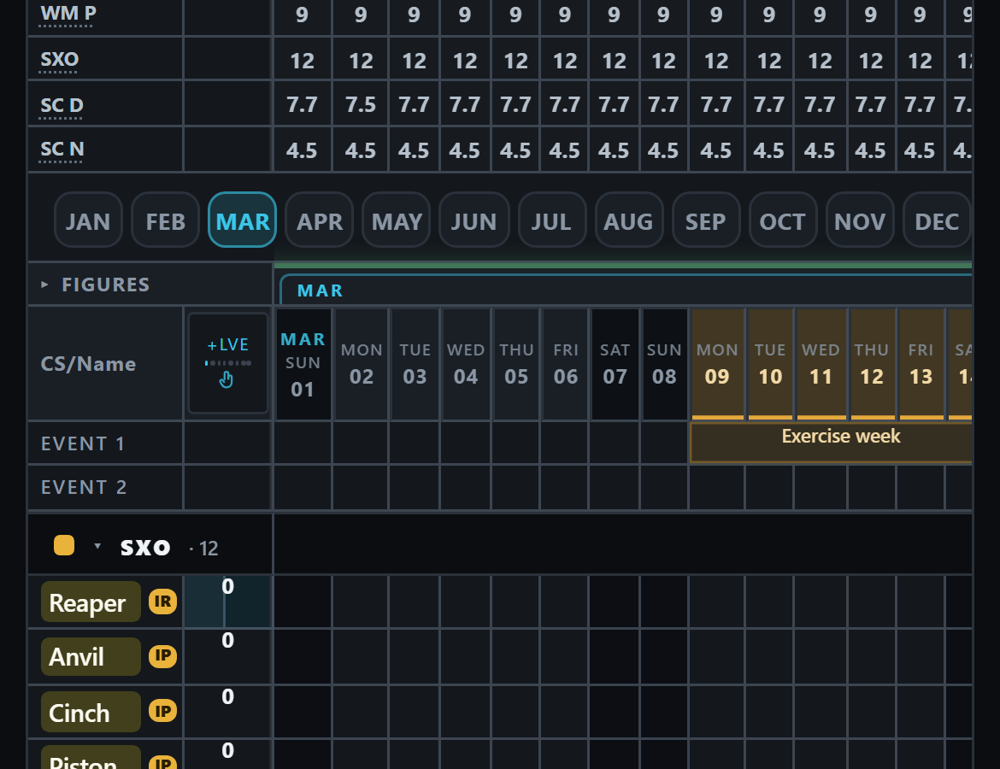
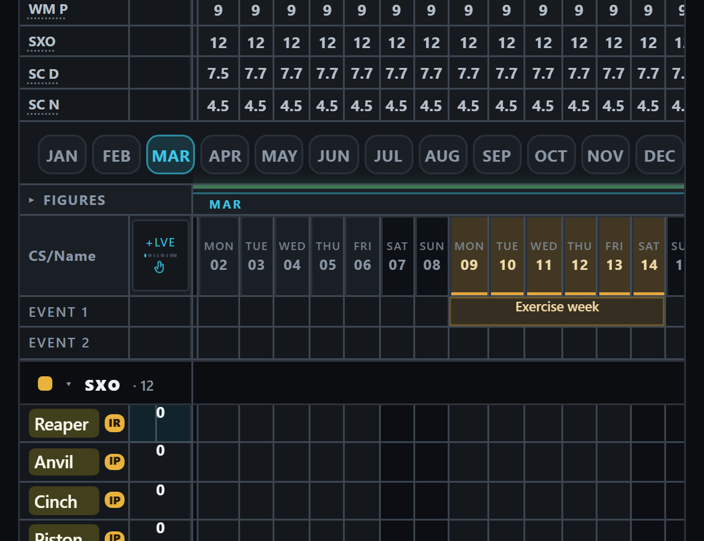

# [LW-MONTHJUMP-PHONE] — three Leave War browser tests on a slow machine (23 Sep 26)

Branch `claude/lw-monthjump-phone`, base `65129783`. Built by Opus 5.5. The owner's ask: make the three
tests robust on a slow machine by waiting on what each needs, not a fixed time (**D87**); prove each fails
before and passes after; the rest of the suite unchanged; **test-only**.
Pictures: `docs/img/handpass/2026-09-23-lw-monthjump/`.

## 1. The eight questions → NONE for the app

Money, the published record, saved data, a shared drawer, a new gesture, a new surface, roles, the warning
list — all **NO**: no file under `src/` changes; the diff is `e2e/app.ts`, `e2e/step4-leavewar.spec.ts` and
the records. What a test-only change CAN get wrong is the test itself — teaching it to look away (order §10,
anti-pattern 14) — so the checks are: red before / green after under the same slow conditions, nothing else
in the suite changing, and an independent read of the diff (§7).

## 2. How "a slow machine" was reproduced

`E2E_CPU_THROTTLE=<n>` (new, `e2e/app.ts`, off unless set) slows everything the page does n times over
through Chromium's own CPU throttling. For scale: the "leave is cut" test takes 10s on this desktop; on
GitHub it took 23.1s on a green run (about 2.3x) and needed more than 30s on 23 Sep (3x or more). All
runs below: the SAME built bundle, served on port 4190, one test at a time unless a row says otherwise.

## 3. Red before, green after — the two desktop scenarios (3 runs at each speed)

| Browser speed | "LL 14–18 Jul … undo restores" BEFORE | AFTER | "a reload (not ?fresh) …" BEFORE | AFTER |
|---|---|---|---|---|
| normal | 10.1 · 10.3 · 10.4s | 8.0 · 8.1 · 8.2s | 19.5 · 19.7 · 19.8s | 9.9 · 10.0 · 10.6s |
| 2x slower | 15.2 · 15.6 · 15.7s | 13.6 · 13.7 · 13.9s | 29.6 · 29.7s · **timed out** | 16.8 · 18.0 · 18.5s |
| 3x slower | 21.4 · 22.5 · 23.1s | 20.7 · 21.1 · 21.1s | **timed out ×3** | 29.0 · 29.0 · 29.0s |
| 4x slower | 29.8s · **timed out ×2** | 27.8 · 27.9 · 28.7s | **timed out ×3** | **timed out ×3** |

**What changed, and why each one.** Every fixed pause in the file's shared steps became a wait on the thing
the next step needs: a month jump waits for the month to be drawn and for its header to stop moving on
screen (0.7s before); a tap waits for its sheet (0.25s); closing a sheet, reading figures and closing the tap
list wait for the sheet to be gone (0.1–0.6s); undo/redo wait for the other button to light (0.35s); filing
on the Inputs page waits for its actual outcome — the no-document question, a filing, or a refusal (0.4s,
and the old 0.15s look for the question could MISS it on a slow machine, so the medical was never filed).
The reload scenario also read each person's three figures from three separate openings of their sheet; it
now reads all three from one (same sheet, same moment, same numbers — a third of the work), and it waits for
every cell it compares to be drawn, because an undrawn cell reads "undefined" on both sides of the reload and
compared equal without comparing anything.

**Where it still breaks:** the reload scenario at 4x — two full Leave War loads, four month jumps and ten
figure sheets are real work, and at 3x it now sits at 29s of the 30s limit (with four tests at once: passed
at 28.3s in one run, timed out at 34.4s in another). The remaining lever is a longer limit for that one test
— the remedy D87 did not pick.

## 4. The rest of the suite

| Run | Before | After |
|---|---|---|
| Whole browser suite, normal speed | 461 passed · 45 skipped · 0 failed (3.6m) | 461 passed · 45 skipped · 0 failed (3.4m) — **every test the same outcome** |
| `step4-leavewar.spec.ts`, both widths, 4 at a time, normal | 24 passed | 24 passed, every one faster (reload 20.8 → 11.1s) |
| the same at 3x slower | 23 passed · reload timed out | 24 passed |
| Type errors in the three e2e files (not part of the build) | 15 | the same 15 |

## 5. The phone test — an APP bug, left unchanged on purpose

`e2e/leavewar.spec.ts` "a month button works from wherever the grid already is" (lw-phone). **Not changed.**

| Pacing of the two taps (4 runs each, unless noted) | March lands a day short |
|---|---|
| as the test does it (SEP right after opening, MAR as soon as September is drawn) | 4 of 4 (and 10 of 10 alone) |
| grid settled before SEP / before MAR / both | 4 of 4 / 4 of 4 / 1 of 4 |
| like a person: 1s, SEP, 1.5s, MAR | 2 of 4; 3 of 4 in a second batch |
| inside a busy full-suite run (a slower machine) | passes |

First picture: tapping MAR lands on "Sun 01". Second: the same taps land on "Mon 02" — 1 March is under
the frozen name column (it fails alone on a quiet desktop; in a busy full run, and on GitHub, it passes). **Measured cause:** February's width (591px on screen) is remembered while a posted-out man's
row (ignite) is showing; by September his row is hidden; back at March the grid regrows February within
160ms of the jump, treats the remembered width as exact and, on a touch screen, skips the re-anchor "in
motion" — February draws 571px, March slides 20px left. Filed with its fix direction as
`[LW-MONTHJUMP-PHONE]` in `OUTSTANDING.md`. Pacing the test would only hide it.

## 6. What was not done

- No app change (the owner's "test-only"). The phone fix is filed, not built.
- The shared `login()` / `go()` pauses in `e2e/app.ts` (0.35–0.4s) were left alone: every browser test in
  the suite leans on them, so changing them is its own job with a suite-wide re-run.
- The other step4 scenarios were not rewritten; they only inherit the new shared steps (and got faster).
- One fixed pause is left in the file on purpose: `dragSelect`'s 0.4s back-off before it RETRIES a drag
  that did not register — a failure path only, and neither of the two scenarios drags.

## 7. Checks and the independent read

Gates on the final tree: `npm test` 5760/5760 · build OK · `tfin.js` 728/0 · `test:e2e` 461 passed / 45
skipped / 0 failed · `smoke:tracker` 425/0 · rulecheck OK · docsize OK.

**Astra (Codex CLI, default model, high effort), blind, on commit `5b38ecef` — verdict REVISE, no defect in
the diff.** Its explicit negatives: the combined figure reads keep every prior assertion; the cell waits close
the undefined-equals-undefined false pass; every caller of the changed steps walked on BOTH projects with no
problem in the scrim waits, the no-document handling or the filing callers; the `login()`/`go()` pauses are
not load-bearing on these paths; the throttle switch is inert unset and survives the reload. Its two findings
are decisions for the owner, not fixes: **001** — the reload test is still at the 30s edge at 3x with other
tests running; the remaining lever is a longer limit for that one test, which needs his word because D87 chose
waits. **002** — the phone test needs the APP fix (spec folded into `[LW-MONTHJUMP-PHONE]`). **That read
covers `5b38ecef` only.** Everything after it — the checks moved to his PC (`deploy.yml`, the e2e port in
`playwright.config.ts`), the scrubber test's wait, the notes — goes to a SECOND, fresh Astra read.

**GitHub (PR #428), all 12 checks green — with one retry.** On GitHub's own machine the "LL 14–18 Jul" test
passed first time at 27.8s (it failed twice on 23 Sep); the reload test timed out once (31.5s) and passed on
the automatic retry (12.5s). Why GitHub is this slow: the repo went PRIVATE on 22 Sep ~17:40 UTC, and GitHub
gives a private repo a 2-core machine where a public one gets 4 (GitHub's runner reference). Every
parallel check doubled at that moment (desktop browser leg 5–6 → 10–11 min, scheduler unit tests 5–9 → 13–20
min) while the one single-threaded check (Tracker) did not move — and CI still runs 3 browser tests at once,
a setting chosen for 4 cores. Filed as `[CI-TWO-CORES]`.

**Then on his own PC (D89, the self-hosted runner "JK"), three trial runs of the whole set:** run 1 failed two
unit files — Git for Windows' CRLF default on the runner's fresh clone (fixed: that clone keeps the repo's
line endings); run 2 failed the Leave War scrubber test (the app's 250ms drag window; the test now waits it
out, `[LW-HBAR-RESYNC]` filed); run 3: everything passed except the phone month test — the app bug above,
which shows on a fast machine. Time on the PC: ~14 min for a green run (unit tests 4.7 min, browser tests
3.7 min, Tracker smoke ~4.5 min). Until the phone fix (D150), the checks run on GitHub (`CI_ON_GITHUB=true`).
